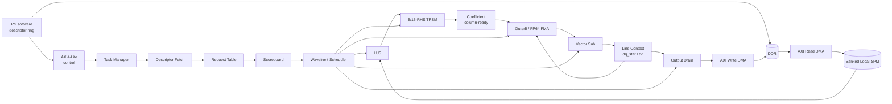
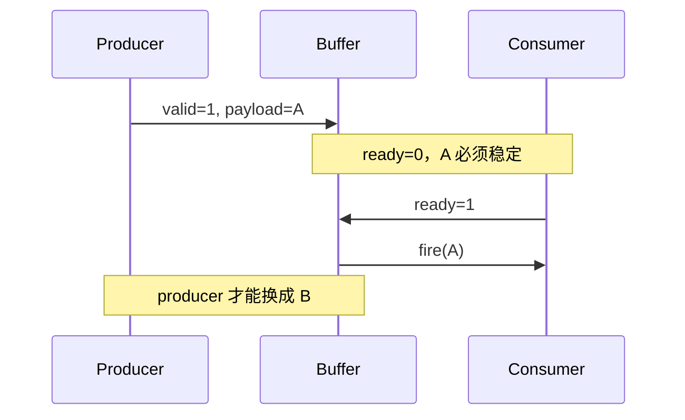

# CFD LU-SGS FPGA 加速器 RTL 设计与实现指南

> 目标平台：ZCU104 / Zynq UltraScale+ MPSoC
>
> 基础数据格式：IEEE-754 FP64
>
> 基础块规模：5×5
>
> 文档性质：RTL 实现约束、接口契约与验证指南
> 状态：设计指南；本目录当前尚无已完成、已仿真或已综合的 LU-SGS RTL

## 1. 文档目标与适用范围

本指南把仓库中已验证的 CFD LU-SGS 数学路径和 gem5 控制语义，转换为可实施的 FPGA
模块边界、握手规则、状态生命周期与验证要求。

面向读者包括：

- ZCU104 上的 SystemVerilog RTL 工程师；
- 封装 Vivado Floating-Point IP 或 HLS `double` kernel 的工程师；
- 设计 AXI4-Lite、AXI4 master DMA、banked SPM 的工程师；
- 负责 UVM、C/RTL co-simulation、综合、实现和 timing closure 的工程师。

本指南不包括板卡安装、Linux 驱动部署或 Vivado GUI 教程。

### 1.1 三类陈述标签

| 标签 | 含义 |
|---|---|
| **[gem5 已验证]** | 当前仓库的 C/C++/ISA/event 模型或回归已存在 |
| **[FPGA 推荐设计]** | 本文建议的新 RTL/HLS 实现；不能声称已经完成 |
| **[未来优化]** | 第一版验收后再评估的性能或面积优化 |

必须避免以下等价：

- gem5 `event completion` 不等于真实 RTL pipeline completion；
- gem5 `coarse opLat` 不等于硬件内部周期；
- gem5 `functional readBlob/writeBlob` 不等于 AXI transaction；
- gem5 内部 `packet` 仲裁不等于接入 cache/coherent fabric；
- C++ `std::array` 或 request-local buffer 不自动对应 BRAM；
- 仿真参数敏感性不等于器件频率、资源、功耗结论。

### 1.2 当前仓库依据

关键事实来自以下实现：

- Step2 guest 数据结构与模式入口：
  `projects/cfd_dsa/benchmarks/lusgs/test_cfd_lusgs_patha_step2.c:27-120,3335-3655,4843-6468,9041-9530`；
- coefficient descriptor/record：
  `src/arch/arm/cfd_coeff_preprocess_controller.hh:16-319`；
- request、15-RHS 状态与事件推进：
  `src/arch/arm/cfd_coeff_preprocess_controller.cc:255-506,807-1048,1608-2478,2934-2970`；
- 本地 SPM 类别与内部 request API：
  `src/arch/arm/cfd_local_spm.hh:25-155`、
  `src/arch/arm/cfd_local_spm.cc:2290-2385`；
- Step4 独立 LU-SGS event controller：
  `src/arch/arm/cfd_lusgs_event_controller.cc:40-344,1240-1322,2985-3665`；
- TRSV5 数学 helper：
  `src/arch/arm/cfd_trsv5_math.hh:17-40`。

相关项目地图和专项说明：

- `projects/cfd_dsa/docs/CFD_DSA_PROJECT_STRUCTURE.md`
- `projects/cfd_dsa/docs/CFD_DSA_PROJECT_FILE_INDEX.md`
- `projects/cfd_dsa/docs/CFD_DSA_LUSGS_STEP2.md`
- `projects/cfd_dsa/docs/CFD_DSA_LUSGS_STEP2_STREAMING.md`
- `projects/cfd_dsa/docs/CFD_DSA_LUSGS_PRETRANSFORM.md`
- `projects/cfd_dsa/docs/CFD_DSA_TRSV5.md`
- `projects/cfd_dsa/docs/CFD_DSA_LUSGS_STEP4.md`

## 2. 算法到硬件的数据流映射

每个 cell 的输入为：

- `D[i]`：5×5 FP64 块对角矩阵；
- `L[i]`：5×5 FP64 下邻块；
- `U[i]`：5×5 FP64 上邻块；
- `R[i]`：5×1 FP64 右端向量。

推荐 pretransform 定义为：

```text
LU[i]   = LU(D[i])
Dinv[i] = D[i]^-1
Lbar[i] = D[i]^-1 L[i]
Ubar[i] = D[i]^-1 U[i]
```

前向：

```text
base[i] = Dinv[i] × R[i]

dq_star[0] = base[0]

dq_star[i] =
    base[i]
  - Lbar[i] × dq_star[i-1]
```

后向：

```text
dq[last] = dq_star[last]

dq[i] =
    dq_star[i]
  - Ubar[i] × dq[i+1]
```

### 2.1 真实依赖

必须在 RTL scoreboard 中表达：

- 同一 line 的 forward cell `i` 依赖 `dq_star[i-1]`；
- 同一 line 的 backward cell `i` 依赖 `dq[i+1]`；
- `base[i]` 不依赖相邻 cell，可尽早计算；
- 不同 cell 的 LU/TRSM 可进入 request window 并交错；
- 不同 line 在存储容量允许时可并行；
- backward 至少等待所需 `dq_star[i]`、`Ubar[i]` 和 `dq[i+1]`；
- coefficient drain 到 DDR 不是 forward/backward 的数学前置条件。

### 2.2 总体数据流



### 2.3 每级最小 ready 条件

| 级 | 输入 | 输出 | 最小启动条件 |
|---|---|---|---|
| Input DMA | descriptor 地址/长度 | SPM beat | 合法地址、目标 slot、DMA credit |
| LU5 | 完整 D | packed LU 或 step-ready | D valid、LU engine ready |
| TRSM Dinv | LU step、identity RHS | Dinv column | 所需 LU step ready、算术资源可用 |
| TRSM Lbar | LU step、L column | Lbar column | 当前列输入 ready，不等待 U |
| TRSM Ubar | LU step、U column | Ubar column | 当前列输入 ready，不等待 drain |
| Base Outer5 | Dinv column、R scalar | base accumulator | 对应 column ready、R[k] ready |
| Forward Outer5 | Lbar column、prev scalar | correction accumulator | 对应列与 `dq_star_prev[k]` ready |
| Forward Sub | base、correction | dq_star | 两个向量完整、sub lane ready |
| Backward Outer5 | Ubar column、next scalar | correction accumulator | 对应列与 `dq_next[k]` ready |
| Backward Sub | dq_star、correction | dq | 两个向量完整、sub lane ready |
| Output DMA | final/local result | DDR write | 输出 FIFO 有 entry、AXI credit |

### 2.4 最小依赖 ready 原则

禁止人为等待：

- 全部 cell preprocess 完成；
- 15 个 RHS 全部完成；
- 完整 coefficient matrix 已写 DDR；
- 完整 line 已写 DDR；
- 更老但与当前 operand 无关的 request 完成。

TRSM 自然按 RHS 发布一列。Outer5 应按列消费：

```text
acc[row] += matrix_column[k][row] × vector[k]
```

五列均消费后才得到完整 MVM，但第 0 列的消费不需要等第 4 列生成。

## 3. 顶层架构与模块边界

### 3.1 推荐层次

```text
cfd_lusgs_accel_top
├── cfd_lusgs_regs
├── cfd_lusgs_task_manager
├── cfd_lusgs_descriptor_fetch
├── cfd_lusgs_dma_read
├── cfd_lusgs_dma_write
├── cfd_lusgs_spm
├── cfd_lusgs_request_table
├── cfd_lusgs_scoreboard
├── cfd_lusgs_wavefront_scheduler
├── cfd_lusgs_lu5_wrapper
├── cfd_lusgs_trsm5_wrapper
├── cfd_lusgs_outer5_wrapper
├── cfd_lusgs_vector_sub
├── cfd_lusgs_line_context
├── cfd_lusgs_output_drain
└── cfd_lusgs_perf_counter
```

### 3.2 模块职责矩阵

| 模块 | 必须负责 | 不应负责 | 主要验证 |
|---|---|---|---|
| `accel_top` | 连接、时钟复位、接口暴露 | 算法状态决策 | elaboration、接口连通 |
| `regs` | AXI-Lite、寄存器、IRQ | DMA burst | AXI VIP、WSTRB |
| `task_manager` | start/abort/done/error | cell 算术调度 | descriptor 生命周期 |
| `descriptor_fetch` | 拉取并校验 descriptor | coefficient 计算 | 地址/版本/长度错误 |
| `dma_read` | AXI read burst、重组 | SPM bank policy | 随机 RREADY、RRESP |
| `dma_write` | AXI write burst、response | request release 决策 | AW/W 解耦、BRESP |
| `spm` | 物理 bank、端口、仲裁 | wavefront 优先级 | 冲突、read-during-write |
| `request_table` | entry 状态、generation | 选择本周期 winner | allocate/release/stale |
| `scoreboard` | operand/resource ready | 公平仲裁 | ready 真值表 |
| `scheduler` | winner、age、fairness | 保存大数据矩阵 | 饥饿、优先级 |
| `lu5_wrapper` | LU command/result/status | DDR 访问 | pivot、stall、tag |
| `trsm5_wrapper` | 5/15 RHS context | request 释放 | column-ready、共享 FU |
| `outer5_wrapper` | 列 FMA 累加 | coefficient ownership | mask、acc context |
| `vector_sub` | 5-lane subtraction | line 顺序 | lane backpressure |
| `line_context` | prev/next vector、本地 bypass | DDR drain | tag、一致性 |
| `output_drain` | local result 到 write FIFO | compute complete | backpressure |
| `perf_counter` | 真实 event 计数/快照 | 推导未观测 overlap | counter 定义 |

### 3.3 数据面与控制面

控制面只携带：

```text
line_id, cell_id, slot_id, generation,
op_type, matrix_type, column_id, row_id,
ready mask, consumed mask, error/status
```

数据面保存：

```text
D/L/U/LU coefficient data,
R/base/correction/dq_star/dq,
FP pipeline operands/results
```

request table 是控制状态，不是完整数据 buffer。

## 4. RTL 与 HLS 的职责划分

### 4.1 推荐 RTL

- AXI4-Lite 和寄存器；
- AXI master DMA command/response；
- descriptor/task lifecycle；
- request table、scoreboard、scheduler；
- FIFO、skid buffer、arbiter；
- banked SPM 和 line context；
- generation、错误、timeout、性能计数器；
- FP IP wrapper 周围的 tag 与 backpressure。

### 4.2 可用 HLS 或计算 RTL

- LU5；
- 5/15-RHS TRSM；
- Outer5；
- Vector Sub。

### 4.3 边界原则

不建议每个 HLS kernel 独立成为 DDR master，原因是：

- D/L/U 会重复读；
- Dinv/Lbar/Ubar 会被写回再读回；
- 无法集中维护 slot/generation；
- 多 master QoS 和 outstanding 更难验证；
- column-ready 旁路会退化为 matrix barrier。

推荐 HLS kernel 只使用 AXI4-Stream 或显式 command/result ready/valid，由 RTL SPM
adapter 提供数据。

## 5. SystemVerilog 编码规范

### 5.1 命名

| 对象 | 规则 | 示例 |
|---|---|---|
| 文件 | 小写 snake_case | `cfd_sync_fifo.sv` |
| module | 文件同名 | `cfd_sync_fifo` |
| package | `_pkg` | `cfd_lusgs_pkg` |
| interface | `_if` | `cfd_rv_if` |
| 输入/输出 | `_i` / `_o` | `cmd_valid_i` |
| 寄存/次态 | `_q` / `_d` | `state_q` |
| 参数 | 首字母大写 | `Depth` |
| 常量 | 大写 | `FP64_W` |
| handshake | `_valid/_ready/_fire` | `cmd_fire` |
| 状态 | enum 大写 | `ST_RUN` |
| 错误 | `_error` | `axi_error_o` |

### 5.2 必须规则

- 时序状态只在 `always_ff` 更新；
- 组合 next-state 使用 `always_comb`，开头给完整默认值；
- 宽度显式，避免无尺寸十进制常量；
- signed/unsigned 转换显式；
- 循环界限是参数或常量，不由运行时无界值决定；
- 大容量 RAM 不在 reset 分支逐项清零；
- 仿真专用代码放 `ifndef SYNTHESIS`；
- `unique case` 必须有 `default` 恢复路径；
- 参数化必须保留 `N=5` 主配置的 elaboration assertion。

### 5.3 推荐与反例

```systemverilog
// 推荐：宽度和转换明确。
logic [CELL_W-1:0] next_cell;
assign next_cell = cell_id_q + CELL_W'(1);

// 反例：无尺寸常量可能扩宽并引入 signed 比较。
// assign next_cell = cell_id_q + 1;
```

```systemverilog
always_comb begin
    state_d = state_q;
    error_d = error_q;
    case (state_q)
        ST_IDLE: if (start_fire) state_d = ST_FETCH;
        ST_FETCH: if (desc_fire) state_d = ST_RUN;
        default: begin
            state_d = ST_ERROR;
            error_d = 1'b1;
        end
    endcase
end
```

## 6. ready/valid 握手规范

统一定义：

```systemverilog
assign fire = valid && ready;
```

必须满足：

1. producer 在 `valid=1` 且未 fire 时保持 payload 稳定；
2. consumer 可独立拉低 ready；
3. valid 不得组合依赖 ready；
4. ready 路径不得形成组合环；
5. issue、compute complete、consumer complete、drain complete 分开；
6. completion 只能由真实 pipeline/FIFO 输出 fire 产生；
7. slot 仍被引用时不得复用；
8. backpressure 必须逐级传播或由有界 buffer 吸收；
9. multi-beat transaction 持有 beat count 和 tag；
10. reset/flush 后清除所有 control valid。

### 6.1 参数化 register slice

```systemverilog
module cfd_rv_reg_slice #(
    parameter int unsigned Width = 64
) (
    input  logic                 clk_i,
    input  logic                 rst_ni,
    input  logic                 flush_i,
    input  logic                 in_valid_i,
    output logic                 in_ready_o,
    input  logic [Width-1:0]     in_data_i,
    output logic                 out_valid_o,
    input  logic                 out_ready_i,
    output logic [Width-1:0]     out_data_o
);
    logic             valid_q;
    logic [Width-1:0] data_q;

    assign in_ready_o  = !valid_q || out_ready_i;
    assign out_valid_o = valid_q;
    assign out_data_o  = data_q;

    always_ff @(posedge clk_i) begin
        if (!rst_ni) begin
            valid_q <= 1'b0;
            data_q  <= '0;
        end else if (flush_i) begin
            valid_q <= 1'b0;
        end else if (in_ready_o) begin
            valid_q <= in_valid_i;
            if (in_valid_i) begin
                data_q <= in_data_i;
            end
        end
    end
endmodule
```

适用于单 entry elastic stage 和切断 payload 时序路径。

不适用于：

- 不可停顿 FP pipeline 的全部吸收；
- 多 beat AXI transaction；
- 需要同时 push/pop 两个以上元素；
- clock domain crossing。

### 6.2 握手时序



## 7. FIFO 与 Skid Buffer

### 7.1 参数化同步 FIFO

```systemverilog
module cfd_sync_fifo #(
    parameter int unsigned Width = 64,
    parameter int unsigned Depth = 4,
    localparam int unsigned PtrW =
        (Depth <= 1) ? 1 : $clog2(Depth),
    localparam int unsigned CntW = $clog2(Depth + 1)
) (
    input  logic                 clk_i,
    input  logic                 rst_ni,
    input  logic                 flush_i,
    input  logic                 push_valid_i,
    output logic                 push_ready_o,
    input  logic [Width-1:0]     push_data_i,
    output logic                 pop_valid_o,
    input  logic                 pop_ready_i,
    output logic [Width-1:0]     pop_data_o,
    output logic [CntW-1:0]      occupancy_o,
    output logic                 almost_full_o
);
    logic [Width-1:0] mem [Depth];
    logic [PtrW-1:0] rd_ptr_q, wr_ptr_q;
    logic [CntW-1:0] count_q;
    logic push_fire, pop_fire;

    initial begin
        assert (Depth >= 2)
            else $fatal(1, "cfd_sync_fifo Depth must be >= 2");
    end

    assign push_ready_o  = (count_q < Depth);
    assign pop_valid_o   = (count_q != 0);
    assign pop_data_o    = mem[rd_ptr_q];
    assign occupancy_o   = count_q;
    assign almost_full_o = (count_q >= Depth-1);
    assign push_fire     = push_valid_i && push_ready_o;
    assign pop_fire      = pop_valid_o && pop_ready_i;

    always_ff @(posedge clk_i) begin
        if (!rst_ni) begin
            rd_ptr_q <= '0;
            wr_ptr_q <= '0;
            count_q  <= '0;
        end else if (flush_i) begin
            rd_ptr_q <= '0;
            wr_ptr_q <= '0;
            count_q  <= '0;
        end else begin
            if (push_fire) begin
                mem[wr_ptr_q] <= push_data_i;
                wr_ptr_q <= (wr_ptr_q == Depth-1) ? '0 : wr_ptr_q + 1'b1;
            end
            if (pop_fire) begin
                rd_ptr_q <= (rd_ptr_q == Depth-1) ? '0 : rd_ptr_q + 1'b1;
            end
            unique case ({push_fire, pop_fire})
                2'b10: count_q <= count_q + 1'b1;
                2'b01: count_q <= count_q - 1'b1;
                default: count_q <= count_q;
            endcase
        end
    end
endmodule
```

注意：

- 上例采用异步读数组语义；若目标 BRAM 需要同步读，必须增加 output register；
- `Depth` 非 2 的幂时显式 wrap；
- FIFO flush 只清 pointer/count，不清 RAM；
- `almost_full` 应给不可停顿流水线预留“在途结果”容量。

### 7.2 两 entry skid buffer

下例在主 output register 后增加一个 spill entry。下游突然停止时，已被上游视为接受的
payload 可以进入 spill；只有两个 entry 都被占用时才向上游施加 backpressure。

```systemverilog
module cfd_skid_buffer #(
    parameter int unsigned Width = 64
) (
    input  logic             clk_i,
    input  logic             rst_ni,
    input  logic             flush_i,
    input  logic             in_valid_i,
    output logic             in_ready_o,
    input  logic [Width-1:0] in_data_i,
    output logic             out_valid_o,
    input  logic             out_ready_i,
    output logic [Width-1:0] out_data_o
);
    logic main_valid_q, skid_valid_q;
    logic [Width-1:0] main_data_q, skid_data_q;
    logic in_fire, out_fire;

    assign in_ready_o  = !skid_valid_q || out_ready_i;
    assign out_valid_o = main_valid_q;
    assign out_data_o  = main_data_q;
    assign in_fire     = in_valid_i && in_ready_o;
    assign out_fire    = out_valid_o && out_ready_i;

    always_ff @(posedge clk_i) begin
        if (!rst_ni) begin
            main_valid_q <= 1'b0;
            skid_valid_q <= 1'b0;
            main_data_q  <= '0;
            skid_data_q  <= '0;
        end else if (flush_i) begin
            main_valid_q <= 1'b0;
            skid_valid_q <= 1'b0;
        end else begin
            unique case ({in_fire, out_fire})
                2'b10: begin
                    if (!main_valid_q) begin
                        main_valid_q <= 1'b1;
                        main_data_q  <= in_data_i;
                    end else begin
                        skid_valid_q <= 1'b1;
                        skid_data_q  <= in_data_i;
                    end
                end
                2'b01: begin
                    if (skid_valid_q) begin
                        main_valid_q <= 1'b1;
                        main_data_q  <= skid_data_q;
                        skid_valid_q <= 1'b0;
                    end else begin
                        main_valid_q <= 1'b0;
                    end
                end
                2'b11: begin
                    if (skid_valid_q) begin
                        main_data_q  <= skid_data_q;
                        skid_data_q  <= in_data_i;
                        main_valid_q <= 1'b1;
                        skid_valid_q <= 1'b1;
                    end else begin
                        main_data_q  <= in_data_i;
                        main_valid_q <= 1'b1;
                    end
                end
                default: begin
                    main_valid_q <= main_valid_q;
                    skid_valid_q <= skid_valid_q;
                end
            endcase
        end
    end

    assert property (@(posedge clk_i) disable iff (!rst_ni)
        out_valid_o && !out_ready_i
        |=> out_valid_o && $stable(out_data_o));
endmodule
```

这个模板允许持续吞吐一拍一个 transaction；它不是 async FIFO，也不处理多 beat
transaction 的 packet boundary。

### 7.3 Skid buffer 放置

建议位置：

- 长 ready 链每 1～2 个模块；
- AXI R/B channel 进入内部队列之前；
- 不可停顿 FP pipeline 输出之前；
- 多 producer arbiter 之后；
- SPM response 到 consumer 之间。

Skid buffer 必须能在下游突然 `ready=0` 的同周期捕获原本已接受的数据。

### 7.4 FIFO 断言

```systemverilog
assert property (@(posedge clk_i) disable iff (!rst_ni)
    !(push_valid_i && !push_ready_o && push_fire));

assert property (@(posedge clk_i) disable iff (!rst_ni)
    !(pop_ready_i && !pop_valid_o && pop_fire));
```

## 8. Request Table 设计

### 8.1 entry 字段

```systemverilog
package cfd_lusgs_pkg;
    parameter int unsigned LineIdW = 16;
    parameter int unsigned CellIdW = 24;
    parameter int unsigned SlotW   = 4;
    parameter int unsigned GenW    = 16;

    typedef enum logic [3:0] {
        REQ_FREE,
        REQ_INPUT,
        REQ_LU,
        REQ_TRSM,
        REQ_COMPUTE,
        REQ_DRAIN,
        REQ_DONE,
        REQ_ERROR
    } request_state_e;

    typedef struct packed {
        logic                    valid;
        logic [LineIdW-1:0]      line_id;
        logic [CellIdW-1:0]      cell_id;
        logic [SlotW-1:0]        slot_id;
        logic [GenW-1:0]         generation;
        request_state_e          state;
        logic                    need_dinv;
        logic                    need_lbar;
        logic                    need_ubar;
        logic                    input_ready;
        logic                    lu_ready;
        logic [4:0]              dinv_col_ready;
        logic [4:0]              lbar_col_ready;
        logic [4:0]              ubar_col_ready;
        logic [4:0]              base_col_consumed;
        logic [4:0]              fwd_col_consumed;
        logic [4:0]              bwd_col_consumed;
        logic                    base_ready;
        logic                    forward_ready;
        logic                    backward_ready;
        logic [3:0]              consumer_count;
        logic                    compute_complete;
        logic                    consumer_complete;
        logic                    drain_complete;
        logic                    error;
        logic [7:0]              error_code;
    } request_entry_t;
endpackage
```

### 8.2 身份规则

任何 command/completion 必须携带：

```text
line_id
cell_id
slot_id
generation
operation type
column/row index
```

`slot_id` 不是唯一身份。slot 复用后，旧 completion 的 `slot_id` 仍相同，只有
`generation` 能拒绝陈旧结果。

### 8.3 release 完整条件

```text
release =
    valid
 && (request_done || request_error)
 && compute_complete
 && consumer_count == 0
 && no_pipeline_tag_refers_to_entry
 && no_spm_response_refers_to_entry
 && no_dma_transaction_refers_to_entry
 && (drain_complete || drain_not_requested)
 && completion_record_accepted
```

compute completion、consumer completion、DDR drain completion、request completion 必须是四个状态。

### 8.4 与 gem5 的对应

**[gem5 已验证]** `Request` 保存 requested mask、LU/RHS 状态、三套 coefficient、
column masks、base/correction/dq_star 和 drain 状态
（`cfd_coeff_preprocess_controller.cc:324-416`）。

**[FPGA 推荐设计]** 数据从 request entry 分离，放入 SPM/accumulator/context；
entry 只保存 tag、mask、pointer 和 lifecycle。

## 9. Scoreboard 设计

scoreboard 回答“能不能执行”；scheduler 回答“本周期选择谁”。

### 9.1 ready 表达式骨架

```systemverilog
logic forward_cell_ready;
logic backward_cell_ready;
logic request_identity_ok;

assign request_identity_ok =
       request_q.valid
    && request_q.slot_id    == candidate_slot_i
    && request_q.generation == candidate_generation_i;

assign forward_cell_ready =
       request_identity_ok
    && request_q.base_ready
    && prev_dq_star_ready_i
    && forward_acc_available_i
    && vector_sub_available_i
    && forward_result_fifo_ready_i;

assign backward_cell_ready =
       request_identity_ok
    && request_q.forward_ready
    && request_q.ubar_col_ready == 5'b1_1111
    && next_dq_ready_i
    && backward_acc_available_i
    && vector_sub_available_i
    && backward_result_fifo_ready_i;
```

实际实现应进一步把 backward 拆为列级 ready，而不是强制等待完整 `Ubar`。

### 9.2 scoreboard 必须追踪

- operand ready bit 和 producer；
- coefficient column ready；
- accumulator owner；
- FP resource credit；
- 目标 FIFO space；
- SPM read/write port grant；
- neighbor context ready；
- generation 匹配；
- 已消费 mask，防 double consume；
- output drain 是否只是后台工作。

### 9.3 更新优先级

同周期 completion 和 issue 同时发生时：

1. 先形成 completion event；
2. 校验 tag/generation；
3. 更新 next-state ready bit；
4. scheduler 可选择是否支持 completion-to-issue bypass；
5. 若支持同周期 bypass，必须有专门 SVA 和 timing 预算；
6. 第一版建议 completion 在下一周期对 scheduler 可见。

## 10. Wavefront Scheduler

### 10.1 推荐 ready queue

```text
input_queue
lu_queue
trsm_queue
base_outer_queue
forward_outer_queue
backward_outer_queue
vector_sub_queue
drain_queue
```

不要建立覆盖 line/cell/row/RHS/pipeline wait 的巨大嵌套 FSM。

### 10.2 优先级

推荐由高到低：

1. 会解除当前 forward frontier 的 operand；
2. 会解除当前 backward frontier 的 operand；
3. 即将造成不可停顿 pipeline overflow 的 completion/drain；
4. 已 aging 的 request；
5. LU/TRSM 新工作；
6. 非关键 coefficient DDR drain。

必须保留 line fairness，不能让短 line 永久压住长 line。

### 10.3 round-robin arbiter

```systemverilog
module cfd_rr_arbiter #(
    parameter int unsigned NumReq = 4,
    localparam int unsigned IdW =
        (NumReq <= 1) ? 1 : $clog2(NumReq)
) (
    input  logic                 clk_i,
    input  logic                 rst_ni,
    input  logic                 advance_i,
    input  logic [NumReq-1:0]    req_i,
    output logic [NumReq-1:0]    grant_o,
    output logic                 grant_valid_o,
    output logic [IdW-1:0]       grant_id_o
);
    logic [IdW-1:0] last_q;
    integer offset;
    integer index;

    always_comb begin
        grant_o       = '0;
        grant_valid_o = 1'b0;
        grant_id_o    = '0;
        for (offset = 1; offset <= NumReq; offset = offset + 1) begin
            index = last_q + offset;
            if (index >= NumReq)
                index = index - NumReq;
            if (!grant_valid_o && req_i[index]) begin
                grant_o[index]   = 1'b1;
                grant_valid_o    = 1'b1;
                grant_id_o       = IdW'(index);
            end
        end
    end

    always_ff @(posedge clk_i) begin
        if (!rst_ni)
            last_q <= '0;
        else if (advance_i && grant_valid_o)
            last_q <= grant_id_o;
    end

    initial begin
        assert (NumReq >= 1);
    end
endmodule
```

`advance_i` 只能在 winner 真正 fire 时拉高。

fixed priority 简单但可能饿死 drain；纯 round-robin 公平但不理解 frontier。
推荐“critical class + class 内 round-robin + age promotion”。

## 11. 状态机设计原则

顶层只保留粗粒度 FSM：

```text
IDLE
FETCH_DESCRIPTOR
VALIDATE
INITIALIZE
RUN
FINAL_DRAIN
WRITE_PERF
DONE
ERROR
```

### 11.1 可综合 FSM 骨架

```systemverilog
module cfd_lusgs_task_fsm (
    input  logic clk_i,
    input  logic rst_ni,
    input  logic start_i,
    input  logic desc_valid_i,
    input  logic desc_ok_i,
    input  logic init_done_i,
    input  logic run_done_i,
    input  logic drain_done_i,
    input  logic perf_done_i,
    input  logic clear_done_i,
    input  logic timeout_i,
    output logic fetch_o,
    output logic run_o,
    output logic drain_o,
    output logic done_o,
    output logic error_o
);
    typedef enum logic [3:0] {
        ST_IDLE, ST_FETCH, ST_VALIDATE, ST_INIT, ST_RUN,
        ST_DRAIN, ST_PERF, ST_DONE, ST_ERROR
    } state_e;
    state_e state_q, state_d;

    always_comb begin
        state_d = state_q;
        if (timeout_i) begin
            state_d = ST_ERROR;
        end else begin
            unique case (state_q)
                ST_IDLE:     if (start_i)      state_d = ST_FETCH;
                ST_FETCH:    if (desc_valid_i) state_d = ST_VALIDATE;
                ST_VALIDATE: state_d = desc_ok_i ? ST_INIT : ST_ERROR;
                ST_INIT:     if (init_done_i)  state_d = ST_RUN;
                ST_RUN:      if (run_done_i)   state_d = ST_DRAIN;
                ST_DRAIN:    if (drain_done_i) state_d = ST_PERF;
                ST_PERF:     if (perf_done_i)  state_d = ST_DONE;
                ST_DONE:     if (clear_done_i) state_d = ST_IDLE;
                ST_ERROR:    if (clear_done_i) state_d = ST_IDLE;
                default:                         state_d = ST_ERROR;
            endcase
        end
    end

    always_ff @(posedge clk_i) begin
        if (!rst_ni)
            state_q <= ST_IDLE;
        else
            state_q <= state_d;
    end

    always_comb begin
        fetch_o = (state_q == ST_FETCH);
        run_o   = (state_q == ST_RUN);
        drain_o = (state_q == ST_DRAIN);
        done_o  = (state_q == ST_DONE);
        error_o = (state_q == ST_ERROR);
    end
endmodule
```

binary encoding 适合状态少的顶层；one-hot 可能改善 decode 时序但增加触发器。
算法内部应使用 queue/scoreboard/completion，不用顶层 FSM 展开循环。

## 12. SPM 与 Bank 设计

### 12.1 数据类别

| 数据 | 每 cell 大小 | 推荐存储 |
|---|---:|---|
| D/L/U | 各 200 B | BRAM/URAM input bank |
| packed LU | 200 B | BRAM，靠近 LU/TRSM |
| Dinv/Lbar/Ubar | 各 200 B | column-banked BRAM |
| R/base/correction | 各 40 B | register array 或 distributed RAM |
| dq_star/dq | 各 40 B | line context BRAM/register |
| metadata | 数十字节 | register/distributed RAM |
| output FIFO | 按 burst | BRAM FIFO |

推荐逻辑地址：

```text
{slot_id, matrix_type, column_id, row_id}
```

若 Outer5 每周期读完整一列，物理布局应让 5 个 row lane 同周期可读。

### 12.2 bank 策略

- coefficient 可按 column 分 5 bank；
- FP lane 可按 row 分 bank；
- D/L/U input 与 output coefficient 分 bank，降低 LU/TRSM 冲突；
- ping/pong 只解决 producer/consumer 跨 tile 冲突，不代替 generation；
- metadata 可复制以降低 scoreboard fanout；
- RAM read-during-write 模式必须在 Xilinx primitive/IP 配置中固定并验证；
- 大 RAM reset 只清 valid bit。

### 12.3 双端口仲裁骨架

```systemverilog
module cfd_spm_2p_arbiter #(
    parameter int unsigned AddrW = 12,
    parameter int unsigned DataW = 64
) (
    input  logic clk_i,
    input  logic rst_ni,
    input  logic a_valid_i,
    output logic a_ready_o,
    input  logic a_write_i,
    input  logic [AddrW-1:0] a_addr_i,
    input  logic [DataW-1:0] a_wdata_i,
    input  logic b_valid_i,
    output logic b_ready_o,
    input  logic b_write_i,
    input  logic [AddrW-1:0] b_addr_i,
    input  logic [DataW-1:0] b_wdata_i,
    output logic p0_en_o,
    output logic p0_we_o,
    output logic [AddrW-1:0] p0_addr_o,
    output logic [DataW-1:0] p0_wdata_o,
    output logic p1_en_o,
    output logic p1_we_o,
    output logic [AddrW-1:0] p1_addr_o,
    output logic [DataW-1:0] p1_wdata_o
);
    logic prefer_b_q;
    logic same_addr;

    assign same_addr = a_valid_i && b_valid_i &&
                       (a_addr_i == b_addr_i) &&
                       (a_write_i || b_write_i);

    always_comb begin
        a_ready_o = 1'b0;
        b_ready_o = 1'b0;
        p0_en_o = 1'b0;
        p0_we_o = 1'b0;
        p0_addr_o = '0;
        p0_wdata_o = '0;
        p1_en_o = 1'b0;
        p1_we_o = 1'b0;
        p1_addr_o = '0;
        p1_wdata_o = '0;

        if (same_addr) begin
            if (prefer_b_q) begin
                b_ready_o = 1'b1;
                p0_en_o = 1'b1;
                p0_we_o = b_write_i;
                p0_addr_o = b_addr_i;
                p0_wdata_o = b_wdata_i;
            end else begin
                a_ready_o = 1'b1;
                p0_en_o = 1'b1;
                p0_we_o = a_write_i;
                p0_addr_o = a_addr_i;
                p0_wdata_o = a_wdata_i;
            end
        end else begin
            a_ready_o = a_valid_i;
            b_ready_o = b_valid_i;
            p0_en_o = a_valid_i;
            p0_we_o = a_write_i;
            p0_addr_o = a_addr_i;
            p0_wdata_o = a_wdata_i;
            p1_en_o = b_valid_i;
            p1_we_o = b_write_i;
            p1_addr_o = b_addr_i;
            p1_wdata_o = b_wdata_i;
        end
    end

    always_ff @(posedge clk_i) begin
        if (!rst_ni)
            prefer_b_q <= 1'b0;
        else if (same_addr && (a_ready_o || b_ready_o))
            prefer_b_q <= !prefer_b_q;
    end
endmodule
```

该骨架只处理两个已解码到同一物理 RAM 的请求。真实设计还需 response tag、同步读延迟、
bank decode、ECC status 和 bypass。

### 12.4 当前 gem5 边界

**[gem5 已验证]** `CfdLocalSpm::issuePacket()` 记录 port/bank/outstanding 并通过 event
callback 完成（`cfd_local_spm.cc:2290-2385`）。

**[FPGA 推荐设计]** 上述语义映射成真实 BRAM 端口仲裁和 response channel。
不可称 gem5 内部 request API 为真实 AXI packet。

## 13. AXI4-Lite 控制接口

### 13.1 推荐寄存器

| Offset | 名称 | 属性 | 说明 |
|---:|---|---|---|
| `0x000` | CONTROL | RW/W1P | start、abort、soft reset |
| `0x004` | STATUS | RO | busy、done、error、idle |
| `0x008` | IRQ_STATUS | RW1C | done/error sticky |
| `0x00C` | IRQ_ENABLE | RW | interrupt mask |
| `0x010` | DESC_ADDR_LO | RW | descriptor 地址低 32 位 |
| `0x014` | DESC_ADDR_HI | RW | descriptor 地址高 32 位 |
| `0x018` | DESC_COUNT | RW | descriptor 数 |
| `0x01C` | ERROR_CODE | RO | first error |
| `0x020` | PERF_SNAPSHOT | W1P | 冻结 counter |
| `0x024` | PERF_CLEAR | W1P | idle 时清 counter |
| `0x040+` | PERF_* | RO | 64-bit counter low/high |
| `0x100+` | CAPABILITY | RO | lanes、depth、版本 |

### 13.2 AXI 要求

- AW 与 W 可独立到达；
- BVALID 必须保持到 BREADY；
- RVALID/RDATA 必须保持到 RREADY；
- WSTRB 对每个 byte 生效；
- 非法地址返回 SLVERR 并记录 sticky error；
- start 是已接受 write 产生的 pulse；
- busy 时再次 start 必须返回明确错误或排队，不能 silent fallback；
- 64-bit 地址高低寄存器在 start 时原子 snapshot；
- 64-bit counter 使用 snapshot，避免 low/high 撕裂。

### 13.3 简化写通道示例

> **简化示例，不可直接作为完整 AXI slave 使用。** 它只展示 AW/W 独立捕获、
> WSTRB 和 BVALID 保持；完整实现还需 read channel、地址 decode、SLVERR 和 CDC。

```systemverilog
module cfd_axil_write_example #(
    parameter int unsigned AddrW = 12,
    parameter int unsigned DataW = 32
) (
    input  logic clk_i,
    input  logic rst_ni,
    input  logic awvalid_i,
    output logic awready_o,
    input  logic [AddrW-1:0] awaddr_i,
    input  logic wvalid_i,
    output logic wready_o,
    input  logic [DataW-1:0] wdata_i,
    input  logic [DataW/8-1:0] wstrb_i,
    output logic bvalid_o,
    input  logic bready_i,
    output logic [1:0] bresp_o,
    output logic [DataW-1:0] control_o
);
    logic aw_hold_q, w_hold_q;
    logic [AddrW-1:0] awaddr_q;
    logic [DataW-1:0] wdata_q;
    logic [DataW/8-1:0] wstrb_q;
    integer byte_idx;

    assign awready_o = !aw_hold_q && !bvalid_o;
    assign wready_o  = !w_hold_q  && !bvalid_o;
    assign bresp_o   = 2'b00;

    always_ff @(posedge clk_i) begin
        if (!rst_ni) begin
            aw_hold_q <= 1'b0;
            w_hold_q  <= 1'b0;
            awaddr_q  <= '0;
            wdata_q   <= '0;
            wstrb_q   <= '0;
            bvalid_o  <= 1'b0;
            control_o <= '0;
        end else begin
            if (awvalid_i && awready_o) begin
                aw_hold_q <= 1'b1;
                awaddr_q  <= awaddr_i;
            end
            if (wvalid_i && wready_o) begin
                w_hold_q <= 1'b1;
                wdata_q  <= wdata_i;
                wstrb_q  <= wstrb_i;
            end
            if (aw_hold_q && w_hold_q && !bvalid_o) begin
                if (awaddr_q == '0) begin
                    for (byte_idx = 0; byte_idx < DataW/8;
                         byte_idx = byte_idx + 1) begin
                        if (wstrb_q[byte_idx])
                            control_o[byte_idx*8 +: 8]
                                <= wdata_q[byte_idx*8 +: 8];
                    end
                end
                aw_hold_q <= 1'b0;
                w_hold_q  <= 1'b0;
                bvalid_o  <= 1'b1;
            end
            if (bvalid_o && bready_i)
                bvalid_o <= 1'b0;
        end
    end
endmodule
```

## 14. AXI4 Master DMA

### 14.1 第一版约束

建议第一版：

- 单 AXI ID 或严格 in-order ID；
- 固定数据宽度，例如 128 bit；
- 支持 INCR burst；
- 地址/长度按 beat 对齐，尾部用 byte strobe；
- burst 不跨 4 KiB；
- 有界 read/write outstanding；
- RRESP/BRESP 非 OKAY 进入 sticky error；
- task abort 后仍接收并丢弃属于旧 generation 的 response，不能破坏 AXI。

### 14.2 DMA descriptor

```systemverilog
typedef enum logic [3:0] {
    DMA_D, DMA_L, DMA_U, DMA_R,
    DMA_LU, DMA_DINV, DMA_LBAR, DMA_UBAR,
    DMA_DQSTAR, DMA_DQ
} dma_object_e;

typedef struct packed {
    logic [63:0] address;
    logic [23:0] byte_count;
    dma_object_e destination;
    logic [3:0]  slot_id;
    logic [15:0] generation;
    logic [15:0] line_id;
    logic [23:0] cell_id;
} dma_desc_t;
```

### 14.3 200 B 与 40 B 映射

以 128-bit/16 B beat 为例：

- 200 B matrix = 12 个完整 beat + 1 个 8 B 尾 beat；
- 40 B vector = 2 个完整 beat + 1 个 8 B 尾 beat；
- 若地址未 16 B 对齐，第一/末 beat 需要 byte lane shift；
- 4 KiB 边界前要拆 burst；
- SPM write response 的 tag 必须包含 beat index；
- matrix complete 由所有 beat fire 且无 error 决定。

以 512-bit/64 B beat 为例，200 B 为 4 beat，最后只写 8 B；宽接口降低 command
开销但增大跨 bank 写入和 routing 压力。

### 14.4 通道状态

读路径：

```text
command accepted
→ AR issued
→ R beats accepted
→ reorder/align
→ SPM writes accepted
→ read descriptor complete
```

写路径：

```text
command accepted
→ AW issued
→ W beats accepted
→ B response accepted
→ write descriptor complete
```

AW fire 不等于 write complete；最后一个 W fire 也不等于 write complete。

## 15. FP64 IP 封装

### 15.1 统一契约

每个 FP add/mul/FMA/div wrapper 暴露：

- input ready/valid；
- operation tag；
- result ready/valid；
- exception flags；
- capability：latency、initiation interval、是否可 stall；
- flush/generation 处理。

控制 FSM 不硬编码 latency。

### 15.2 带 tag 的固定延迟 pipeline

下面模板展示固定级数的 tag/data 对齐：无 stall 时延迟固定为 `Latency+1` 个寄存级且
每拍可接收；发生 output backpressure 时整体冻结。因此它只适合允许 clock-enable 的
pipeline。对于内部不可停顿的 IP，输出 FIFO 深度必须覆盖最坏 backpressure 加在途结果，
并在 issue 侧使用 credit 保证 terminal stage 永不被堵塞。

```systemverilog
module cfd_tag_delay #(
    parameter int unsigned DataW   = 64,
    parameter int unsigned TagW    = 64,
    parameter int unsigned Latency = 4
) (
    input  logic clk_i,
    input  logic rst_ni,
    input  logic flush_i,
    input  logic in_valid_i,
    output logic in_ready_o,
    input  logic [DataW-1:0] in_data_i,
    input  logic [TagW-1:0] in_tag_i,
    output logic out_valid_o,
    input  logic out_ready_i,
    output logic [DataW-1:0] out_data_o,
    output logic [TagW-1:0] out_tag_o
);
    logic [Latency:0] valid_q;
    logic [DataW-1:0] data_q [Latency:0];
    logic [TagW-1:0] tag_q [Latency:0];
    integer stage;

    initial assert (Latency >= 1);

    // All stages stop together while the terminal result is blocked.
    assign in_ready_o  = !(out_valid_o && !out_ready_i);
    assign out_valid_o = valid_q[Latency];
    assign out_data_o  = data_q[Latency];
    assign out_tag_o   = tag_q[Latency];

    always_ff @(posedge clk_i) begin
        if (!rst_ni) begin
            valid_q <= '0;
        end else if (flush_i) begin
            valid_q <= '0;
        end else begin
            if (out_valid_o && !out_ready_i) begin
                // This must be prevented by credit sizing.
                valid_q <= valid_q;
            end else begin
                for (stage = Latency; stage > 0; stage = stage - 1) begin
                    valid_q[stage] <= valid_q[stage-1];
                    if (valid_q[stage-1]) begin
                        data_q[stage] <= data_q[stage-1];
                        tag_q[stage]  <= tag_q[stage-1];
                    end
                end
                valid_q[0] <= in_valid_i && in_ready_o;
                if (in_valid_i && in_ready_o) begin
                    data_q[0] <= in_data_i;
                    tag_q[0]  <= in_tag_i;
                end
            end
        end
    end

    assert property (@(posedge clk_i) disable iff (!rst_ni)
        out_valid_o && !out_ready_i
        |=> out_valid_o && $stable(out_data_o) && $stable(out_tag_o));
endmodule
```

对于 AXI-Stream Floating-Point IP，优先使用 IP 自带 backpressure。若 IP 配置为
non-blocking，不能用上例“冻结全管线”的策略，应使用 issue credit + output FIFO。

### 15.3 数值契约

必须固定：

- rounding mode；
- denormal flush/preserve；
- NaN propagation；
- `+0/-0`；
- Inf；
- FMA 是一次舍入还是 mul+add 两次舍入；
- pivot epsilon；
- division by zero；
- HLS `double` 与 Vivado IP 配置的一致性。

当前 gem5 B3/B4 shadow 的位级匹配依赖相同的 `k=0..4` 累加顺序。RTL 若使用树归约或
真正 fused FMA，可能数值合法但不再 bitwise 一致；必须先定义 golden tolerance。

## 16. LU5 Engine RTL/HLS 接口

### 16.1 推荐接口

```systemverilog
module cfd_lusgs_lu5_wrapper #(
    parameter int unsigned TagW = 64
) (
    input  logic clk_i,
    input  logic rst_ni,
    input  logic flush_i,
    input  logic cmd_valid_i,
    output logic cmd_ready_o,
    input  logic [TagW-1:0] cmd_tag_i,
    input  logic [25*64-1:0] matrix_i,
    output logic step_valid_o,
    input  logic step_ready_i,
    output logic [2:0] step_index_o,
    output logic [TagW-1:0] step_tag_o,
    output logic result_valid_o,
    input  logic result_ready_i,
    output logic [TagW-1:0] result_tag_o,
    output logic [25*64-1:0] packed_lu_o,
    output logic pivot_error_o,
    output logic fp_exception_o
);
    // Wrapper contract only. LU datapath may be RTL, HLS, or Vivado IP based.
endmodule
```

### 16.2 设计要求

- 固定 5×5 循环可完全展开控制索引，但算术资源可共享；
- divider 与 mul/sub 的 latency/II 来自 wrapper；
- packed LU 格式必须逐元素定义；
- pivot check 在使用 divisor 前完成；
- `step_valid` 表示某个 TRSM 所需 LU step 真正可用；
- `result_valid` 表示完整 packed LU 可读；
- 第一版可只在完整 LU 后发布；
- **[未来优化]** 再实现 LU step-ready 与同 cell TRSM overlap；
- cancel 通过 generation 使晚到 result 无效，不能破坏 IP 内部协议。

## 17. 5/15-RHS TRSM Engine

### 17.1 RHS 映射

```text
RHS 0..4   → Dinv = solve(D, I)
RHS 5..9   → Lbar = solve(D, L)
RHS 10..14 → Ubar = solve(D, U)
```

identity RHS 在本地生成，不从 DDR 读取。

边界：

- head cell 无 Lbar 消费需求时可跳过 Lbar；
- tail cell 无 Ubar 消费需求时可跳过 Ubar；
- single-cell 通常只需 Dinv；
- mask 必须成为 command 的一部分并被 counter 记录。

### 17.2 每 RHS context

```systemverilog
typedef enum logic [2:0] {
    RHS_IDLE,
    RHS_FORWARD_DIV,
    RHS_FORWARD_UPDATE,
    RHS_LAST_DIV,
    RHS_BACKWARD_UPDATE,
    RHS_DONE,
    RHS_ERROR
} rhs_phase_e;

typedef struct packed {
    logic          valid;
    rhs_phase_e    phase;
    logic [2:0]    k;
    logic [2:0]    i;
    logic          wait_div;
    logic          wait_mulsub;
    logic [15:0]   age;
    logic [3:0]    rhs_id;
    logic [3:0]    slot_id;
    logic [15:0]   generation;
} rhs_state_t;
```

15 context 不代表 15 套 divider/FMA。

推荐：

- context 保存 phase/index/value pointer；
- divider pool 和 mul/sub pool 共享；
- ready RHS 经 scheduler 选择；
- 每个 RHS 完成立即发 `column_ready`；
- column result 保留到 consumer fire；
- 5/15-RHS 使用同一 engine 和 mask；
- 不等待完整 coefficient matrix。

### 17.3 TRSV5 与 MRHS/dual/coeff3 的关系

**[gem5 已验证]**

- TRSV5：单 RHS 5×5 solve；
- MRHS：同一 LU 解 5 RHS，常用于 Ubar；
- dual：同一 LU 读一次，求 Dinv 和 Lbar 两批；
- coeff3：同一 LU 处理 Dinv/Lbar/Ubar 三批，共 15 RHS；
- coarse coeff3 在一条 `execute()` 中完成数学；
- event coeff3 用 request/RHS/drain event graph。

**[FPGA 推荐设计]** 统一为 mask 驱动的 15-context TRSM engine；单 RHS/5 RHS 是同一
硬件的子集，不复制四套数学核。

## 18. Outer5 Engine

### 18.1 运算

```text
for k = 0..4:
    for row = 0..4:
        acc[row] += column[k][row] × scalar[k]
```

### 18.2 command

```systemverilog
typedef enum logic [1:0] {
    OUTER_BASE,
    OUTER_FORWARD,
    OUTER_BACKWARD
} outer_kind_e;

typedef struct packed {
    outer_kind_e kind;
    logic [3:0]  slot_id;
    logic [15:0] generation;
    logic [15:0] line_id;
    logic [23:0] cell_id;
    logic [2:0]  column_id;
    logic        clear;
    logic        finalize;
    logic [4:0]  column_mask;
} outer_cmd_t;
```

### 18.3 资源参数

| Lane 数 | 每列周期下限 | 特点 |
|---:|---:|---|
| 1 | 5 个 row issue | 面积小，acc context 占用久 |
| 2 | 3 个 group | 折中，末组 1 lane |
| 5 | 1 个 group | 快，FP64 FMA 和 routing 大 |

必须明确 accumulator ownership：

```text
owner = {slot_id, generation, kind}
```

收到重复 column 或错误 generation 时不得覆盖。

### 18.4 直接消费

推荐通路：

```text
TRSM column_ready
→ coefficient skid/FIFO
→ Outer5
→ consumed acknowledgement
```

若 coefficient 同时需要 DDR drain，使用 multicast/refcount：

```text
producer complete
→ local consumer ref
→ optional drain ref
→ both refs released
→ coefficient storage reusable
```

## 19. Vector Sub 与 Context Forwarding

```text
dq_star = base - forward_corr
dq      = dq_star - backward_corr
```

### 19.1 lane 设计

- 5 lane 并行最直观；
- 1/2 lane 参数化时必须携带 lane mask 和 beat index；
- result valid 只在五 lane 全部完成后产生；
- exception flags 按 vector OR，并保留 first failing lane。

### 19.2 line context

每条活跃 line 至少保存：

```text
forward_valid
forward_cell_id
forward_generation
dq_star[5]
backward_valid
backward_cell_id
backward_generation
dq[5]
```

结果优先级：

1. 同周期 producer bypass；
2. line context；
3. SPM local vector；
4. DDR reload（只作为容量溢出方案）。

旁路结果仍需写 line context，保证下游 stall 或 replay 时一致。

### 19.3 当前 Step2 streaming 事实

**[gem5 已验证]** B4 direct 使用 controller-local handoff，把 producer `dq_star` 交给
相邻 consumer，并校验 line/cell/generation；实现位于
`cfd_coeff_preprocess_controller.cc:1967-2185`。

**[gem5 已验证]** 当前 streaming 仍只支持 single line / single sweep，且 backward 仍在
forward 后执行；详见 `CFD_DSA_LUSGS_STEP2_STREAMING.md:375-395,601-638`。

**[FPGA 推荐设计]** 从第一版接口就保留多 line tag，但按 single-line、single-cell、
multi-cell、multi-line 分阶段验收。

## 20. Reset、Flush 与错误恢复

### 20.1 五种语义

| 类型 | 触发 | 行为 |
|---|---|---|
| power-on reset | `rst_ni=0` | 清控制 valid、FSM、IRQ |
| soft reset | AXI-Lite | idle 立即；busy 按定义拒绝或 abort |
| task abort | software/error | generation 递增，停止新 issue |
| pipeline flush | task-local | 清可停顿 pipeline/FIFO 的旧 tag |
| error recovery | completion | drain AXI、发布 first error、回 idle |

大容量 RAM 不物理清零；清 metadata valid/generation。

outstanding AXI transaction 不能被无条件丢弃：

- 继续接收 response；
- 标为 poisoned generation；
- 不写入新 request；
- 所有 response 回收后才允许相关 ID/slot 复用。

### 20.2 sticky error

```systemverilog
module cfd_sticky_error #(
    parameter int unsigned CodeW = 8
) (
    input  logic clk_i,
    input  logic rst_ni,
    input  logic clear_i,
    input  logic error_valid_i,
    input  logic [CodeW-1:0] error_code_i,
    output logic error_o,
    output logic [CodeW-1:0] first_code_o
);
    always_ff @(posedge clk_i) begin
        if (!rst_ni) begin
            error_o      <= 1'b0;
            first_code_o <= '0;
        end else if (clear_i) begin
            error_o      <= 1'b0;
            first_code_o <= '0;
        end else if (error_valid_i && !error_o) begin
            error_o      <= 1'b1;
            first_code_o <= error_code_i;
        end
    end
endmodule
```

first error 用于 root cause；后续错误可进入位图 counter，但不能覆盖 first code。

## 21. CDC 与时钟

### 21.1 第一版

**[FPGA 推荐设计]** 第一版让 AXI、SPM 和 compute core 使用同一 PL clock，以减少功能 CDC。
这不表示 PS、DDR controller 内部与 PL 同时钟；AXI interconnect 负责边界转换。

### 21.2 多时钟扩展

- command/data 用 async FIFO；
- 单 bit level 可用两级 synchronizer；
- pulse 用 toggle 或 pulse synchronizer；
- 禁止用两个触发器同步 multi-bit payload；
- async FIFO pointer 使用 Gray code；
- reset assertion 可异步，deassertion 每个 domain 同步；
- XDC 声明 asynchronous clock groups；
- Gray pointer synchronizer 标注 ASYNC_REG；
- CDC report 逐项 waiver，不用通配 waiver。

当前无功能 CDC 时，也应在 top-level 接口文档写明 clock domain。

## 22. SystemVerilog Assertions

### 22.1 通用 assertion module

```systemverilog
module cfd_rv_assertions #(
    parameter int unsigned DataW = 64,
    parameter int unsigned MaxLatency = 1024
) (
    input logic clk_i,
    input logic rst_ni,
    input logic valid_i,
    input logic ready_i,
    input logic [DataW-1:0] data_i,
    input logic request_i,
    input logic complete_i,
    input logic error_i
);
    assert property (@(posedge clk_i) disable iff (!rst_ni)
        valid_i && !ready_i
        |=> valid_i && $stable(data_i));

    assert property (@(posedge clk_i) disable iff (!rst_ni)
        request_i |-> ##[1:MaxLatency] (complete_i || error_i));
endmodule
```

### 22.2 项目断言

```systemverilog
assert property (@(posedge clk_i) disable iff (!rst_ni)
    !(fifo_push_i && fifo_full_o));

assert property (@(posedge clk_i) disable iff (!rst_ni)
    !(fifo_pop_i && fifo_empty_o));

assert property (@(posedge clk_i) disable iff (!rst_ni)
    completion_valid_i
    |-> request_table[completion_slot_i].valid
     && completion_generation_i
        == request_table[completion_slot_i].generation);

assert property (@(posedge clk_i) disable iff (!rst_ni)
    slot_release_i
    |-> request_table[release_slot_i].consumer_count == 0
     && !pipeline_ref_valid[release_slot_i]
     && !dma_ref_valid[release_slot_i]);

assert property (@(posedge clk_i) disable iff (!rst_ni)
    axi_bvalid_i && axi_bready_o && axi_bresp_i != 2'b00
    |=> axi_error_o);

assert property (@(posedge clk_i) disable iff (!rst_ni)
    perf_counter_o < $past(perf_counter_o)
    |-> perf_clear_i);
```

liveness assertion 的 `MaxLatency` 需覆盖允许的 backpressure；若环境可无限拉低 ready，
formal 必须增加 fairness assumption，simulation 则用 watchdog。

### 22.3 断言分层

- interface SVA：ready/valid、AXI；
- module SVA：FIFO、arbiter、RAM hazard；
- algorithm SVA：column once、frontier 顺序；
- lifecycle SVA：generation、slot release；
- cover property：所有 mask、stall、同时完成/发射。

## 23. 性能计数器设计

### 23.1 必选 counter

```text
total_cycles
first_forward_cycle
preprocess_finish_cycle
overlap_cycles
lu_busy_cycles
trsm_div_busy_cycles
trsm_mulsub_busy_cycles
outer_busy_cycles
vector_busy_cycles
dma_read_stall_cycles
dma_write_stall_cycles
request_window_full_cycles
spm_bank_conflict_cycles
queue_full_cycles
wait_coefficient_cycles
wait_neighbor_vector_cycles
drain_busy_cycles
stale_completion_count
first_error_cycle
```

### 23.2 counter 模板

```systemverilog
module cfd_perf_counter #(
    parameter int unsigned Width = 64,
    parameter bit Saturating = 1'b1
) (
    input  logic clk_i,
    input  logic rst_ni,
    input  logic clear_i,
    input  logic enable_i,
    input  logic snapshot_i,
    output logic [Width-1:0] value_o,
    output logic [Width-1:0] snapshot_o
);
    logic [Width-1:0] count_q;

    always_ff @(posedge clk_i) begin
        if (!rst_ni) begin
            count_q    <= '0;
            snapshot_o <= '0;
        end else begin
            if (clear_i)
                count_q <= '0;
            else if (enable_i) begin
                if (!Saturating || count_q != {Width{1'b1}})
                    count_q <= count_q + 1'b1;
            end
            if (snapshot_i)
                snapshot_o <= count_q;
        end
    end

    assign value_o = count_q;
endmodule
```

### 23.3 统计口径

- `total_cycles`：start fire 到 terminal completion fire；
- `preprocess_finish`：最后一个必需 coefficient 对本任务 ready，不是最后 drain；
- `overlap`：同周期至少一个 preprocess engine 和一个 sweep engine busy；
- `wait_coefficient`：frontier 只缺 coefficient；
- `wait_neighbor_vector`：frontier 只缺 dq_star/dq；
- `FU busy`：真实 pipeline 有有效 op，不由配置推导；
- `DMA stall`：valid&&!ready 或 credit unavailable；
- validation 可单独计数，不能混进硬件吞吐；
- counter 从真实 fire/completion 事件增加。

## 24. 验证指南

### 24.1 分层矩阵

| 层 | DUT | 重点 |
|---|---|---|
| module | FIFO/arbiter/IP wrapper | handshake、随机 stall |
| compute | LU/TRSM/Outer/Vector | FP64 数值、tag |
| storage | SPM/line context | bank conflict、hazard |
| subsystem | request/scoreboard/scheduler | generation、frontier |
| top RTL | DMA+compute | descriptor 到 output |
| AXI VIP | AXI-Lite/master | protocol、error |
| C/RTL co-sim | HLS/RTL | golden vector |
| board | ZCU104 | cache、DDR、IRQ、timeout |

### 24.2 随机化

- producer valid 间隔；
- consumer ready 拉低长度；
- AXI R/B latency 和 response error；
- AW/W 不同顺序；
- SPM bank conflict；
- divider/FMA result timing；
- slot reuse 和 generation wrap 邻域；
- request window 1/2/4/8；
- line/cell 数 1、2、17、64；
- head/interior/tail mask；
- stride/alignment 和 4 KiB 边界；
- abort 位于 input/LU/TRSM/outer/drain 各阶段。

### 24.3 数值测试

至少覆盖：

- well-conditioned D；
- 小但合法 pivot；
- zero pivot；
- NaN/Inf 输入；
- ±0；
- 极大/极小正规数；
- denormal（按配置决定预期）；
- identity D；
- L/U 为 0；
- 单 cell；
- 多 cell chain。

### 24.4 必须 scoreboard

testbench reference 记录：

```text
expected tag
expected generation
expected coefficient column
expected consumed count
expected dq_star/dq
expected DMA bytes
expected terminal status
```

不仅比较最终向量，还要比较每个 column-ready、consume 和 release 次数。

## 25. 综合和时序指南

### 25.1 流程

```text
lint
→ elaboration assertions
→ module simulation
→ synthesis
→ resource estimate
→ implementation
→ timing analysis
→ congestion analysis
→ power estimate
→ post-route simulation（按风险）
```

### 25.2 高风险路径

| 风险 | 典型原因 | 处理 |
|---|---|---|
| FP64 divider | 深 pipeline/大面积 | 共享、II 量化、floorplan |
| 大 mux | request × operand | 分层选择、local queue |
| request table | 多读多写 | bank/复制 metadata |
| scoreboard fanout | 全局 ready | hierarchical ready |
| global ready | 组合链 | register slice/skid |
| reset fanout | RAM/全 entry reset | valid epoch/generation |
| AXI wide path | aligner/crossbar | 分段 pipeline |
| priority encoder | 大 window | tree arbiter |
| BRAM output | 无寄存 | primitive output reg |
| SLR crossing | FP/SPM 分散 | floorplan + register |

### 25.3 timing closure 规则

- ready 链必须有最大组合深度预算；
- scheduler winner 后至少一层 register；
- SPM address decode 局部化；
- coefficient multicast 用 FIFO，不用高扇出 combinational valid；
- performance counter event 先 local accumulate；
- debug/status 不回馈关键控制路径；
- retiming 前先保证 SVA 对延迟不敏感；
- 每次实现记录 WNS/TNS、关键端点、拥塞热区。

## 26. 常见错误与反例

| 错误 | 后果 | 正确处理 |
|---|---|---|
| 把 issue 当 complete | 过早释放 slot | 等 result fire |
| valid 只脉冲一拍 | stall 时丢事务 | 保持至 fire |
| payload stall 时变化 | tag/data 错配 | `$stable` assertion |
| ready-valid 组合环 | 不收敛/振荡 | reg slice |
| slot 过早复用 | 旧结果污染新任务 | refcount+generation |
| generation 丢失 | stale completion 被接受 | tag 全程携带 |
| 等全部 coefficient | 丢失 wavefront overlap | column-ready |
| coefficient DDR 往返 | 带宽和延迟放大 | TRSM→Outer bypass |
| 所有控制塞大 FSM | 难扩展、长路径 | queue+scoreboard |
| 状态机写死 FP latency | 换 IP 即错误 | wrapper completion |
| 大 RAM 全 reset | 资源/时序恶化 | valid epoch |
| 假设 AW/W 同周期 | AXI 死锁 | 独立捕获 |
| 忽略 WSTRB | 部分写错误 | byte enable |
| 忽略 BRESP/RRESP | silent corruption | sticky error |
| divider 当单周期 | 数据依赖错误 | ready/valid/tag |
| buffer 满覆盖旧数据 | 不可恢复错误 | ready backpressure |
| 配置推导 overlap | 虚假统计 | real busy event |
| slot_id 当身份 | wrap 后冲突 | slot+generation |
| drain complete=compute complete | 无谓 barrier | 状态分离 |
| bypass 不写 context | replay 读旧值 | 同步更新 |
| 取消后不收 AXI response | 协议破坏 | poison/drop payload |
| FMA 舍入未定义 | golden 不稳定 | 数值契约 |

## 27. RTL 代码评审清单

### 27.1 协议

- [ ] 所有 valid 在未握手时保持。
- [ ] 所有 payload 在 stall 时稳定。
- [ ] valid 不组合依赖 ready。
- [ ] 无组合 ready 环。
- [ ] FIFO 有 overflow/underflow 保护。
- [ ] 不可停顿 pipeline 有足够 output credit。
- [ ] multi-beat beat count 正确。
- [ ] flush 后 control valid 清零。

### 27.2 生命周期

- [ ] generation 随所有 completion 返回。
- [ ] slot 释放条件包含 consumer/pipeline/DMA reference。
- [ ] compute、consumer、drain、request completion 分离。
- [ ] stale completion 被拒绝并计数。
- [ ] cancel 不破坏 outstanding AXI。
- [ ] generation wrap 有测试或被配置禁止。
- [ ] first error 不被覆盖。

### 27.3 AXI/SPM

- [ ] AW/W 独立处理。
- [ ] BVALID/RVALID 保持。
- [ ] WSTRB 生效。
- [ ] AXI error 被记录。
- [ ] burst 不跨 4 KiB。
- [ ] SPM read-during-write 语义明确。
- [ ] bank conflict 真实 backpressure。
- [ ] 大 RAM 不做全 reset。

### 27.4 算法/数值

- [ ] D/L/U/R 语义未与 legacy prepared 输入混用。
- [ ] RHS 0..4/5..9/10..14 映射正确。
- [ ] boundary RHS mask 正确。
- [ ] coefficient ready 粒度为列。
- [ ] 中间数据优先本地旁路。
- [ ] dq_star/dq frontier 次序正确。
- [ ] FP rounding/denormal/FMA 语义明确。
- [ ] pivot/NaN/Inf 错误路径覆盖。

### 27.5 工程

- [ ] 不支持参数显式报错。
- [ ] 无 silent fallback。
- [ ] 模块单一职责。
- [ ] 性能 counter 定义明确。
- [ ] testbench 覆盖 backpressure。
- [ ] lint 无 latch/width warning。
- [ ] 综合报告无意外 RAM/ROM。
- [ ] timing 关键路径已记录。
- [ ] CDC 报告已审查。

## 28. 推荐开发顺序

| 步骤 | 内容 | 最低验收标准 |
|---:|---|---|
| 1 | package/interface | lint、N=5 elaboration |
| 2 | FIFO/skid | 随机 backpressure 10k transaction |
| 3 | AXI-Lite | AXI VIP、AW/W 任意顺序 |
| 4 | perf counter | snapshot/clear/overflow |
| 5 | SPM | 双端口、冲突、同步读 |
| 6 | DMA | 40/200 B、4 KiB、error |
| 7 | request table | allocate/release/generation |
| 8 | scoreboard | ready truth-table |
| 9 | LU5 wrapper | 单 cell LU 数值/pivot |
| 10 | TRSM wrapper | 1/5/15 RHS、column-ready |
| 11 | Outer5 | lane 1/2/5、mask、stall |
| 12 | Vector Sub | 五 lane 和 exception |
| 13 | single-cell | Dinv×R、dq 正确 |
| 14 | multi-cell window | slot 1/2/4/8 无污染 |
| 15 | forward overlap | column consume、dq_star bypass |
| 16 | backward | reverse frontier 正确 |
| 17 | multi-line | fairness、context tag |
| 18 | timing optimization | post-route 时序与 counter 不变 |

每一步都要保留：

- deterministic directed test；
- randomized stall test；
- assertion clean；
- lint clean；
- synthesis smoke；
- 资源与关键路径基线。

## 29. 当前 Step2 路径对 RTL 的具体约束

### 29.1 Step2 不是单一路径

**[gem5 已验证]** 当前 Step2 benchmark 同时包含：

- legacy prepared-input；
- raw TRSV5；
- raw pretransform dual；
- raw coeff3 coarse；
- raw coeff3 event；
- context/non-context/line buffer；
- streaming Stage A/B3/B4。

入口链：

```text
projects/cfd_dsa/configs/lusgs/run_cfd_lusgs_step2.py
→ projects/cfd_dsa/configs/run_cfd_dsa.py
→ test_cfd_lusgs_patha_step2_arm
→ main()
→ parse_args()
→ mode dispatcher
```

### 29.2 Legacy prepared-input

输入已经是：

```text
lu_a = LU(D)
c_mat = L
b_bar = D^-1 U
rhs   = R
```

它不代表从 raw D/L/U/R 开始的完整硬件成本。

forward：

```text
L × dq_star_prev
→ subtract R
→ TRSV5 with LU(D)
→ dq_star
```

backward：

```text
Ubar × dq_next
→ subtract dq_star
→ dq
```

### 29.3 Raw TRSV5

```text
D/L/U/R
→ LU(D)
→ solve(D,U)=Ubar
→ forward L MVM/Sub/TRSV5
→ backward Ubar MVM/Sub
```

### 29.4 Raw pretransform

```text
D/L/U/R
→ LU/Dinv/Lbar/Ubar
→ base=Dinv×R
→ forward correction=Lbar×dq_star_prev
→ dq_star=base-correction
→ backward correction=Ubar×dq_next
→ dq=dq_star-correction
```

这一路径最自然映射到 LU5 + unified TRSM + Outer5 + Vector Sub。

### 29.5 Streaming B4 direct

**[gem5 已验证]**

- DInv column 进入共享 ColumnFma5 计算 base；
- Lbar column 与 controller-local previous dq_star 进入同一 ColumnFma5；
- ForwardCombine 计算 `base-correction`；
- `dq_star` 以 40 B timed publication 输出并 handoff 给下一 cell；
- direct 跳过 DInv/Lbar matrix drain 和 guest forward Path A；
- 仍保留 backward Path A；
- tail-first Ubar/backward frontier 尚未实现。

证据：

- flags/record：`cfd_coeff_preprocess_controller.hh:35-68,171-294`；
- request 数据：`cfd_coeff_preprocess_controller.cc:324-416`；
- column consumer：同文件 `:1608-1965`；
- handoff/combine：同文件 `:1967-2185`；
- tick 顺序：同文件 `:2934-2970`。

### 29.6 FPGA 取舍

第一版不必一次实现 B4 所有 overlap，但接口不能封死：

- coefficient result 必须按列带 tag；
- Outer5 接口必须允许 direct consume；
- dq_star 必须同时支持 local context 和 optional drain；
- request completion 不能依赖非必要 matrix drain；
- scheduler 必须支持未来 backward frontier。

## 30. gem5/软件到 FPGA RTL 映射

| gem5/软件概念 | FPGA RTL 概念 | 注意事项 |
|---|---|---|
| coefficient request | request table entry | 需要物理 buffer/端口 |
| event completion | valid/ready completion | 必须真实流水完成 |
| token/generation | slot/generation tag | 防旧结果污染 |
| partial output | coefficient column-ready | 不等于 request complete |
| local SPM | BRAM/URAM banked SPM | 受真实端口限制 |
| Path A MVM | Outer5/FP64 datapath | 真实 FMA latency |
| line context | local vector buffer | 优先不经 DDR |
| controller tick | synchronous scheduler cycle | 每周期真实仲裁 |
| packet | AXI/DMA/SPM request | 不得混称 |
| coarse opLat | 无直接 RTL 等价 | 只能早期估算 |
| output ring | result FIFO/refcount | 有容量/backpressure |
| pending op vector | tagged pipeline/FIFO | 固定硬件容量 |
| Busy poll | status/interrupt/completion queue | 避免 PS 高频轮询 |
| functional blob | DMA/SPM transfer | 多 beat、error、alignment |

可直接借鉴：

- 数学依赖；
- descriptor identity；
- generation 防护；
- per-RHS phase；
- partial-ready 与 drain 分离；
- request/window/backpressure 统计类别。

只能作为控制参考：

- C++ 容器容量；
- `tick()` 内函数调用顺序；
- environment latency；
- coarse FU `opLat`；
- functional memory visibility；
- gem5 O3 committed instruction 周期。

## 31. 接口与 tag 统一建议

建议所有内部 command 使用公共 header：

```systemverilog
typedef struct packed {
    logic [15:0] line_id;
    logic [23:0] cell_id;
    logic [3:0]  slot_id;
    logic [15:0] generation;
    logic [3:0]  op_type;
    logic [3:0]  object_type;
    logic [2:0]  column_id;
    logic [2:0]  row_id;
} cfd_tag_t;
```

规则：

- 不允许模块私自丢字段；
- 若某级不使用字段，仍原样传递；
- tag 与 payload 同一 ready/valid channel；
- tag FIFO 与 data FIFO 不分离；
- exception completion 返回原 tag；
- debug trace 打印完整 tag；
- SPM response 返回 request tag，不由地址反推身份。

## 32. 推荐的第一批公共 RTL 基础模块

第一批应先实现并独立验证：

```text
cfd_lusgs_pkg.sv
cfd_rv_if.sv
cfd_rv_reg_slice.sv
cfd_sync_fifo.sv
cfd_skid_buffer.sv
cfd_rr_arbiter.sv
cfd_tag_delay.sv
cfd_sticky_error.sv
cfd_perf_counter.sv
```

公共模块验收：

- 参数非法时 elaboration 失败；
- reset/flush 定义明确；
- randomized backpressure 通过；
- assertion clean；
- lint clean；
- 至少一个 ZCU104 目标综合 smoke；
- 不引入非预期 DSP/BRAM。

## 33. 第一阶段 RTL 验收条件

- [ ] AXI-Lite 可读写，AW/W 任意顺序。
- [ ] WSTRB、BVALID、RVALID 行为符合协议。
- [ ] FIFO 支持随机 backpressure。
- [ ] request generation 正确，stale completion 被拒绝。
- [ ] SPM 在 bank conflict 下无数据覆盖。
- [ ] FP pipeline tag 与 data 对齐。
- [ ] single-cell `Dinv×R` 数值正确。
- [ ] zero pivot/AXI error 进入 first-error。
- [ ] 所有 assertions 无失败。
- [ ] lint/综合无 latch。
- [ ] 关键路径和资源有基线报告。
- [ ] 未把 gem5 cycle 宣称为板级 cycle。

## 34. 后续阅读建议

推荐顺序：

1. 本指南；
2. `projects/cfd_dsa/docs/CFD_DSA_PROJECT_STRUCTURE.md`；
3. `projects/cfd_dsa/docs/CFD_DSA_LUSGS_STEP2.md`；
4. `projects/cfd_dsa/docs/CFD_DSA_LUSGS_STEP2_STREAMING.md`；
5. `projects/cfd_dsa/docs/CFD_DSA_LUSGS_PRETRANSFORM.md`；
6. `projects/cfd_dsa/benchmarks/lusgs/test_cfd_lusgs_patha_step2.c`；
7. `src/arch/arm/cfd_coeff_preprocess_controller.hh`；
8. `src/arch/arm/cfd_coeff_preprocess_controller.cc`；
9. `src/arch/arm/cfd_local_spm.hh` 与 `.cc`；
10. `src/arch/arm/cfd_trsv5_math.hh`；
11. `projects/cfd_dsa/docs/CFD_DSA_LUSGS_STEP4.md`；
12. `src/arch/arm/cfd_lusgs_event_controller.cc`。

## 35. 结论

LU-SGS FPGA 加速器的关键不是把 gem5 event controller 逐行翻译成 RTL，而是保留它已经
暴露出的正确控制语义：

- 最小依赖 ready；
- coefficient 按列发布；
- 计算、消费、drain、request completion 分离；
- TRSM→Outer5、dq_star/dq 邻接旁路；
- slot+generation 完整身份；
- 有界 queue 和真实 backpressure；
- 统计只来自真实 fire/busy/completion。

第一版应先完成可验证的单 cell 数据通路和可靠基础设施，再扩展 request window、
forward wavefront、backward frontier 与 multi-line。任何优化都不得牺牲协议正确性、
数据生命周期或可观测性。
