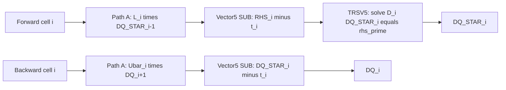
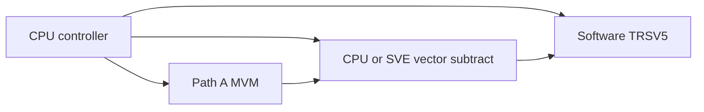
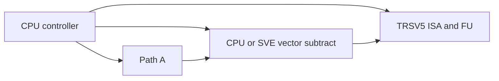
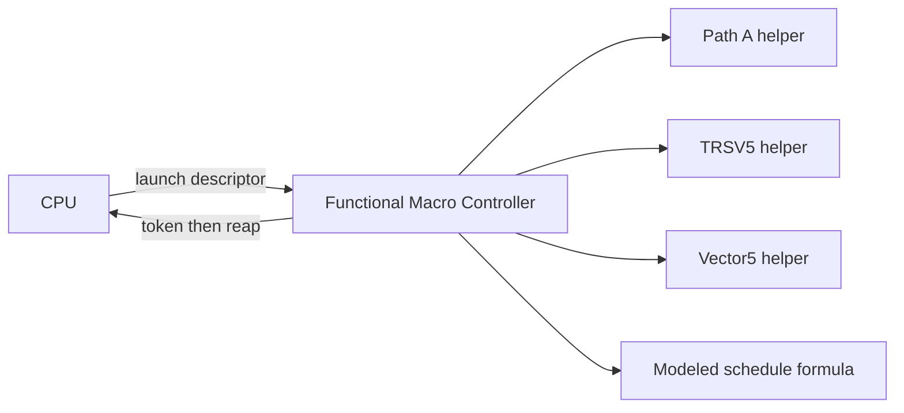
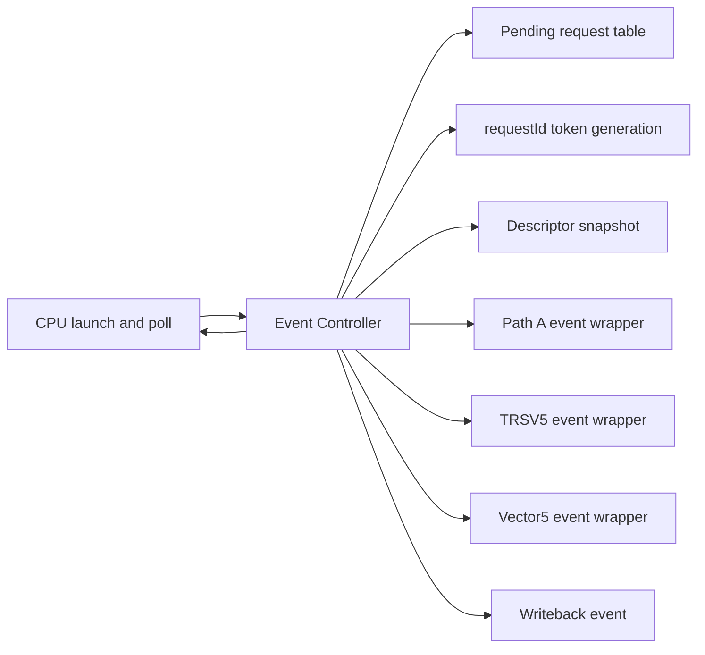
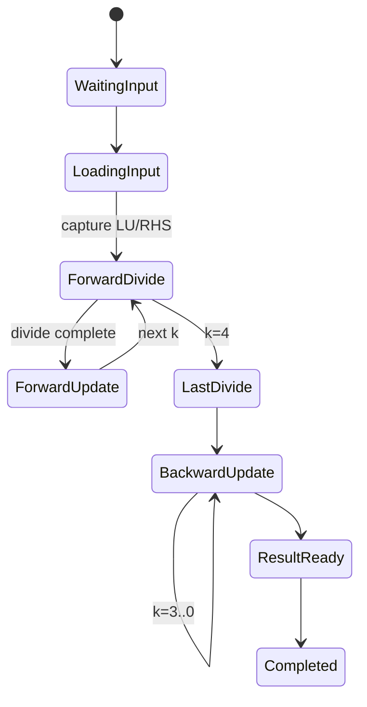
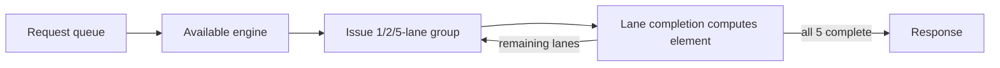
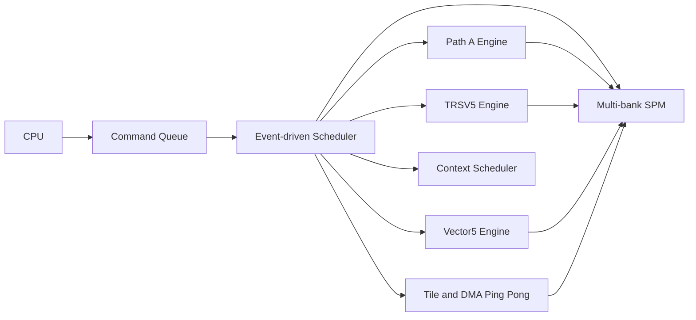

# gem5 ARM CFD-DSA LU-SGS 加速器完整技术报告

> 审计日期：2026-07-01
> 工程目录：`/home/zyy/gem5`
> 文档性质：基于当前代码、当前 stats 和既有回归记录的实现审计报告
> 状态基线：Step1、Step2、Step3 functional macro-controller、Step4-A.1 event lifecycle、Step4-B Path A resource graph，以及 Step4-C event-driven TRSV5/Vector5 engines 已实现

## 1. 摘要

本工程面向三维可压缩流计算中的 5 变量块 LU-SGS（Lower-Upper Symmetric Gauss-Seidel）过程，逐步把原本由 CPU 完成的块矩阵向量乘、5 阶 LU 三角求解、向量运算和扫描控制映射到 gem5 ARM 自定义 DSA 模型。

演进路线如下：

1. **Step1** 复用既有 Path A 完成 5x5 FP64 MVM，CPU 保留软件 TRSV、向量减法和循环控制。
2. **Step2** 用独立 `TRSV5` ISA/FU 替换前向扫描中的软件 5 阶 LU 求解，Path A 和 CPU 控制结构保持不变。
3. **Step3** 引入 descriptor、`cfd_lusgs_launch/wait`、Vector5 helper 和 functional macro-controller，并用解析公式给出 Stage A/B/C 调度周期。
4. **Step4-A/A.1** 把任务移出 launch 调用栈，建立 poll/reap、token、descriptor snapshot、逐请求 event、pending table、completion validation、watchdog 和错误生命周期。
5. **Step4-B** 已在 event controller 内把 Path A MVM 展开为 `6 MatLd + 5 Dotp + 1 Pack + 1 result-ready` 的子请求图。
6. **Step4-C** 已把 TRSV5 展开为 load、5 divide、20 multiply-subtract 和 result response，把 Vector5 展开为可配置 queue/count/1-2-5 lane 的 COPY/SUB/AXPY engine。

当前实现已经能够验证算法映射、ABI、任务生命周期和三个 controller 内计算资源图，但仍不是可流片硬件模型。Step3 的周期是解析调度结果；Step4-A.1/B/C 的周期是 gem5 event tick 差值。TRSV5 与 Vector5 已有 queue、busy、retry 和逐阶段 completion，SPM/DMA 仍未形成真实排队和竞争；`SETranslatingPortProxy` 的 functional 访问也不能等同于多 bank SRAM 端口时序。

### 1.1 代码审计后的关键修正

任务说明与当前工作区之间存在四处需要显式修正的差异：

- **Step4-B 已实现，而不是“尚未完成”**。其完成范围是 controller 内部 Path A 子请求图；它尚未与 guest Path A 的全局 O3 FUPool 共享同一仲裁实例。
- **Step4-C 已实现，而不是 fixed wrapper**。Stage C 热路径不再调用完整 TRSV/Vector helper；数值只在 divide/FMA/lane completion callback 更新。Stage A/B 兼容路径仍保留原 helper。
- **当前 Step1/2/3/4 主路径不是原地修改下一 cell 的 RHS**。代码为当前 cell 构造 `rhs_prime = RHS[i] - C[i] * DQ_STAR[i-1]`。原地更新下一 RHS 是数学等价实现，本文单独说明，但不把它误写成当前事实。
- **Step4-A.1 当前 1x64 记录是 1132 次 Busy poll**，对应 1133 条 wait 指令和 1 次成功 reap。旧材料中的 1133 次 Busy 来自不同记录口径或较早运行。

## 2. 研究背景与目标

LU-SGS 是 CFD 隐式时间推进和稳态求解中常用的近似因子化迭代方法。对于三维可压缩 Navier-Stokes 方程，每个网格单元通常包含 5 个守恒变量，因此线性化系统按网格单元组织为 5x5 FP64 块矩阵和 5x1 FP64 向量。

本工程的目标不是在 Step1 中一次性构造完整硬件，而是分阶段回答以下问题：

- 既有 5x5 MVM 指令能否正确承载 LU-SGS 的邻接块耦合；
- 5 阶 LU 求解是否值得独立成专用 ISA/FU；
- CPU 的逐 cell 调度能否迁入 macro-controller；
- launch/wait 是否具备非同步任务生命周期；
- 资源延迟是否能够从解析公式继续推进为逐请求 event 图；
- 最终如何加入共享资源竞争、多 bank SPM、多 context 和 tile/DMA。

本文坚持三条边界：

1. 数学语义以标准 `L/D/U` 定义为准，代码变量只在映射处出现。
2. functional 计算、解析 modeled schedule、event timeline 和 RTL 时序互不混用。
3. 当前性能用于架构探索和趋势比较，不作为流片后性能承诺。

## 3. LU-SGS 标准数学定义

### 3.1 原始线性系统

线性化后的增量方程为：

$$
A\Delta Q=b
$$

其中：

- $A$ 是线性化后的全局系数矩阵；
- $\Delta Q$ 是待求解的流场增量；
- $b$ 是右端项，通常与负残差 $-R(Q)$ 相关。

### 3.2 矩阵分裂

LU-SGS 使用标准分裂：

$$
\boxed{A=L+D+U}
$$

- $D$：块对角部分；
- $L$：严格块下三角部分；
- $U$：严格块上三角部分。

对 5 变量 CFD 系统，$D_i$、$L_{ij}$ 和 $U_{ij}$ 通常都是 5x5 FP64 块，每个块占 $25\times8=200$ B；单元向量占 $5\times8=40$ B。

### 3.3 LU-SGS 近似分解

标准近似因子化写为：

$$
\boxed{A\approx(D+L)D^{-1}(D+U)}
$$

因此近似系统为：

$$
\boxed{(D+L)D^{-1}(D+U)\Delta Q=b}
$$

这里的 $D^{-1}$ 表示对各块对角系统执行求解，不要求显式构造逆矩阵。

### 3.4 前向扫描

先求中间量 $\Delta Q^*$：

$$
\boxed{(D+L)\Delta Q^*=b}
$$

逐单元形式为：

$$
D_i\Delta Q_i^*+\sum_{j<i}L_{ij}\Delta Q_j^*=b_i
$$

因而：

$$
\boxed{
\Delta Q_i^*=D_i^{-1}
\left(b_i-\sum_{j<i}L_{ij}\Delta Q_j^*\right)
}
$$

$\Delta Q_i^*$ 只是前向扫描中间结果，不是最终解。

### 3.5 后向扫描

后向阶段满足：

$$
\boxed{(D+U)\Delta Q=D\Delta Q^*}
$$

逐单元形式为：

$$
D_i\Delta Q_i+\sum_{j>i}U_{ij}\Delta Q_j=D_i\Delta Q_i^*
$$

即：

$$
\boxed{
\Delta Q_i=\Delta Q_i^*-D_i^{-1}
\sum_{j>i}U_{ij}\Delta Q_j
}
$$

### 3.6 块三对角简化

当前 benchmark 每条 line 只保留相邻 cell 耦合。前向为：

$$
\boxed{
\Delta Q_i^*=D_i^{-1}
\left(b_i-L_i\Delta Q_{i-1}^*\right)
},\qquad
\boxed{\Delta Q_0^*=D_0^{-1}b_0}
$$

后向为：

$$
\boxed{
\Delta Q_i=\Delta Q_i^*-D_i^{-1}U_i\Delta Q_{i+1}
},\qquad
\boxed{\Delta Q_{N-1}=\Delta Q_{N-1}^*}
$$

若上三角块已预处理为 $\overline U_i=D_i^{-1}U_i$，则：

$$
\boxed{
\Delta Q_i=\Delta Q_i^*-\overline U_i\Delta Q_{i+1}
}
$$

当前代码的 backward 路径在 MVM 后不再调用 TRSV5，因此 `B_BAR[i]` **承担预处理上三角块的算法角色**。但是 benchmark 通过独立确定性缩放直接生成 `B_BAR`，没有在加速器路径中由 $D_i$ 和 $U_i$ 推导它。因此不能仅凭命名断言其生成式必然是 $D_i^{-1}U_i$；精确预处理过程不属于当前实现范围。

### 3.7 数学流程图



## 4. 软件算法与代码数据映射

### 4.1 标准符号与代码变量

| 标准符号 | 代码变量 | 实现含义 | 单 cell 大小 |
| --- | --- | --- | ---: |
| $D_i$ | `LU_A[i]` / `lu_a_base` | 块对角矩阵的紧凑 LU 存储 | 200 B |
| $L_i$ | `C[i]` / `c_base` | 前向下三角耦合块 | 200 B |
| $\overline U_i$ 的角色 | `B_BAR[i]` / `bbar_base` | backward 使用的预构造等效上三角块 | 200 B |
| $b_i$ | `RHS[i]` / `rhs_base` | 原始右端向量 | 40 B |
| $\Delta Q_i^*$ | `DQ_STAR[i]` / `dqstar_base` | 前向中间结果 | 40 B |
| $\Delta Q_i$ | `DQ[i]` / `dq_base` | backward 最终增量 | 40 B |
| $Q_i$ | `Q[i]` / `q_base` | 待更新流场变量 | 40 B |
| $\omega$ | `omega` | 可选 Q 更新系数 | FP64 |

代码中的 `A/B/C` 局部命名不得直接等同于全局矩阵 $A$ 或标准分裂的 $L/D/U$。本文只在引用具体代码变量时使用 `LU_A/C/B_BAR`。

### 4.2 当前前向实现

Step1、Step2、Step3 和 Step4 的主路径都按当前 cell 构造临时 RHS：

```text
tmp       = C[i] * DQ_STAR[i - 1]
rhs_prime = RHS[i] - tmp
DQ_STAR[i] = TRSV5(LU_A[i], rhs_prime)
```

这直接对应：

$$
\Delta Q_i^*=D_i^{-1}(b_i-L_i\Delta Q_{i-1}^*)
$$

### 4.3 原地前向更新的等价性

另一种常见实现会在求出 $\Delta Q_i^*$ 后更新下一单元的工作 RHS：

$$
b_{i+1}^{current}\leftarrow
b_{i+1}^{current}-L_{i+1}\Delta Q_i^*
$$

再执行：

$$
\Delta Q_{i+1}^*=D_{i+1}^{-1}b_{i+1}^{current}
$$

它与直接构造：

$$
\Delta Q_{i+1}^*=D_{i+1}^{-1}
(b_{i+1}-L_{i+1}\Delta Q_i^*)
$$

数学等价。**但当前主代码采用后一种直接构造方式，不应把等价的原地形式写成当前执行事实。**

### 4.4 地址与布局

descriptor 通过 line stride 和 cell stride 计算地址：

```text
base + line * line_stride_bytes + cell * cell_stride_bytes
```

矩阵 cell stride 至少 200 B，向量 cell stride 至少 40 B，所有有效基址要求 8 B 对齐。当前 event controller 还限制 `n_lines=1`、`contexts=1`、`tile_cells=1`，并以 96 KiB 作为容量检查上限。

## 5. 加速器总体架构

LU-SGS 热路径被划分为四类职责：

| 模块 | 数学职责 | 当前真实程度 |
| --- | --- | --- |
| Path A | 5x5 FP64 MVM，用于 $L_i\Delta Q_{i-1}^*$ 和 $\overline U_i\Delta Q_{i+1}$ | guest 路径有 ISA/O3 FU；Step4-B 在 controller 内有 event 子资源图 |
| TRSV5 | 解 $D_i x=r_i$ | Step2 ISA 保留 coarse helper；Step4-C 有独立 staged event engine |
| Vector5 | `COPY/SUB/AXPY` | Stage A/B 保留 helper；Step4-C 有独立 queue/lane engine |
| Macro Controller | descriptor、扫描、调度、写回、token、错误和 watchdog | Step3 functional；Step4 event-driven |

## 6. Path A MVM

### 6.1 运算定义

Path A 计算：

$$
y=Mx,\qquad M\in\mathbb{R}^{5\times5},\quad x,y\in\mathbb{R}^{5}
$$

在 LU-SGS 中有两处调用：

$$
t_i=L_i\Delta Q_{i-1}^*
$$

$$
t_i=\overline U_i\Delta Q_{i+1}
$$

### 6.2 guest Path A 指令序列

Step1/2 benchmark 的 `patha_mvm5_existing()` 使用：

1. 5 次矩阵行加载；
2. 1 次向量加载；
3. 5 次 `dotp_row`；
4. 1 次 `pack_acc`；
5. 1 次 predicated 40 B 写回。

主配置为：

```text
compact40 / pred40 / stride40
internal result buffer, depth=2
dotp_count=1, dotp opLat=7
pack_count=1
unroll=8
```

O3 配置中 MatLd 默认 `opLat=1, count=8`，Dotp 默认 `opLat=7, count=1`，Pack 默认 `opLat=1, count=1`。这些参数描述 gem5 可见资源延迟和数量，不表示已有对应 RTL 流水线。

### 6.3 Step4-A.1 与 Step4-B 的区别

- Step4-A.1 默认 Path A 请求等待固定 wrapper latency，完成后调用 `mvm5()` functional helper。
- Step4-B 在 controller 内创建 parent MVM，并展开 6 个 MatLd、5 个 Dotp、1 个 Pack 和 1 次 40 B result-ready transfer。
- Step4-B 仍不复用 guest Path A 的全局 O3 FUPool；两条路径只是参数语义相近，不是同一个仲裁实体。
- 当前只有一个 live `pathaTx`。即使 result slot depth 为 2，正常单 context 流程也不会自然形成两个 MVM 同时占槽的双缓冲证据。

## 7. TRSV5

### 7.1 数学职责

TRSV5 求解：

$$
D_i x=r_i
$$

`LU_A[i]` 保存已经分解的 5x5 LU 数据。$D_i^{-1}r_i$ 在实现中表示调用 TRSV5 求解，而不是生成或读取显式逆矩阵。

### 7.2 严格数值顺序

`src/arch/arm/cfd_trsv5_math.hh` 的顺序为：

```text
copy rhs -> value

for k = 0..3:
    value[k] /= lu[k][k]
    for i = k+1..4:
        value[i] -= lu[i][k] * value[k]

value[4] /= lu[4][4]

for k = 3..0:
    for i = k+1..4:
        value[k] -= lu[k][i] * value[i]
```

每次求解包含 5 次 FP64 division、10 次 forward multiply-subtract 和 10 次 backward multiply-subtract，共 20 次 multiply-subtract。

### 7.3 ISA/FU 与真实性边界

TRSV5 已具有：

- 独立自定义指令 decode；
- `CFDDSATrsv5` OpClass；
- O3 FU 配置，默认 `opLat=60, count=1`；
- issued/completed、busy latency、division、forward/backward multiply-subtract 和字节流量 stats。

Step2 `zreg-coarse` 模式在指令 `execute()` 中通过 Proxy 读取 LU/RHS，立即调用 helper 完成数值并写入 Z 寄存器。`opLat=60` 是 O3 可见的粗粒度结果延迟。

Step4-C 是另一条显式启用的 controller-internal event 路径：load completion 捕获 LU/RHS，此后 5 次 divide 和 20 次 multiply-subtract 分别占用参数化资源，并在 completion callback 更新 transaction 工作向量。两条路径同时保留，不能用 Step4-C 的 staged 统计反向声称 Step2 ISA 已具有相同内部流水。

## 8. Vector5

`src/arch/arm/cfd_lusgs_vec5.cc` 提供三个严格 5-lane helper：

```text
COPY: dst[i] = src[i]
SUB:  dst[i] = src0[i] - src1[i]
AXPY: dst[i] = src0[i] + scalar * src1[i]
```

对应 LU-SGS：

$$
r_i=b_i-t_i
$$

$$
\Delta Q_i=\Delta Q_i^*-t_i
$$

$$
Q_i=Q_i+\omega\Delta Q_i
$$

Step4-A.1/Stage A/B 保留 helper 兼容路径。Step4-C request accepted 时冻结输入和 scalar，由 1/2/5 lane completion callback 逐元素执行 COPY/SUB/AXPY；独立 queue、engine count、latency、initiation interval、busy/retry 和 result response 均可参数化。

## 9. Step1：Path A 复用验证

### 9.1 设计目标

Step1 不新增 TRSV 硬件，只复用已存在的 Path A 验证完整 LU-SGS 前向和后向映射。

### 9.2 执行路径

```text
Forward:
Path A computes C[i] * DQ_STAR[i-1]
CPU/SVE subtracts RHS[i] - tmp
CPU software TRSV solves LU_A[i]

Backward:
Path A computes B_BAR[i] * DQ[i+1]
CPU/SVE subtracts DQ_STAR[i] - tmp
```

首 cell 前向直接软件 TRSV；末 cell 后向执行 `DQ= DQ_STAR`。CPU 负责地址、循环、依赖和边界 cell。

### 9.3 架构图



### 9.4 意义与结果

对 $L$ 条 line、每条 $N$ 个 cell：

$$N_{MVM}=2L(N-1),\qquad N_{TRSV}=LN$$

8x64 对应 1008 次 Path A MVM 和 512 次软件 TRSV。记录结果为 319718 benchmark cycles，最大绝对误差 $1.6653345369377348\times10^{-16}$，判定 PASS。该阶段证明既有 MVM 自定义指令可正确嵌入完整 LU-SGS 依赖链。

## 10. Step2：独立硬件 TRSV5

### 10.1 变化范围

Step2 只把软件 TRSV 热路径替换为 `trsv5_lu_spm`。Path A 指令序列、CPU/SVE SUB、扫描顺序和边界逻辑保持不变：

```text
Path A MVM -> CPU/SVE SUB -> hardware TRSV5
```

### 10.2 架构图



### 10.3 8x64 结果与解释

| 指标 | 结果 |
| --- | ---: |
| Path A MVM | 1008 |
| hardware TRSV5 | 512 |
| software TRSV hot path | 0 |
| mismatch count | 0 |
| max abs error | $1.6653345369377348\times10^{-16}$ |
| max rel error | $4.1081041058986989\times10^{-16}$ |

性能有两种不同入口的比较：

| 比较条件 | cycles | speedup |
| --- | ---: | ---: |
| 同一 Step2 harness：software TRSV -> hardware TRSV5 | 361930 -> 318338 | 1.136936x |
| 冻结 Step1 独立入口 -> Step2 独立入口 | 319718 -> 318338 | 约 1.0043x |

两套入口的 benchmark 组织和校准方式不同，不能合并成单一加速比。衡量 TRSV 替换效果时，同一 Step2 harness 内的对照更直接；跨入口数据适合说明端到端 wall-cycle 接近，而不适合归因全部差异。

## 11. Step3：Functional Macro Controller

### 11.1 新增内容

Step3 引入：

- `CfdLusgsDescriptor` ABI；
- `cfd_lusgs_launch` 和 `cfd_lusgs_wait`；
- functional macro-controller；
- Vector5 helper；
- Stage C multi-line context 和 tile 统计模型；
- 可选 `Q += omega * DQ`；
- 任务、资源、数据流量、context、tile 和利用率统计。

### 11.2 真实执行路径

未启用 Step4 event controller 时，launch 执行以下过程：

1. 通过 `SETranslatingPortProxy` 读取 descriptor；
2. 在 `runTask()` 内同步完成全部 line/cell 的 forward、backward 和可选 Q update；
3. Path A 由 `mvm5()` helper 计算；
4. TRSV5 由 `cfdTrsv5Solve()` helper 计算；
5. Vector5 由 `cfdVec5*()` helper 计算；
6. 再调用 `modelSchedule()` 生成资源公式周期；
7. 返回 token，wait 仅承担 token 校验和 reap。

因此 Step3 的 token ABI 存在，但任务并未在 launch 返回后异步推进。

### 11.3 Stage A/B/C

| Stage | 实现内容 | 边界 |
| --- | --- | --- |
| A | 单 line 顺序 functional controller；SUB 作为 functional CPU 语义，不登记为 Vec5 请求 | 非 event 调度；调度函数虽保留 5-lane 分支，但当前 `Vec5SubRequests=0` |
| B | 独立 Vector5 helper、内部 `DQ_STAR/DQ` 驻留、可选 Q update | 仍在 launch 栈同步执行 |
| C | multi-line contexts、tile load/prefetch/buffer swap 与资源下界统计 | functional 顺序不变，仅解析调度模型扩展 |

### 11.4 架构图



### 11.5 Stage C 8x64 记录

| 指标 | 值 |
| --- | ---: |
| `TotalCycles` | 43344 |
| `CyclesPerFullCell` | 84.65625 |
| `PathARequests` | 1008 |
| `Trsv5Requests` | 512 |
| `Vec5SubRequests` | 1008 |
| `PathAUtilization` | 1.0 |
| `Trsv5Utilization` | 0.708749 |
| `Vec5Utilization` | 0.093762 |

这些是 **functional macro-controller + modeled schedule** 结果，不是逐事件硬件周期。`contexts=1/2/4/8` 都得到 43344，说明当前公式被 Path A resource bound 限制；context 数增加只改变统计，不产生真实 interleaving。

另一个审计差异是：算法理论和 Step4 event 路径每条 line 有 2 次 boundary COPY，但 Step3 `ControllerReport` 只预统计 forward 首 cell COPY，因此 8x64 stats 为 `Vec5CopyRequests=8`，而理论值是 16。这是 Step3 统计定义差异，不是算法少了 backward 边界赋值。

## 12. Step4-A：Event Controller Skeleton

Step4-A 将任务从 launch 调用栈中拆出。launch 不再执行完整 LU-SGS，而是创建任务、返回 token 并调度 controller event；wait 改为 poll-style：任务未完成返回 `Busy`，完成或错误后由正确 token reap。

状态机把 descriptor read、validation、forward load/PathA/Vec5/TRSV/write、backward load/PathA/Vec5/write、Q update 和 completion 拆成请求及等待状态。Step4-A 的主要成果是异步任务外壳，不是所有资源的硬件化。

## 13. Step4-A.1：逐请求生命周期

### 13.1 Task lifecycle

任务状态为：

```text
Idle
Queued
Running
CompletedNotReaped
ErrorNotReaped
Aborting
```

正常路径为：

```text
Idle -> Queued -> Running -> CompletedNotReaped -> Idle
```

错误路径进入 `ErrorNotReaped`，只有正确 token 的 wait 才能返回最终错误并清理任务。

### 13.2 Request identity

每条请求头包含：

```text
requestId
taskToken
taskGeneration
contextId
line
cell
tile
phase
resourceType
```

`PendingLusgsRequest` 另外保存 issue/completion tick、accepted/completed/cancelled 状态和独立 completion event。

### 13.3 Pending request table

live 请求存放于按 `requestId` 索引的 pending table，生命周期为：

```text
allocate -> issue -> accepted -> complete -> validate -> consume -> free
                                      \-> cancel when aborting
```

表项上限为 64。当前正常单 context 状态机通常一次只等待一条顶层请求，因此 Step4-A.1 与 Step4-B 的 `MaxPendingRequests` 都为 1；Path A 子请求由独立 `pathaTx` 管理，不计入同一个顶层 pending 峰值。

### 13.4 Completion validation

completion 到达时检查：

- request 是否 cancelled、重复或已消失；
- `taskGeneration` 和 `taskToken` 是否匹配当前任务；
- `contextId` 是否匹配；
- `requestId`、`resourceType` 和当前 wait state 是否一致；
- stale、unexpected、duplicate 和 wrong-state completion。

这些校验防止上一任务的迟到事件、错误资源回调或重复回调破坏当前任务。

### 13.5 Descriptor snapshot

launch 只记录 descriptor 地址、context 和新 token/generation。descriptor-read event 完成后，controller 通过 Proxy 读取并复制 `descriptorSnapshot`；validation 和后续所有地址计算只使用快照。因此 CPU 在 launch 后修改原 descriptor 不会改变已启动任务。

这保证的是 descriptor 元数据快照，不表示所有输入矩阵和向量都在 launch 时一次性快照。输入数据仍在后续对应 functional read 时取得。

### 13.6 Poll/reap 语义

`cfd_lusgs_wait(token)` 不是阻塞式 wait：

| 条件 | 返回 | 是否清理任务 |
| --- | --- | --- |
| 任务仍在 Queued/Running | `Busy=1` | 否 |
| Completed 且 token 正确 | `Complete=0` | 是 |
| Error 且 token 正确 | 最终错误码 | 是 |
| token 为 0、不匹配或无任务 | `BadToken=7` | 不清理合法任务 |

### 13.7 Watchdog、投机与 overlap

- watchdog 在配置阈值内无进展时返回 `WatchdogTimeout=10`，避免永久 Busy；
- launch/wait 指令标记为 non-speculative，并带 serialize-before/after 约束；
- wrong-path launch 不应创建 architectural token，wrong-path wait 不应 reap 合法 token；
- CPU 可在 controller event 运行期间执行不依赖该任务结果的工作，已有 overlap 测试覆盖此语义。

### 13.8 架构图



### 13.9 1x64 当前统计

数据源：`results/cfd_dsa/baselines/lusgs/step4a/1x64/stats.txt`。

| 统计 | 值 |
| --- | ---: |
| `lusgsEventActualCycles` | 11440 |
| `lusgsEventEventsProcessed` | 1859 |
| `lusgsEventPendingRequestAlloc/Free` | 575 / 575 |
| `lusgsEventMaxPendingRequests` | 1 |
| `lusgsEventWaitInstructions` | 1133 |
| `lusgsEventBusyPolls` | 1132 |
| `lusgsEventSuccessfulWaits` | 1 |
| `lusgsEventVec5CopyRequests` | 2 |
| `lusgsEventVec5SubRequests` | 126 |
| `lusgsEventVec5AxpyRequests` | 0 |
| stale/unexpected/duplicate completions | 0 / 0 / 0 |
| requestId/generation/wrong-state mismatches | 0 / 0 / 0 |
| watchdog/double-schedule errors | 0 / 0 |

alloc/free 配平表明该运行没有 pending request 泄漏；completion 异常为 0 表明当前单 context 生命周期内部一致；`MaxPendingRequests=1` 表明顶层状态机尚未并发等待多个资源。

## 14. Step4-B：Controller 内部 Path A 资源图

### 14.1 当前完成内容

开启 `--lusgs-step4-patha-real=1` 或 Stage B 后，每个 parent MVM 展开为：

```text
alloc result slot
-> 5 matrix-row MatLd + 1 vector MatLd
-> 5 dependency-aware Dotp
-> Pack after readyMask == 0x1f
-> 40B result-ready transfer
-> free slot and complete parent
```

| 资源 | 每 MVM 数量 | 默认建模 |
| --- | ---: | --- |
| MatLd | 6 | 40 B/read，latency=1，count=8 |
| Dotp | 5 | latency=7，count=1，按 row/vector ready 发射 |
| Pack | 1 | latency=1，count=1 |
| result-ready | 1 | 40 B，latency=1 |

MatLd completion 时通过 `SETranslatingPortProxy` 读取数据；Dotp completion callback 计算实际点积；Pack 等待 5 bit ready mask；result-ready 把结果交回 LU-SGS 临时向量并释放 slot。

### 14.2 资源保留与 backpressure

MatLd、Dotp 和 Pack 分别维护 unit availability，按 count 选择最早可用 engine。资源若不能立即接受会形成 retry/busy 统计。result slot 有 alloc/free、full stall、overwrite 和 early-consume 检查。

当前实现仍有两个结构限制：

1. controller 只允许一个 live `pathaTx`，因此无法同时推进两个 parent MVM；
2. controller Path A 与 guest Path A 不共享 O3 FUPool，尚无真正的 guest/controller 全局仲裁。

### 14.3 1x64 当前统计

数据源：`results/cfd_dsa/baselines/lusgs/step4b/1x64/stats.txt`。

| 统计 | 值 |
| --- | ---: |
| `lusgsEventActualCycles` | 7594 |
| `lusgsEventEventsProcessed` | 3369 |
| Path A MVM | 126 |
| MatLd | 756 |
| Dotp | 630 |
| Pack | 126 |
| 40 B result transfer | 126 |
| average MVM latency | 14 cycles |
| pending alloc/free | 511 / 511 |
| max top-level pending | 1 |
| wait / Busy / successful reap | 748 / 747 / 1 |
| completion validation errors | 全部 0 |

计数满足 `MatLd=6*MVM`、`Dotp=5*MVM`、`Pack=MVM`。7594 是当前 event 参数和单 context 依赖下的 controller timeline，不是 RTL 频率闭合后的最终周期。

## 15. Step4-C：Event-driven TRSV5 与 Vector5

### 15.1 TRSV5 engine

每个 `Trsv5EventRequest` 带 Step4-A.1 header、LU/RHS 地址和 transaction buffer。queue 区分 waiting、active、resource wait、result ready 与 cancelled；queue 满时 `trySubmitTrsv5()` 返回 false，controller 保持 request state，由 engine ready event 唤醒。



默认 transaction/divider/FMA 数量为 1/1/1，load/div/FMA/result latency 为 2/4/3/1，queue depth=2，forwarding 开启。forward 同一 `k` 的不同 `i` 写不同元素，可由多个 FMA 并行；backward 同一 `k` 连续累积到 `value[k]`，保持严格顺序。完整 helper 仅保留给 Step2/Stage A-B/golden，不在 Step4-C 热路径调用。

### 15.2 Vector5 engine



COPY/SUB/AXPY 输入在 request accepted 时冻结。默认 count=1、lanes=5、COPY/SUB/AXPY latency=1/3/4、II=1、queue depth=2。lane 数 1/2/5 与 queue depth 1/2/4 均已验证；资源忙时排队或 retry，不提前产生结果。

### 15.3 Controller 数据流与 validation

```text
forward: Path A -> Vector5 SUB/COPY -> TRSV5 -> DQ_STAR write
backward: Path A -> Vector5 SUB/COPY -> DQ write
Q update: Q read -> Vector5 AXPY -> Q write
```

engine response 仍通过 pending table 校验 requestId、generation、token、context、resource、phase 和 wait state。测试注入覆盖 TRSV divide completion 丢失、stale generation、bad request-id 和重复 Vector5 completion；error path 会取消 transaction、释放 queue，并允许 reap 后启动合法任务。

### 15.4 计数、性能与参数趋势

1x64 实测 `LUSGS_STEP4C_PASS`、三组比较 mismatch=0：Path A MVM/MatLd/Dotp/Pack=`126/756/630/126`；TRSV/divide/FMA=`64/320/1280`，其中 forward/backward 各 640；Vector COPY/SUB/lane-op=`2/126/640`。pending alloc/free=511/511，正常 completion validation 异常均为 0。

1x50000 使用可选 `--dram-size=128MB` 完成大规模端到端验证：actual cycles=6999974，TRSV/divide/FMA=`50000/250000/1000000`，Vector request/lane-op=`100000/500000`，pending=`399999/399999`，reference/Step2/Step4-C 三组 mismatch 均为 0。默认 DRAM 仍为 16MB；benchmark 在 stats reset 前触碰输出页，以满足 SE functional Proxy 不能触发 guest lazy page fault 的约束。

| timeline | actual event cycles | event count | 说明 |
| --- | ---: | ---: | --- |
| Step4-A.1 | 11440 | 1859 | 计算资源均为 coarse wrapper |
| Step4-B | 7594 | 3369 | 仅 Path A 展开 |
| Step4-C | 8934 | 5737 | Path A、TRSV5、Vector5 均为 staged event graph |

默认 TRSV 平均延迟 83 cycles，Vector5 平均延迟 2.96875。1x17 参数扫描：divide latency 4/8/16 得 2354/2694/3374 cycles；FMA latency 3/4/5 得 2354/2694/3034；FMA count 1/2/4 得 2354/2150/2048；Vector lanes 1/2/5 得 2490/2422/2354；SUB latency 1/3/5 得 2290/2354/2418。正常单 context 下增加 TRSV/Vector queue depth 或 Vector engine count没有收益；专用并行压力测试在 queue depth=1 时两侧都产生 retry=1、queue-full=1 且最终正确。

这些变化反映参数化 gem5 资源图，不是工艺频率或面积结论。Step4-C 高于 Step4-B 的主要原因是原 60-cycle TRSV coarse wrapper 被 83-cycle 可解释 staged timeline 取代，并增加真实 stage/lane event 数。

## 16. Descriptor、ISA 与错误码

### 16.1 Descriptor 真实字段

`CfdLusgsDescriptor` 当前字段顺序为：

```text
uint64_t lu_a_base
uint64_t c_base
uint64_t bbar_base
uint64_t rhs_base
uint64_t dqstar_base
uint64_t dq_base
uint64_t q_base
uint32_t n_lines
uint32_t n_cells
uint32_t line_stride_bytes
uint32_t matrix_cell_stride_bytes
uint32_t vector_cell_stride_bytes
uint32_t flags
uint32_t tile_cells
double   omega
```

flags 包括 `WRITE_DQ`、`UPDATE_Q`、`CHECK_BOUNDS` 和 `TRACE`。`UPDATE_Q` 要求非零 `q_base`；event controller 还根据写回要求检查 `dq_base`，并要求核心输入基址存在且 8 B 对齐。

### 16.2 状态码

| 值 | 状态 | 含义 |
| ---: | --- | --- |
| 0 | `Complete` | 成功完成 |
| 1 | `Busy` | poll 时任务未完成 |
| 2 | `BadDescriptor` | descriptor 地址或必需字段非法 |
| 3 | `BadShape` | line/cell 数非法 |
| 4 | `BadStride` | stride 或 tile_cells 非法 |
| 5 | `BadAlignment` | 地址未 8 B 对齐 |
| 6 | `UnsupportedFlags` | flags 超出支持集合 |
| 7 | `BadToken` | token 无效或不匹配 |
| 8 | `UnsupportedStage` | stage/shape/context/tile 组合不支持 |
| 9 | `SpmCapacity` | 96 KiB 容量检查失败 |
| 10 | `WatchdogTimeout` | 长时间无进展 |
| 11 | `UnexpectedCompletion` | 非法 completion |
| 12 | `InternalStateError` | controller 内部状态错误 |

### 16.3 ISA 与提交边界

launch/wait 使用互斥 decode tag，并具有 `IsNonSpeculative`、`IsSerializeBefore`、`IsSerializeAfter` 属性。`CFDDSALusgsCtrl` 是独立 OpClass。该设计把 architectural token 的创建和 reap 放在非投机提交边界，但不等同于完成了 RTL 级乱序、异常恢复和精确中断验证。

## 17. 当前模块连接和数据可见性

### 17.1 Step4 数据路径

```text
CPU descriptor
-> launch creates token
-> descriptor-read event
-> descriptor snapshot and validation
-> forward cells
   -> read LU/RHS/(C and previous DQ_STAR)
   -> Path A wrapper or Step4-B graph
   -> Vector5 SUB/COPY wrapper or Step4-C lane engine
   -> TRSV5 wrapper or Step4-C divide/FMA engine
   -> DQ_STAR functional write + write event
-> backward cells
   -> read B_BAR/next DQ
   -> Path A wrapper or Step4-B graph
   -> Vector5 SUB/COPY wrapper or Step4-C lane engine
   -> DQ functional write + write event
-> optional Q read, AXPY, Q write + event
-> CompletedNotReaped
-> wait reaps token
```

### 17.2 Functional helper 仍存在的位置

| 路径 | 当前数值执行 |
| --- | --- |
| Step4-A.1 Path A | wrapper completion 后 `mvm5()` |
| Step4-B Path A | MatLd/Dotp/Pack/result event 图，Dotp callback 做数值 |
| Step4-A/B TRSV5 | wrapper completion 后 `cfdTrsv5Solve()` |
| Step4-C TRSV5 | load/divide/FMA/result callback 逐步更新 transaction，无完整 helper |
| Step4-A/B Vector5 | wrapper 前后调用 `cfdVec5Copy/Sub/Axpy()` |
| Step4-C Vector5 | lane completion callback 逐元素计算，无完整 helper |
| descriptor、LU/RHS、DQ、Q | `SETranslatingPortProxy` functional read/write |

descriptor、SPM read/write 和最终 DQ/Q 写入仍通过 Proxy；这些 event 主要延迟控制器可见完成时间。因此“有 write event”不表示数据字节经过了真实 bank queue 后才落地。Step4-C 计算输入在 load/accept 时冻结，计算完成时不会重新读取 guest 输入。

## 18. 理论请求计数

对 $L$ 条 line、每条 $N$ 个 cell：

$$
N_{MVM}=2L(N-1)
$$

$$
N_{TRSV}=LN
$$

$$
N_{Vec5Sub}=2L(N-1)
$$

$$
N_{Vec5Copy}=2L
$$

TRSV5 内部操作数为：

$$
N_{Div}=5LN,qquad
N_{ForwardFMA}=10LN,qquad
N_{BackwardFMA}=10LN
$$

仅在 Q update 启用时：

$$
N_{Vec5Axpy}=LN
$$

Path A 展开后：

$$
N_{MatLd}=6N_{MVM},\qquad
N_{Dotp}=5N_{MVM},\qquad
N_{Pack}=N_{MVM}
$$

8x64 理论值：

| 请求 | 数量 |
| --- | ---: |
| MVM | 1008 |
| TRSV5 | 512 |
| divide | 2560 |
| forward multiply-subtract | 5120 |
| backward multiply-subtract | 5120 |
| Vec5 SUB | 1008 |
| Vec5 COPY | 16 |
| Vec5 AXPY | 512，仅启用 Q update 时 |
| MatLd | 6048 |
| Dotp | 5040 |
| Pack | 1008 |

这些公式描述算法请求数。具体 stats 若采用不同 instrumentation 定义，例如 Step3 只记录 forward COPY，应在解释时单独注明。

## 19. 性能统计口径

### 19.1 四类结果必须分开

| 类别 | 代表数据 | 测量/生成方式 | 能说明什么 |
| --- | --- | --- | --- |
| Benchmark software cycles | Step1 319718；Step2 318338 | guest benchmark 读取或折算周期 | 给定 guest/O3/runner 下的端到端软件执行成本 |
| Functional execution | Step3 `runTask()` | launch 栈内一次性完成数值和 Proxy 访问 | 功能、ABI、地址和算法正确性 |
| Modeled schedule cycles | Step3 Stage C 43344，84.65625/full-cell | 请求计数乘固定 latency，再取资源/依赖下界 | 参数化资源趋势，不是事件时间线 |
| Actual event cycles | Step4-A.1 11440；Step4-B 7594；Step4-C 8934 | `(completeTick-startTick)/ticksPerCycle` | 当前 event controller 在给定 wrapper/资源图下的时间线 |

### 19.2 不可直接比较的原因

- Step1/2 包含真实 guest 指令、循环、pollution 和 O3 行为；Step3 modeled cycles 不包含同样的软件开销。
- Step3 的 Path A/TRSV/Vec5 busy 是请求数和固定 latency 的解析结果，没有逐请求排队。
- Step4-A.1 有逐请求 event，但 Path A、TRSV5、Vector5 和 SPM 大多仍是 fixed-latency wrapper。
- Step4-B 只把 Path A 展开；TRSV5、Vector5 和 SPM 仍未完成真实资源图。
- Step4-C 展开 TRSV5/Vector5 计算，但 SPM 仍无 bank/port 时序，且没有多 context 或 DMA。
- Step4 event controller 当前限制 1 line、1 context、tile=1，不能用来证明多 context 吞吐。
- gem5 配置中的 2 GHz 时钟只是模拟换算条件，不证明 RTL 可在 2 GHz 收敛。

### 19.3 当前可支持的结论

可以说：

- Step2 的硬件 TRSV5 在同一 harness 中减少了 guest benchmark cycles；
- Step3 的解析模型判断 Path A 是 8x64 Stage C 的资源下界；
- Step4-A.1 建立了可验证的异步生命周期；
- Step4-B 的 controller 内 Path A 图满足理论子请求计数，并把 1x64 event timeline 从 11440 降为 7594 cycles。
- Step4-C 的 TRSV5/Vector5 统计来自真实 stage/lane event，1x64 timeline 为 8934 cycles；高于 Step4-B 不代表失败。

不能说：

- 84.65625 cycles/cell 是实际硬件吞吐；
- 7594 cycles 是流片后周期；
- 8934 cycles 是流片后周期或 Step4-B 到 Step4-C 的硬件减速比；
- Proxy 访问已经证明多 bank SPM 无冲突；
- `opLat=60` 证明 TRSV5 内部精确执行 60 拍；
- result slot depth=2 已证明双 MVM overlap。

## 20. 验证矩阵

下表只列入现有文档、stats 或回归记录明确存在的项目：

| 阶段/模块 | 测试 | 记录结果 |
| --- | --- | --- |
| Step1 | 1x1、1x2、1x3、1x17、2x17、8x17、8x64 | PASS |
| Step2 | 1x1、1x17、8x64；8x64 mismatch=0 | PASS |
| Step3 | Stage A/B/C；multi-line/context/tile；错误路径 | PASS |
| Step4-A.1 | 1x1、1x2、1x3、1x17、1x64 | PASS |
| Step4-B | 1x1、1x2、1x3、1x17、1x64 | PASS |
| Step4-C | 1x1、1x2、1x3、1x17、1x64、1x512、1x50000 | PASS，mismatch=0 |
| Vector5 | AXPY omega=1/0.5/-0.25；lanes=1/2/5；queue=1/2/4 | PASS，Q mismatch=0 |
| Backpressure | TRSV/Vector queue depth=1 并行压力 | 两侧 retry/queue-full 均大于 0，PASS |
| TRSV5 | 1、17、512、50000 次 | PASS |
| Path A | standalone regression | PASS |
| Path C | standalone regression | PASS |
| Decode | custom decode exclusive test | PASS |
| Error | bad descriptor/shape/stride/alignment/flags/token/stage/SPM capacity | PASS |
| Lifecycle | descriptor snapshot、poll/reap、error then legal | PASS |
| Speculation | wrong-path launch/wait | PASS |
| Overlap | CPU/controller independent work | PASS |
| Watchdog | timeout injection | PASS |
| Completion validation | stale generation、bad request-id、duplicate completion | 对应计数=1；错误 reap 后合法任务 PASS |

本轮重新运行原 TRSV5 ISA 1/17/512/50000，均为 `TRSV5_PASS`；50000 次为 20374532 cycles，div/mul-sub=`250000/1000000`，误差为 0。Step4-C staged engine 经 macro-controller 覆盖到 50000 transactions，内部 div/FMA=`250000/1000000` 且误差为 0。

## 21. Step4-D 至 Step4-F 规划

### 21.1 Step4-B 的剩余工作

Step4-B 的 controller-internal 资源图已经完成。若要达到“系统级真实 Path A”，仍需：

- 允许多个 live parent MVM，使 depth=2 slot 能实际并发占用；
- 把 rowReadyMask、retry、full stall 和 backpressure 置于真实并发压力下；
- 将 guest Path A 与 controller Path A 接到同一资源仲裁层；
- 统一 O3 FUPool、controller event engine 和 SPM 端口的占用语义；
- 验证 guest/controller 同时请求时的公平性和无死锁性。

### 21.2 Step4-C 后续系统级工作

Step4-C 的 controller-internal queue、divider/FMA dependency graph、Vector lane、accept/retry/busy/completion 已完成。系统级仍需：

```text
share or isolate FP64 datapaths across Path A/TRSV5/Vector5
connect all three engines to the Step4-D banked SPM arbiter
validate simultaneous requests from multiple contexts
define fairness, priority and starvation policy
map architectural parameters to an eventual RTL microarchitecture
```

当前 divider/FMA/lane count 和 latency 已可扫描，但仍只是 gem5 架构参数。是否共享 FP64 datapath、如何映射流水级和结果 bypass，必须在 RTL 阶段结合工艺、面积和时序重新确定。

### 21.3 Step4-D：Multi-bank SPM

需要显式定义：

```text
bank count and interleave function
read/write port count
port width and latency
outstanding queue depth
bank conflict and port conflict
accept/retry protocol
arbitration among Path A, TRSV5, Vector5 and DMA
```

所有 descriptor、LU/RHS、DQ 和 Q 访问必须从 Proxy functional timing 分离为真实请求。Proxy 可继续承担 SE 地址翻译或 golden data access，但不能继续充当最终时序端口。

### 21.4 Step4-E：多 Context 调度

目标 context 数为 1/2/4/8。需要：

- 每个 context 独立 line/cell/phase/request/token 状态；
- ready mask 和 blocked reason；
- round-robin 或 age-based 仲裁；
- 一个 context 等待 Path A/TRSV/SPM 时推进其他 line；
- 真实 active context、resource overlap、fairness 和 starvation 证据；
- 保持同一 line 内 forward/backward 严格数据依赖。

LU-SGS 不能跨依赖链任意批处理。可利用的并行性主要来自相互独立的 line/context 和资源级流水重叠，而不是打破单 line 的递推顺序。

### 21.5 Step4-F：Tile/DMA 与 Ping/Pong

需要：

```text
DMA setup and burst
tile prefetch
single-buffer baseline
Ping/Pong double buffer
buffer ownership and swap
cross-tile DQ_STAR/DQ carry
capacity, alignment and tail handling
DMA/SPM/compute overlap
abort and partial-transfer recovery
```

目标是在计算 Ping tile 时预取下一 Pong tile，但必须保留 forward 最后一 cell 和 backward 第一 cell 的跨 tile carry，不能用 tile 并行破坏递推依赖。

### 21.6 最终目标架构



## 22. 当前硬件真实性边界

| 层级 | 已完成 | 尚缺 |
| --- | --- | --- |
| 数学/功能 | 标准 block LU-SGS 映射、边界 cell、Q update | 更广泛 CFD 输入与异常数值验证 |
| ISA | Path A、TRSV5、launch/wait、OpClass/FU/stats | 精确异常、中断和系统态协议 |
| Controller | Step3 functional；Step4 token/event/pending/watchdog | 多 context、abort 完整恢复、真实全资源仲裁 |
| Path A | guest ISA/O3 路径；Step4-B 内部资源图 | guest/controller 共享实例、多 MVM overlap |
| TRSV5 | Step2 coarse helper；Step4-C queue/divider/FMA event graph | 与其他模块共享资源、RTL 映射 |
| Vector5 | Stage A/B helper；Step4-C queue/lane/结构竞争 | 与 SPM/其他 context 的系统仲裁 |
| 存储 | Proxy functional access；96 KiB 容量检查 | bank/port/queue/conflict、DMA、coherence |
| 实现 | gem5 C++ 模型和测试 | RTL、综合、STA、PPA、DFT |

## 23. 流片风险与后续 RTL 工作

当前离流片至少存在以下差距：

1. 没有 RTL 实现。
2. 没有逻辑综合结果。
3. 没有静态时序分析（STA）。
4. 没有基于目标工艺库的可达频率。
5. 没有面积数据。
6. 没有动态或静态功耗数据。
7. FP64 divider 和 FMA 的数量、流水深度与共享关系未确定。
8. Path A 与 TRSV5 是否共享 FP64 资源未确定。
9. 当前多请求参数不能直接映射为真实 SRAM 多端口。
10. 96 KiB 容量尚未计入 ECC、BIST、padding、metadata 和 Ping/Pong 实际开销。
11. cache coherence、一致性域和 CPU/DSA 数据可见性协议尚未建模。
12. DMA descriptor、burst、IOMMU/地址错误和完成语义尚未实现。
13. reset、abort、timeout、partial writeback 和恢复尚未 RTL 化。
14. NaN、Inf、denormal、舍入模式和 FP exception 尚未完整验证。
15. 多 context ready/arbiter 逻辑可能形成关键路径。
16. gem5 的 2 GHz 配置不代表 RTL 可以达到 2 GHz。

此外还需要补充 CDC、reset domain、ECC 错误注入、BIST、DFT、性能计数器可见性、软件驱动和版本化 ABI。**因此当前结果只能用于架构探索、功能验证和趋势比较，不能直接作为流片后性能承诺。**

## 24. 常见误解

1. **代码中的 `A[i]` 不等于全局矩阵 $A$。** 全局 $A=L+D+U$；局部变量名必须结合上下文解释。
2. **TRSV5 不是普通 MVM。** 它含除法和前后代入依赖，不能由一次 5x5 MVM 等价替代。
3. **$D_i^{-1}$ 不是显式求逆。** 当前通过 `cfdTrsv5Solve()` 对 LU 存储执行求解。
4. **原地更新下一 RHS 与直接构造当前 `rhs_prime` 数学等价。** 当前代码实际采用直接构造方式。
5. **backward 不再调用 TRSV5 是因为 `B_BAR` 承担预处理上三角块角色。** 其精确生成式未在当前加速器中实现。
6. **Step3 的 84.65625 cycles/full-cell 不是实际硬件周期。** 它来自 `modelSchedule()` 的资源/依赖公式。
7. **Step4-A.1 有 event 不代表全部资源已有真实竞争。** Stage A 默认仍使用 fixed-latency wrapper + helper。
8. **Step4-C 的计算资源事件化不等于 SPM 已事件化。** LU/RHS/DQ/Q 的数值访问仍依赖 Proxy，没有 bank/port 冲突。
8. **contexts 参数增加不等于真正并行。** Step3 只改变统计；Step4 当前仍限制单 context。
9. **functional SPM 读取不等于真实多 bank SPM。** `SETranslatingPortProxy` 没有表达 bank/port 冲突。
10. **gem5 FU `opLat` 不等于 RTL 内部所有阶段已经实现。** 它只是调度器可见的延迟参数。
11. **Step4-B 已完成不等于 Path A 系统级共享资源已经完成。** 当前图只存在于 event controller 内部。
12. **slot depth=2 不自动产生双缓冲。** 需要至少两个同时存活的 parent MVM 才能证明 overlap。

## 25. 代码审计索引

| 主题 | 当前代码来源 |
| --- | --- |
| Step1 guest Path A 与扫描 | `projects/cfd_dsa/benchmarks/lusgs/test_cfd_lusgs_patha_step1.c` |
| Step2 hardware TRSV5 | `projects/cfd_dsa/benchmarks/lusgs/test_cfd_lusgs_patha_step2.c` |
| TRSV5 数学顺序 | `src/arch/arm/cfd_trsv5_math.hh` |
| TRSV5/launch/wait 指令 | `src/arch/arm/insts/cfd_dsa.cc`、`custom_cfd.isa` |
| Descriptor、status、stats record | `src/arch/arm/cfd_lusgs_controller.hh` |
| Step3 functional controller/model | `src/arch/arm/cfd_lusgs_controller.cc` |
| Step4-A.1/B/C controller 与三个 event engine | `src/arch/arm/cfd_lusgs_event_controller.cc` |
| Vector5 helper | `src/arch/arm/cfd_lusgs_vec5.hh/.cc` |
| SPM 与统计 | `src/arch/arm/cfd_local_spm.hh/.cc` |
| OpClass/FU | `src/cpu/op_class.hh`、`src/cpu/o3/FuncUnitConfig.py` |
| 参数和环境变量 | `projects/cfd_dsa/configs/run_cfd_dsa.py` |

## 26. 数据来源

| 关键数据 | 来源 |
| --- | --- |
| Step1 8x64：319718 cycles、1008 MVM、512 software TRSV | `CFD_DSA_LUSGS_STEP1.md` |
| Step2 8x64：361930 -> 318338、1.136936x；冻结入口 319718 -> 318338 | `CFD_DSA_LUSGS_STEP2.md` |
| TRSV5 1/17/512/50000 campaign | `CFD_DSA_TRSV5.md` |
| Step3 Stage C：43344、84.65625、利用率 | `results/cfd_dsa/archive/legacy-2026-07-05/top-level/m5out_reg_step3_8x64_stageC_step4b/stats.txt`、`CFD_DSA_LUSGS_STEP3.md` |
| Step4-A.1 1x64：11440、1859、575/575、1132 Busy | `results/cfd_dsa/baselines/lusgs/step4a/1x64/stats.txt` |
| Step4-B 1x64：7594、126/756/630/126、14-cycle MVM | `results/cfd_dsa/baselines/lusgs/step4b/1x64/stats.txt` |
| Step4-C 1x64：8934、64 TRSV、320 divide、1280 FMA、640 lane op | `results/cfd_dsa/baselines/lusgs/step4c/1x64/stats.txt` |
| Step4-C 1x50000：6999974、50000 TRSV、250000 divide、1000000 FMA | `results/cfd_dsa/baselines/lusgs/step4c/1x50000/stats.txt` |
| Step4-C 参数敏感性 | `results/cfd_dsa/campaigns/2026-07-01-step4c/sensitivity/*/stats.txt` |
| Step4-C backpressure/trace/completion injection | `results/cfd_dsa/campaigns/2026-07-01-step4c/faults/`、`trace/` |
| Step4 正常、错误、生命周期、wrong-path、overlap、watchdog 回归 | `CFD_DSA_LUSGS_STEP4.md` 与 `results/cfd_dsa/campaigns/2026-07-01-step4c/` |

统计文件中部分 SimObject stats 会在不同 dump section 重复出现，本文只按一次任务语义计数。

## 27. 一致性检查结论

- 公式统一使用 $A=L+D+U$、$D_i/L_i/U_i$、$\Delta Q_i^*/\Delta Q_i$。
- `LU_A/C/B_BAR` 分别映射块对角 LU、前向下三角耦合和预构造 backward 耦合角色。
- `B_BAR` 没有被无证据地写死为某个生成公式。
- Step3 modeled cycles 与 Step4 event cycles 已分栏，不作同口径加速比。
- Step4-A.1、Step4-B 与 Step4-C 已分开描述；后两者的完成边界限定为 controller 内资源图。
- Step2 coarse TRSV5 没有被描述成内部精确 60 拍流水；Step4-C 83-cycle 默认值可由真实 stage 参数解释。
- Proxy 没有被描述成真实 SPM bank/port。
- 8x64 理论计数同时覆盖 Path A、TRSV divide/FMA 和 Vector5。
- 当前单 line 递推依赖没有被 context/tile 概念掩盖。

## 28. 总结

本工程已经从“CPU 调用现有 MVM”推进到“具有异步任务生命周期，并能展开 Path A、TRSV5、Vector5 三类计算资源的 LU-SGS event controller”。Step1 证明算法映射，Step2 验证专用 TRSV5，Step3 建立 descriptor 和 macro-controller，Step4-A.1 建立可靠 request lifecycle，Step4-B 展开 MVM，Step4-C 消除了 controller 热路径中的 TRSV/Vector fixed wrapper。

下一阶段的优先级是 Step4-D 的真实 multi-bank SPM 端口，使三个计算 engine 进入可信的共享存储竞争环境。随后再引入依赖感知的多 context 调度和 Ping/Pong tile/DMA，才能把当前架构探索模型推进为可支撑 RTL 微架构选择的时序模型。
