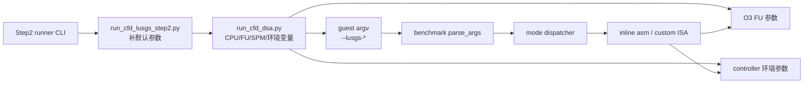
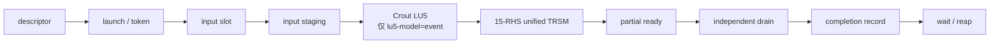
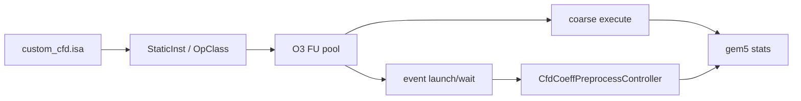

# CFD DSA / LU-SGS Step2 当前执行路径与技术细节

本文档说明仓库中 **当前** Step2 benchmark 的实际执行方式。结论来自 runner、guest
benchmark、ARM 自定义 ISA、FU 配置、系数事件控制器和本地 SPM 的调用关系；历史性能
数字不作为当前默认路径的证据。

> 审查基线：2026-07-22。路径和行号均相对 gem5 仓库根目录。

## 1. 先给结论

当前 Step2 的主入口是：

```text
projects/cfd_dsa/configs/lusgs/run_cfd_lusgs_step2.py
  -> projects/cfd_dsa/configs/run_cfd_dsa.py
  -> build/cfd_dsa/aarch64/test_cfd_lusgs_patha_step2_arm
  -> projects/cfd_dsa/benchmarks/lusgs/test_cfd_lusgs_patha_step2.c::main()
  -> parse_args() 按 --lusgs-mode 选择一条或多条模式
```

证据：runner 设置 wrapper、默认 binary 和 O3 CPU，最后转入统一配置
（`projects/cfd_dsa/configs/lusgs/run_cfd_lusgs_step2.py:36-41`、`:153-156`）；
benchmark 的 `main()` 位于
`projects/cfd_dsa/benchmarks/lusgs/test_cfd_lusgs_patha_step2.c:6168`，模式解析位于
同文件 `:4357-4595`。

必须区分两个“默认”：

- runner 的默认 `--lusgs-mode=all` 会依次运行 reference、Step1、多个 prepared-input
  Step2 变体以及 raw TRSV/pretransform 变体；它是综合回归入口，不是单一性能主路径
  （`run_cfd_lusgs_step2.py:143-149`；benchmark `:4364-4380`、`:4516-4533`）。
- 面向当前 raw `D/L/U/R` 的功能主路径是 raw coefficient preprocessing + Path A hot
  loop。事件级系数模型需显式传 `--coeff-preprocess-model=event`；runner 默认仍为
  `coarse`，LU 默认仍为 guest software LU（`run_cfd_lusgs_step2.py:89-114`）。

因此，不能把“不带参数运行 Step2 runner”描述为“默认执行 event coeff3”。默认实际是
`all + coarse + software-LU` 的回归组合。

## 2. Step2 是模式族，不再只是“Path A + TRSV5”

最初的 Step2 定义是：Step1 的 Path A MVM 保持不变，以 TRSV5 替换每个 cell 的软件
5×5 LU solve。该基线仍可用，但当前同一个 benchmark 已扩展出以下模式族：

1. prepared-input：输入已经是 `lu_a=LU(D)`、`c_mat=L`、`b_bar=D^-1 U`；
2. raw TRSV5：输入为原始 `D/L/U/R`，先生成 `lu_d` 和 `u_bar`；
3. raw pretransform dual：在公共预处理后，再生成 `Dinv` 和 `Lbar`；
4. raw pretransform coeff3 coarse：一条 coarse 指令生成 `Dinv/Lbar/Ubar`；
5. raw pretransform coeff3 event：descriptor + launch/wait 驱动事件控制器；
6. context / non-context / hardware line-buffer：改变跨 cell 依赖值保存位置；
7. core / forwarded：逐步融合 MVM、减法以及 forward RHS 到 TRSV5 的传递。
8. raw pretransform streaming：Stage A wavefront；`sync/queue/auto` 三种退休路径；默认
   B1.5 auto-retire + B2.5 固定 boundary mask；B3 DInv 与 B4 Lbar consumer 均可选
   `off/shadow/direct`。

完整 mode dispatcher 在
`projects/cfd_dsa/benchmarks/lusgs/test_cfd_lusgs_patha_step2.c:4498-4595`。所以本文中的
“Step2”若未带 mode，只表示这个实验框架；讨论具体执行模型时必须写完整模式名。

## 3. 数据语义：prepared 与 raw 不能混用

`Problem` 同时保存 raw、公共预处理、legacy prepared 和 pretransform 数组，这正是当前
最容易混淆的地方（定义：
`projects/cfd_dsa/benchmarks/lusgs/test_cfd_lusgs_patha_step2.c:67-120`）。

| 字段 | 数学语义 | 生产者 | 消费路径 |
|---|---|---|---|
| `d_mat` | 原始块对角矩阵 `D` | problem 初始化 | raw reference、raw preprocess |
| `l_mat` | 原始下邻块 `L` | problem 初始化 | raw TRSV、raw coeff3 |
| `u_mat` | 原始上邻块 `U` | problem 初始化 | raw preprocess |
| `rhs` | 右端 `R`（prepared/raw 共用该数组） | problem 初始化 | reference 和各 hot loop |
| `lu_d` | `LU(D)` 的紧凑 5×5 存储 | software LU 或 event LU | TRSV、TRSM |
| `u_bar` | `D^-1 U` | MRHS、coeff3 coarse/event | raw backward |
| `lu_a` | legacy prepared `LU(D)` | prepared 数据生成；raw 运行时临时别名到 `lu_d` | prepared/aliased raw solver |
| `c_mat` | legacy prepared `L` | prepared 数据生成；raw 运行时临时别名到 `l_mat` | prepared/aliased raw forward |
| `b_bar` | legacy prepared `D^-1 U` | prepared 数据生成；raw 运行时临时别名到 `u_bar` | prepared/aliased raw backward |
| `d_inv` | `D^-1` | dual 或 coeff3 | pretransform forward |
| `l_bar_precomputed` | `D^-1 L` | dual 或 coeff3 | pretransform forward |

raw TRSV 复用 prepared solver 时会暂时执行：

```text
p->lu_a = p->lu_d
p->c_mat = p->l_mat
p->b_bar = p->u_bar
```

调用结束后恢复原指针。该别名桥接位于 benchmark `:4141-4168`，不表示 raw `U` 与
legacy `b_bar` 具有相同语义。

## 4. 配置和参数如何到达执行层



Step2 wrapper 只在用户未提供参数时补默认值（`run_cfd_lusgs_step2.py:31-34`）。其中：

- Path A 默认 direct SPM、40-byte read、`pred40` store、2-entry result buffer、
  dot-product latency 7/count 1（`:43-59`）；
- TRSV5/MRHS/dual/coeff3 coarse latency 分别为 60/100/200/300（`:61-75`）；
- event coeff3 默认 RHS lanes=15、div=1、mul/sub=1、partial output 开启、input slots=2、
  output depth=4（`:86-129`）；
- problem 默认 1 line × 17 cells × 1 sweep（`:40`、`:143-147`）。

统一配置把 guest 参数传入 binary，并用同一组参数配置 O3 FU、SPM 和事件控制器；对应
代码见 `projects/cfd_dsa/configs/run_cfd_dsa.py:1381-1482`、`:3481-3566`、
`:3661-3742`。这意味着性能比较必须保留完整命令行，不能只记录 mode 名。

## 5. prepared-input Step2 的逐 cell 执行

### 5.1 公共 sweep 入口

prepared Step1/Step2/core/forwarded/context/linebuf 最终都进入
`patha_lusgs_solve()`（benchmark `:3177-3215`），区别由五个布尔量决定：

```text
hardware_trsv, fused_sub, forwarded_rhs, context, linebuf
```

| mode | 参数组合 | forward RHS | 相邻值来源 | 状态/用途 |
|---|---|---|---|---|
| `step1` | `0,0,0,0,0` | Path A MVM + 软件减法 + 软件 TRSV | guest 数组 | prepared golden/regression |
| `step2` | `1,0,0,0,0` | Path A MVM + 软件减法 + SPM RHS TRSV5 | guest 数组 | 原始 Step2 基线 |
| `step2-core` | `1,1,0,0,0` | fused MVM-sub，结果仍需 RHS staging | guest 数组 | 融合实验 |
| `step2-core-forwarded` | `1,1,1,0,0` | pack-sub 的 Z 结果直接送 Z-RHS TRSV5 | guest 数组 | 当前 TRSV hot-loop 基线 |
| `step2-core-forwarded-context` | `1,1,1,1,0` | 同上 | `Forward/BackwardLineContext` | software context 对照 |
| `step2-core-forwarded-linebuf` | `1,1,1,0,1` | 同上 | 硬件 line buffer | hardware forwarding 实验 |

模式到布尔量的实际调用位于 benchmark `:6453-6530`；模式别名定义于 `:4546-4565`。

### 5.2 forward sweep

`patha_forward_sweep()` 位于 benchmark `:2889-3040`：

1. `cell=0` 没有前驱 MVM，直接对 `R[0]` 做 software/TRSV5 solve；
2. `cell>0` 计算 `L[i] * dq_star[i-1]`；
3. 形成 `rhs = R[i] - L[i] * dq_star[i-1]`；
4. 对 `LU(D[i]) * dq_star[i] = rhs` 做 5×5 solve；
5. 把 `dq_star[i]` 留给下一个 cell。

基础 `step2` 的 RHS 会先 stage 到固定 SPM 槽，再执行 `trsv5_lu_spm`，结果从 Z11
写回 guest 数组（SPM staging 和指令封装：benchmark `:980-1022`）。

forwarded 变体使用 `patha_mvm_sub5_trsv5_forwarded_from_source()`：Path A pack-sub
把五 lane RHS 留在 Z 寄存器，随后用 Z-RHS TRSV5，避免 RHS 的 stack/SPM 往返
（helper：benchmark `:2231-2349`；指令封装 `:642-657`、`:633-639`）。

### 5.3 backward sweep

`patha_backward_sweep()` 位于 benchmark `:3043-3175`：

1. 最后一个 cell 直接令 `dq[last] = dq_star[last]`；
2. 由后向前计算 `Ubar[i] * dq[i+1]`；
3. 计算 `dq[i] = dq_star[i] - Ubar[i] * dq[i+1]`。

backward 不再调用 TRSV5，因为 `Ubar=D^-1 U` 已在输入中准备好。它仍使用 Path A
MVM，并可选择普通 guest 数组、software context 或 hardware line buffer 保存 next 值。

### 5.4 Path A 指令序列

普通 MVM 的 guest helper 是 `patha_mvm5_existing()`（benchmark `:1909` 起），其逻辑为：

```text
matrix/vector staging
  -> lmat/load
  -> 5 行 dotp
  -> internal result buffer
  -> pack 或 pack-sub
  -> Z register
  -> store/forward
```

这里的 “internal-buffer” 是 Path A 的指令内部结果缓冲，不是 LU-SGS context，也不是
coefficient event 的 output ring。

## 6. raw TRSV5 路径

模式：`step2-trsv5-raw`、`step2-trsv5-raw-context`。入口是
`run_trsv5_raw()`（benchmark `:4134-4175`）。

```mermaid
flowchart LR
    RAW[D / L / U / R] --> LU[每 cell: LU(D)]
    LU --> UB[MRHS: solve LU * Ubar = U]
    UB --> F[Forward: L*MVM + Sub + Z-RHS TRSV5]
    F --> B[Backward: Ubar*MVM + Sub]
    B --> OUT[dq]
```

执行顺序：

1. 按 `coefficient_update_interval` 把 sweeps 分块；0 表示整个运行只更新一次系数
   （benchmark `:4137-4147`）。
2. coarse 模式调用 `prepare_raw_common(..., generate_ubar=1)`；event 模式调用
   `prepare_raw_event(..., coeff3=0)`（`:4148-4150`）。
3. 生成 `lu_d` 与 `u_bar` 后，用上一节的 alias 桥接进入
   `patha_lusgs_solve(..., 1,1,1,use_context,0)`（`:4159-4168`）。
4. 因而 raw TRSV hot loop 固定使用 fused + forwarded RHS，不等同于 legacy `step2`
   的软件减法/SPM RHS 基线。

公共 coarse 预处理的 LU 在 guest 中调用 `cfd_lu5_factor()`，Ubar 使用 5-RHS MRHS
指令；实现入口为 `prepare_raw_common()`（benchmark `:1328-1406`）。

event 且 `coeff3=0` 时 controller 只处理 `D/U` 两个输入和 5 RHS，输出 `LU/Ubar`；
它不是 15-RHS coeff3（controller 根据 flag 选择 5 或 15 RHS：
`src/arch/arm/cfd_coeff_preprocess_controller.cc:621-646`）。

## 7. pretransform 路径

pretransform 把 forward 的逐 cell TRSV 提前变换为 MVM：

```text
Dinv  = D^-1
Lbar  = D^-1 L
Ubar  = D^-1 U

forward cell 0: dq_star = Dinv * R
forward cell i: dq_star = Dinv * R - Lbar * dq_star[i-1]
backward:       dq      = dq_star - Ubar * dq[i+1]
```

因此 forward 非首 cell 有两次 Path A MVM，hot loop 没有 TRSV5。代码在 benchmark
`pretransform_forward_sweep():3218-3278` 和
`pretransform_backward_sweep():3281-3344`。

### 7.1 prepared pretransform

`step2-pretransform[-context]` 使用 prepared `lu_a/c_mat/b_bar`，MRHS 分别求
`Dinv/Lbar`，并复用已有 `b_bar=Ubar`。`step2-pretransform-optprep[-context]` 使用 dual
INV/LBAR 指令比较系数生成方案。入口见 `preprocess_coefficients():1410` 起、
`trsm5_inv_lbar_hardware():1534` 起和 prepared solver `:3347-3415`。

这些模式用于兼容和系数生成对照，不是 raw 输入主路径。

### 7.2 raw dual

`step2-pretransform-raw` 与 `-context`：

1. `prepare_raw_common()` 生成 `lu_d` 和 `u_bar`；
2. `prepare_raw_extra_dual()` 用 dual INV/LBAR 生成 `d_inv/l_bar_precomputed`；
3. 进入 pretransform forward/backward。

dual 路径入口为 benchmark `:3417-3494`，用于兼容、对照和系数生成方案比较。

### 7.3 raw coeff3 coarse

`step2-pretransform-raw-optprep` 与 `-context` 在默认 `coarse` 模型下：

1. guest software LU 生成 `lu_d`；
2. `trsm5_coeff3_spm` 一次求解 15 RHS：`I | L | U`；
3. 输出 `Dinv | Lbar | Ubar`；
4. O3 只观察到该自定义指令配置的 coarse latency，默认 300 cycles。

指令封装和 coarse staging 位于 benchmark `:677-682`、`:3502-3587`；具体数学在
自定义指令 `execute()` 中一次性完成，位于 `src/arch/arm/insts/cfd_dsa.cc:1707-1780`。

该路径适合功能回归和固定延迟上界/对照，不是逐周期硬件模型。

### 7.4 raw coeff3 event

同一 `step2-pretransform-raw-optprep[-context]` mode 加上
`--coeff-preprocess-model=event` 后改走 `prepare_raw_event(..., coeff3=1)`（分派：
benchmark `:4197-4204`）。这里还要再看 `--lu5-model`：默认 `software` 会先在 guest
生成 `lu_d`，descriptor 带 `PACKED_LU_INPUT`，controller 从现成 LU 开始 TRSM；只有
`--lu5-model=event` 才由 controller 从原始 `D` 执行 Crout LU，再生成
`Dinv/Lbar/Ubar`（benchmark `:3937-3998`）。



每个 cell 的 descriptor 包含版本、flags、generation、line/cell id、输入/输出地址和
completion record；guest 定义位于 benchmark `:488-560`。launch/wait/cancel 的 inline
asm 位于 `:685-705`。

controller 的关键行为：

- `launch()` 校验 descriptor/地址，分配 token；coeff3 为 15 RHS，TRSV preprocess 为
  5 RHS，并拒绝同一 line/cell 的非递增 generation
  （`src/arch/arm/cfd_coeff_preprocess_controller.cc:609-673`）；
- `wait()` 对普通 descriptor 在未完成时返回 Busy，完成后 reap 并删除 request；仅带
  `CFD_COEFF_PRE_STREAMING_PROGRESS` 的新 descriptor 可返回 DInv/Lbar/Ubar drain-ready
  progress，且 progress 不 reap token；`cancel()` 负责撤销 slot、drain task 并写
  completion record（同文件 `:677-723`）；
- 每个 tick 的顺序是完成运算、分配输入槽、推进输入、启动/推进 LU、启动/推进 solve、
  drain、完成 request 和统计资源活动（`:1902-1929`）；
- event controller 只在环境模型为 `event` 时启用（`:1937-1946`）。

guest 使用深度为 `coeff_output_buffer_depth` 的 token/output ring：ring 满时先 reap head，
全部 launch 后再回收剩余项；实现位于 `prepare_raw_event():3917-4130`，Busy polling helper
位于 `reap_coeff_event():3819-3836`。

重要边界：上述同步语义仍适用于 `step2-pretransform-raw-optprep[-context]`、
`raw-compare[-context]` 等旧 mode；`prepare_raw_event()` 会在返回前回收全部请求，随后才
进入 hot loop。

新增显式实验 mode `step2-pretransform-raw-optprep-stream` 已移除这一
preprocess→forward 全局 barrier：guest 维护 per-cell window，DInv/Lbar 完整 drain-ready
后启动对应 cell forward，同时让 Ubar 和后续 cell coefficient request 后台推进。旧 mode
没有静默改变。该路径当前仅支持 single line / single sweep，且仍保留 forward→backward
barrier。B3 direct 已实现 DInv 逐列消费和 request-local base；B4 direct 已实现 Lbar 逐列消费、
request 生命周期之外的相邻 dq_star handoff、ForwardCombine、40 B dq_star timed publish，并
跳过 guest 全部 forward Path A。tail-first Ubar、backward frontier 和双 frontier 尚未实现。完整接口、状态机、实测
timeline 和边界见 `projects/cfd_dsa/docs/CFD_DSA_LUSGS_STEP2_STREAMING.md`。

## 8. context、non-context 和 line buffer

`ForwardLineContext` / `BackwardLineContext` 定义在 benchmark `:571-583`。

| 变体 | 保存内容 | 值存储位置 | 数学结果 |
|---|---|---|---|
| non-context | 前一个 `dq_star` / 后一个 `dq` | guest 输出数组，下一 cell 再读取 | 与 reference 相同 |
| context | 每条 line 的最近 5-lane 值和有效标志 | guest heap context 数组 | 与 non-context 相同 |
| linebuf | 最近值/有效性 | gem5 Path A line-buffer 状态 | 与前两者相同 |

context 在每个 sweep 前 reset（benchmark `:2867-2885`、`:3197-3205`）；它减少/改变
guest 数组访问，但仍由 CPU loop 决定 cell 顺序。linebuf helper 位于 benchmark
`:2351-2529`，对应 decode/execute 是独立硬件 forwarding 实验。

三者的性能不能只用算法 MVM/TRSV 数量解释，还受 load/store、指令依赖、Z 寄存器传递
以及 O3 调度影响。当前三者都应保留回归；不能因数值等价就把 context 当成默认替代。

## 9. 自定义 ISA、OpClass 与 FU 边界

| 操作 | Step2 用途 | 执行模型 | 关键实现 |
|---|---|---|---|
| Path A load/dotp/pack | 5×5 MVM、fused subtract | 普通 custom inst + Path A 内部缓冲 | decoder `src/arch/arm/isa/formats/custom_cfd.isa:274-319` |
| pack-sub | 将 MVM 结果与 RHS/`dq_star` 相减 | 普通 custom inst，结果留 Z | decoder `custom_cfd.isa:219-223` |
| TRSV5 SPM | legacy Step2 staged RHS | coarse FU execute | decoder `custom_cfd.isa:263-272`；execute `src/arch/arm/insts/cfd_dsa.cc:1414-1469` |
| TRSV5 Z-RHS | forwarded/raw forward solve | coarse FU execute | execute `cfd_dsa.cc:1480-1539` |
| TRSM5 MRHS | raw Ubar/legacy pretransform | coarse FU execute | decoder `custom_cfd.isa:204-212`；execute `cfd_dsa.cc:1550-1609` |
| dual INV/LBAR | dual 系数路径 | coarse FU execute | decoder `custom_cfd.isa:196-199`；execute `cfd_dsa.cc:1621-1696` |
| coeff3 | coarse 15-RHS | coarse FU execute | decoder `custom_cfd.isa:200-203`；execute `cfd_dsa.cc:1707-1780` |
| coeff launch/wait/cancel | event 预处理控制 | controller event | decoder `custom_cfd.isa:248-262`；execute `cfd_dsa.cc:2039-2151` |
| linebuf 操作 | hardware context | custom stateful instruction | decoder `custom_cfd.isa:224-237` |



TRSV/MRHS/dual/coeff3 coarse 均以 FU `opLat` 对 O3 暴露固定占用/完成时间；默认 latency
来自 Step2 runner `:61-75`，FU class 定义在 `src/cpu/o3/FuncUnitConfig.py` 的 CFD
TRSV/MRHS/dual/coeff3 单元。event launch/wait 指令本身不等价于预处理完成，真实推进由
controller tick 完成。

O3 当前负责发射 guest 指令、跟踪寄存器/内存依赖、执行 FU latency 和运行 CPU 控制流；
它不自动理解跨 cell LU-SGS 数学依赖。event controller 内部接管的仅是 coefficient
request 的 slot、LU/TRSM lane、partial-ready、drain、backpressure、token/generation 和
completion 调度。

## 10. SPM 和存储访问边界

Step2 至少涉及三类“本地/临时存储”，不能统称为同一 SPM：

1. coarse TRSV/MRHS/dual/coeff3 的固定 SPM staging：guest helper 调用
   `functional` 风格读写后执行一条 coarse 指令；
2. `CfdLocalSpm`：统一配置创建并映射本地窗口，提供 functional blob 访问和内部
   packet/arbitration 接口；
3. Path A internal result buffer、line buffer，以及 event controller 的 request-local
   buffer/output ring：这些是控制器/指令状态，不是 guest 可直接寻址的同一数组。

event 的 `--coeff-spm-model=internal` 默认使用 `CfdLocalSpm` 内部 bank/port/outstanding
仲裁（runner `:115-129`）。即使配置名或统计使用 packet，也只是控制器到
`CfdLocalSpm` 的内部 request/response 模型；当前没有接入 gem5 cache/memory hierarchy
的真实 timing packet 路径。性能报告应写“内部 SPM 仲裁模型”，不能写成“真实 packet
memory system”。

## 11. 错误、验证与回退

raw 路径并非失败后继续使用未初始化系数：

- raw common preprocess 失败时，TRSV raw 复制 raw software reference 输出并停止该
  chunk，计入 `common_preprocess_fallback_runs`（benchmark `:4151-4157`）；
- pretransform 的 common 阶段失败时同样回退到 raw reference（`:4205-4211`）；
- common 成功但 extra pretransform 失败时，若启用 fallback，则用剩余 sweeps 走 fused
  forwarded TRSV5 raw，并计入 `pretransform_fallback_to_trsv5_raw`（`:4213-4234`）。

event `coeff-validation` 支持 full/sampled/performance。残差、矩阵比较和 validation cycle
单独累计（benchmark `:4067-4117`）。`performance` 关闭高成本残差检查不等于关闭
finite/status 检查；做正确性回归仍应使用 `full`。

## 12. 统计与周期口径

当前 benchmark 为每个 mode 分配独立 `Stats` 和 `CompareResult`，并在各模式前后调用
gem5 stats reset/dump（初始化与运行分派从 benchmark `:6168` 起）。因此 `all` 模式的
`stats.txt` 可能包含多段 dump，不能把最后一段自动当作全部模式总计。

raw 周期应按下列口径解释：

```text
common_preprocess = LU + Ubar（或 event 中对应阶段）
extra_preprocess  = Dinv/Lbar，coeff3 时也包括统一 15-RHS solve 的额外口径
runtime           = forward + backward sweep
validation        = residual / compare，单独统计
total             = preprocess + runtime；不要把 validation 混入硬件吞吐
```

TRSV raw 明确记录
`trsv5_raw_total_cycles = common_preprocess_cycles + trsv5_raw_runtime_cycles`
（benchmark `:4171-4174`）；pretransform raw 明确记录
`common + extra + runtime`（`:4254-4258`）。不同 coarse `opLat` 与 event controller 周期
不是同一执行模型，不能直接当作硬件方案的逐周期同比。

理论 hot-loop 计数（每 sweep、每 line、`cells=C`）：

| 路径 | Path A MVM | TRSV5 |
|---|---:|---:|
| Step1/Step2/TRSV raw | `2(C-1)` | Step1 为 0；Step2/raw 为 `C` |
| pretransform | `3C-2` | 0 |

其中 pretransform forward 为 `1 + 2(C-1)=2C-1` 次 MVM，backward 为 `C-1` 次。

## 13. 模式选择速查

| 目的 | 建议 mode/参数 | 原因 |
|---|---|---|
| prepared 兼容基线 | `--lusgs-mode=step2` | 保留最初 Path A + staged TRSV5 语义 |
| 当前 raw TRSV 回归 | `--lusgs-mode=step2-trsv5-raw --coeff-preprocess-model=coarse` | raw 输入、简单公共预处理 |
| coarse coeff3 功能对照 | `--lusgs-mode=step2-pretransform-raw-optprep --coeff-preprocess-model=coarse` | 固定 opLat、易做功能回归 |
| event coeff3 功能主路径 | `--lusgs-mode=step2-pretransform-raw-optprep --coeff-preprocess-model=event` | descriptor/controller/15-RHS/partial drain 完整路径 |
| streaming B2.5 兼容基线 | `--lusgs-mode=step2-pretransform-raw-optprep-stream --coeff-stream-dinv-consumer=off` | 完整 DInv drain + guest DInv Path A；冻结历史点 15648 cycles |
| streaming 当前 B3 性能路径 | 同上并设 `--coeff-stream-dinv-consumer=direct` | in-order ColumnFma5 + 40 B base publish；跳过 DInv drain/guest MVM；1×17 实测 15466 cycles、mismatch 0 |
| streaming B3 数值回归 | 同上并设 `--coeff-stream-dinv-consumer=shadow` | 两路同时执行并逐 cell bitwise compare，不作为性能点 |
| streaming B4 性能路径 | B3 direct 并设 `--coeff-stream-lbar-consumer=direct` | controller-local prev-dq handoff + 同一 ColumnFma5 + ForwardCombine + 40 B dq_star publish；同构建 1×17 为16754、off为18158 |
| streaming B4 数值回归 | B3 direct 并设 `--coeff-stream-lbar-consumer=shadow` | guest Lbar Path A 与 controller correction/dq_star 逐 cell bitwise compare，不作为性能点 |
| streaming queue 压力回归 | 同上但 `--coeff-stream-retire-mode=queue` | 保留 B1 bounded completion queue/reaper、慢 drain 与乱序 reap 覆盖，不作为性能推荐 |
| raw 三方案比较 | `--lusgs-mode=raw-compare` | 同时跑 reference、TRSV raw、dual、coeff3 |
| context 对比 | `--lusgs-mode=raw-compare-context` | 对应的 context 三方案 |
| 全部兼容回归 | `--lusgs-mode=all` | 覆盖最多，但不适合作为单模式性能口径 |

event 功能主路径的建议显式命令：

```bash
build/ARM/gem5.opt -d results/cfd_dsa/runs/step2-event-check \
  projects/cfd_dsa/configs/lusgs/run_cfd_lusgs_step2.py \
  --lusgs-mode=step2-pretransform-raw-optprep \
  --coeff-preprocess-model=event \
  --lu5-model=event \
  --coeff-validation=full \
  --lusgs-lines=1 --lusgs-cells=17
```

面积/性能探索时再显式改变 `coeff3-rhs-lanes`、divider/mulsub 数量和 validation；不得把
这些参数省略后只记录“event”。runner 当前默认 RHS15/div1/mulsub1，见
`run_cfd_lusgs_step2.py:102-114`。

### 13.1 Streaming 当前具体执行路径（Stage A+B1.5+B2.5+B3+B4）

```text
raw D/L/U/R per cell
  -> guest 生成 NEED_DINV/LBAR/UBAR mask
  -> launch descriptor（controller snapshot）
  -> controller 固定 batch/RHS mask table
  -> event Crout LU5
  -> request-local 15-bit mask + fixed 15-entry worklist
  -> DInv column ready -> 按 k=0..4 的 ColumnFma5 -> base accumulator
  -> B4 off: 40 B BaseVector timed drain -> guest Lbar Path A + subtract
  -> B4 shadow/direct: controller-local previous dq_star handoff
  -> cell>0 按 k=0..4 用同一 ColumnFma5 累加 Lbar*dq_prev
  -> bounded ForwardCombine: dq_star=base-correction
  -> 40 B DqStarVector timed drain
  -> direct 跳过 DInv/Lbar matrix drain、BaseVector 和全部 guest forward Path A
  -> terminal record 完整发布 -> controller auto-retire request/token
  -> guest 检查 generation/status/Ubar -> backward
  -> backward 结束后聚合完整 record stats
```

N=1 只请求 DInv；head 请求 DInv+Ubar；interior 请求三者；tail 请求 DInv+Lbar。旧
descriptor 未设置 NEED bits 时仍为全 15 RHS。launch slot、forward consumer、backward Ubar、
stable completion record 和 controller request/token 是独立所有权域。auto 正常路径为 0 WAIT、
0 completion queue scan；record 在 token 释放后仍稳定。`queue` 显式模式继续保留旧 reaper，
慢 drain 压力用例用于验证 terminal 前复用和乱序 reap。
完整状态机、统计和证据见 `projects/cfd_dsa/docs/CFD_DSA_LUSGS_STEP2_STREAMING.md`。

B3/B4 descriptor 不扩容：reserved[0]/[1] 分别携带 R/base，reserved[2]/[3] 分别携带 shadow
correction/dq_star；bit10..13 分离 DInv/Lbar consumer 与各自 matrix-drain bypass。R 先经过现有
input timing；base/dq_star 只有对应 output drain complete 后才 ready。ColumnFma5 是 controller
内共享资源（默认 4/1/1/5），ForwardCombine 默认 1/1/1/2，二者都不是 ISA/FU。B4 direct
1×17 的 Path A MVM 为 forward 0 + backward 16，避免 DInv drain/reload各3400 B、Lbar各3200 B，
证据 `results/cfd_dsa/campaigns/stageb4-final-perf4/`；完整实现、浮点顺序和 handoff 生命周期见
`projects/cfd_dsa/docs/CFD_DSA_LUSGS_STEP2_STREAMING.md`。

## 14. Step2 与 Step3/Step4 的关系

当前 Step2 benchmark 仍由 guest CPU 外层循环推进 line/cell/sweep。所谓 core、forwarded、
linebuf 只是减少 cell 内或相邻 cell 的数据往返；它们没有把整条 LU-SGS sweep 交给一个
macro controller。

Step3/Step4 的 controller/event 工作是并行保留的后续实验：coefficient event 已把系数
输入、LU、TRSM、drain 调度移入 controller；新 streaming Stage A 让 guest forward 在系数
request 尚未全局结束时启动，但 forward/backward cell 调度仍由 guest 驱动。故不能因为
Step2 使用 coefficient event 或 streaming mode 就称其为“完整 Step4 LU-SGS controller
路径”。

## 15. 修改影响面与回归建议

经常修改且会直接改变 Step2 行为的文件：

- `projects/cfd_dsa/benchmarks/lusgs/test_cfd_lusgs_patha_step2.c`：数据、模式分派、
  preprocess、hot loop、validation、benchmark stats；
- `projects/cfd_dsa/configs/lusgs/run_cfd_lusgs_step2.py`：Step2 默认参数；
- `projects/cfd_dsa/configs/run_cfd_dsa.py`：参数到 SimObject/FU/controller 的桥接；
- `src/arch/arm/isa/formats/custom_cfd.isa`：decode 和 OpClass；
- `src/arch/arm/insts/cfd_dsa.cc`：coarse 指令数学语义；
- `src/arch/arm/cfd_coeff_preprocess_controller.cc`：event 状态机和周期；
- `src/arch/arm/cfd_local_spm.cc`：event 内部 SPM 仲裁；
- `src/cpu/o3/FuncUnitConfig.py`：O3 FU 数量/latency。

不应轻易修改：指令编码、SPM ABI 地址、descriptor/record layout、LU/TRSM 数值顺序和
prepared 数据语义。修改任一项都需要 decode-exclusive、standalone TRSV5、raw compare、
coarse/event correctness、generation/cancel/backpressure 和 SPM bank-conflict 回归。

文档-only 修改至少执行：

```bash
python3 -m py_compile \
  projects/cfd_dsa/configs/run_cfd_dsa.py \
  projects/cfd_dsa/configs/lusgs/run_cfd_lusgs_step2.py \
  projects/cfd_dsa/tools/run_suite.py

python3 -m json.tool \
  projects/cfd_dsa/suites/coeff-event-sensitivity.json >/dev/null

git diff --check
```

若修改 C++/ISA/Python/SConscript，则还需构建 gem5、guest 并运行对应最小回归。

## 16. 历史基线说明

旧版本文档记录过 prepared Step2 在 `1x1` 至 `8x64` 上相对 Step1 harness 的性能数据，
并把 Step2 简化描述为“Path A MVM + 软件 vector subtract + TRSV5”。这些数据仅对应早期
prepared-input baseline，且当前文档审查未确认其结果目录、提交版本和完整命令行；因此
不用于 raw/coarse/event 的当前结论。需要引用历史数字时，应先从 `results/cfd_dsa/`
定位原始 `simout/stats` 并补齐规模、mode、参数和版本。

## 17. 尚待确认

1. `--lusgs-mode=all` 是否应继续作为 runner 默认值，还是改成显式 regression suite；
   当前只记录事实，不改默认值。
2. B4 Lbar consumer 已实现且同构建 direct 快于 off 7.73%，但16754未达到14500，且比历史
   B3 direct15466慢8.33%。先优化 previous-dq/Lbar readiness、dq_star frontier 与 guest dispatch，再决定
   是否进入 tail-first Ubar/B5；off/shadow 必须保留。
3. `coeff-spm-model=packet` 的命名是否应改成更准确的 internal packet/arbitration；当前
   不修改接口以保持回归兼容。
4. 历史 Step2 性能表对应的正式 evidence 目录和 gem5 commit 待确认。
5. prepared-input 系列是否长期只保留最小模式集合；在测试依赖审查完成前不得删除。
6. wrong-cell/wrong-generation 通过 `--coeff-cancel-test=1` 内部的 test-only descriptor flag
   显式注入；正常 runner 不暴露或设置这两个 bit。其用途仅是证明防御检查，不属于性能模式。

## 18. 推荐阅读顺序

1. 本文档；
2. `projects/cfd_dsa/configs/lusgs/run_cfd_lusgs_step2.py`；
3. benchmark 的 `Problem`、`parse_args()`、`main()`；
4. `projects/cfd_dsa/docs/CFD_DSA_LUSGS_STEP2_STREAMING.md`；
5. benchmark 的 `patha_lusgs_solve()`、`run_trsv5_raw()`、
   `run_pretransform_raw()`、`prepare_raw_event()`、`run_pretransform_raw_stream()`；
6. `src/arch/arm/isa/formats/custom_cfd.isa`；
7. `src/arch/arm/insts/cfd_dsa.cc`；
8. `src/arch/arm/cfd_coeff_preprocess_controller.cc`；
9. `src/arch/arm/cfd_local_spm.cc`；
10. `projects/cfd_dsa/docs/CFD_DSA_PROJECT_STRUCTURE.md`。
