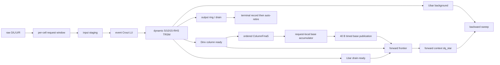
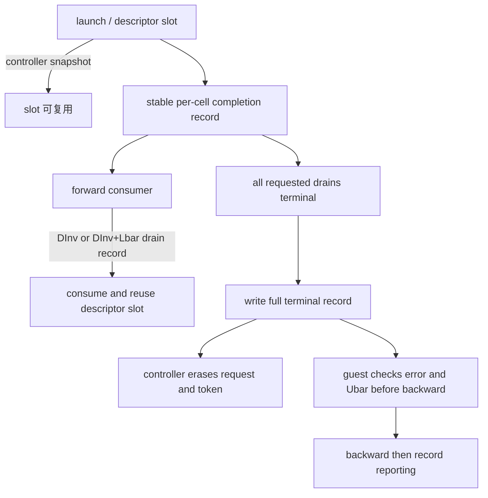
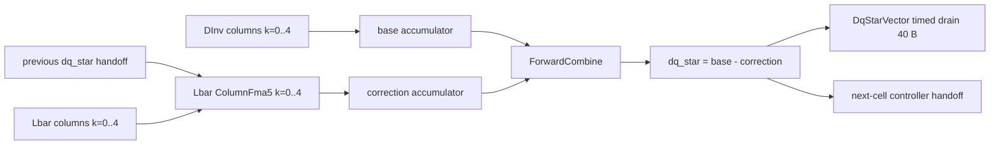

# CFD DSA / LU-SGS Step2 Streaming Wavefront 实现说明

> 状态：Stage A、Stage B1/B2 兼容路径、Stage B1.5（controller auto-retire）、
> Stage B2.5（固定 bitmask/worklist）、**Stage B3 DInv column consumer** 及
> **Stage B4 Lbar column consumer / forward accumulator**、**Stage C1 line-level
> autonomous controller**、**Stage C2/B5 Ubar backward consumer** 和多 line
> wavefront 均已实现并通过回归。B3、B4 各提供 `off/shadow/direct`，B5 提供
> `off/direct`；结果更新至 2026-07-28。

## 1. 目标与结论

新增显式模式：

```text
--lusgs-mode=step2-pretransform-raw-optprep-stream
--coeff-preprocess-model=event
--lu5-model=event
--coeff-streaming-enable=1
--coeff-stream-window=8
--coeff-stream-retire-mode=auto
--coeff-stream-dinv-consumer=direct
--coeff-stream-lbar-consumer=direct
--coeff-stream-ubar-consumer=direct
--coeff-stream-line-autonomous=1
--coeff3-schedule=frontier-aware
```

该模式保留 raw `D/L/U/R` 数值语义和原有 coefficient event controller。默认 `auto` 路径在
guest heap 为每个 cell 保留稳定 completion record，但不建立 completion queue；controller
在真实 drain 后发布 record，在 terminal record 完整写回后自行释放 request/token。`queue`
保留 Stage B1 有界 round-robin reaper 压力回归，`sync` 保留逐 cell terminal wait 基线。
三种路径共用同一数学计算和边界 5/10/15-RHS mask，不改变 ISA 编码或 FU 资源。

B3 `direct` 在 controller 内按列消费 DInv，真实读取 40 B `R`、按 k=0..4 累加
`base=DInv*R`。B4 在此基础上复用同一个有界 ColumnFma5，严格按 k=0..4 消费 Lbar 列与
controller-local 前一 cell `dq_star`，经 ForwardCombine 计算
`dq_star=base-Lbar*dq_prev` 并真实发布 40 B 结果。B4 `direct` 因而跳过 DInv/Lbar matrix
drain、guest DInv/Lbar Path A 与 guest VectorSub；`shadow` 同时保留 guest Lbar 路并逐 cell
位级比较 correction/dq_star；`off` 完整保留 B3 行为。B4 没有新增 guest ISA、OpClass 或 O3 FU。

Stage A 的冻结基线（实现 B1/B2 之前）为：

```text
firstForwardIssueCycle = 193502
preprocessFinishCycle  = 204240
firstForwardIssueCycle < preprocessFinishCycle
streaming mismatch_count = 0
```

证据：
`results/cfd_dsa/runs/step2-stream-w4-1x17-final5/simout:813-858,953-971`。

B1+B2 queue 历史点相同配置为 `totalCycles=23228`、`effectiveRhsCount=245`、
`boundarySkippedRhsTotal=10`、`mismatch_count=0`。正常 window=4 下 O3-visible wait 到达时
各请求已经 terminal，因此 `slotReuseAfterForwardBeforeTerminal=0`；慢 drain/单输出环压力
用例真实观测到 3 次 terminal 前 slot 复用和 9 次乱序 reap。性能回退必须按第 11 节解释，
不能将该历史点描述为已达到加速目标。B1.5+B2.5 默认 auto 点为
`totalCycles=15648`、17/17 auto-retire、0 WAIT、0 completion queue scan、mismatch 0；证据为
`results/cfd_dsa/campaigns/stageb15-final-smoke/auto-1x17-w4-final/simout.txt:784-1032`。

## 2. 原有全局 barrier 在哪里

旧 `step2-pretransform-raw-optprep` event 路径调用 `prepare_raw_event()`。该函数：

1. 在 guest 中建立 ring 并逐 cell launch（benchmark `:4134-4237`）；
2. ring 满或 controller launch backpressure 时 reap 最老请求（`:4177-4222`）；
3. launch 结束后执行 `while (live)`，把所有剩余请求 wait/reap（`:4238-4242`）；
4. 直到函数返回后，调用者才进入 pretransform forward/backward。

因此 controller 内部虽然能重叠 input、LU、TRSM 和 drain，但 guest 时间线仍是：

```text
launch/reap all cells -> prepare_raw_event returns -> forward all -> backward all
```

`reap_coeff_event()` 会轮询 Busy，直至 terminal status；旧 descriptor 没有
`CFD_COEFF_PRE_STREAMING_PROGRESS`，controller 的 `wait()` 对它仍只返回 Busy 或 terminal
status（controller `:741-770`）。这保证 legacy/raw-compare 的原有同步语义未被静默改变。

## 3. 新 Streaming Stage A 数据流



分派入口 `run_pretransform_raw_stream()` 位于 benchmark
`projects/cfd_dsa/benchmarks/lusgs/test_cfd_lusgs_patha_step2.c:5031`；默认实现
`run_pretransform_raw_stream_auto()` 位于 `:4829`。它先填满
lookahead window，再按 cell 顺序推进 forward frontier：

- cell 0 只需 `DInvReady`；
- cell 1..N-1 需 `DInvLBarReady`；
- 普通 load 观察到稳定 record 的真实 drain timestamp 后调用 `pretransform_forward_cell()`
  （ready loop `:4747`，forward 调用 `:4913`）；
- forward 运行时，同一个 request 的 Ubar、后续 request 的 LU/TRSM/drain 仍由 controller
  event graph 推进；
- auto 路径每个 cell 的 record 地址在本次 solve 生命周期内不复用；descriptor window slot 可在
  forward 后复用，controller request/token 在 terminal publication 后自动释放；
- auto 路径没有 completion queue，也不执行 `coeff_preprocess_wait`；controller request table
  仍保持原有有界容量，launch 失败表现为显式 backpressure；
- queue 路径继续使用 `stream-window + output-buffer-depth` 的有界 completion entries 和
  round-robin reaper（benchmark `poll_streaming_reaper():4602`）；
- 全部 forward 和 terminal record 检查完成后才执行现有 backward sweep（`:4943-4970`）。

这里移除的是 preprocess→forward 的**全局** barrier，并把 terminal retirement 从 guest
non-speculative WAIT 移入 controller。forward→backward 仍执行一次轻量 terminal/error record
检查；完整统计聚合在测量的 backward 结束后执行，不阻塞计算关键路径（benchmark
`:4793-4825,4943-5022`）。当前仍没有双 frontier scheduler。

## 4. Streaming descriptor、ready 与 wait/reap

Streaming ABI 包含 progress flag/status，并新增 bit 9
`CFD_COEFF_PRE_STREAMING_AUTO_RETIRE`（controller header `:52`）：

| status | 数值 | guest 可安全读取的矩阵 |
| --- | ---: | --- |
| `DInvReady` | 12 | `Dinv` 已完整写回 |
| `DInvLBarReady` | 13 | `Dinv`、`Lbar` 已完整写回 |
| `DInvLBarUBarReady` | 14 | 三者均已完整写回，但 request 未必 terminal |

ABI 定义见 `src/arch/arm/cfd_coeff_preprocess_controller.hh:16-74`，guest 镜像见 benchmark。
controller 的 `wait()` 仅在 queue/sync 调用时检查 per-request
`drainDone[]` 并返回 progress（controller `:741-770`）；terminal status 才执行
`requests.erase(token)`。auto 路径不调用 wait；terminal request 不会再伪装成 progress。

ready 的发布点不是 functional 预计算。`finishDrain()` 先写真实 request-local matrix，再设置
`drainDone`/timestamp，随后 `publishProgress()` 写 record（controller `:1720-1784`）。terminal
序列为：全部 requested drain done → `finishRequests()` 写 status/completeCycle → 当周期 activity
统计完成 → `retireAutoRequests()` 重写完整 terminal record → erase request/token（`:1923-1973,
2069-2094`）。token erase 后 guest record 仍稳定；此 record 是错误传播和 backward 前检查依据。

Stage B2 复用 descriptor flag 的 bit 6/7/8：`NEED_DINV/NEED_LBAR/NEED_UBAR`，定义见
controller header `:43-48`。三位全零保留旧 COEFF3 的全 15 RHS 行为；任一位非零即表示
显式 mask。launch 根据 mask 同时校验地址、建立 input matrix 列表和 RHS worklist
（controller `:644-716`），因此未请求矩阵不会读取输入，也不会进入 solve/drain queue。

## 5. Per-cell 状态与 slot 复用

`StreamingCellState` 只保存 launch/forward descriptor slot 状态和一个 completion 指针；
auto 路径按 cell 分配 `StreamingCompletionEntry[p->cells]`，因此 window slot 复用不会覆盖 record。
每个 entry 独立保存：

```text
stable completion record
line_id / cell_id / generation / issue_sequence / token
required coefficient mask
active / attached / terminal / reaped / cancel_pending / error
DInv/Lbar/Ubar progress
```

定义见 benchmark。controller 在 launch 时 snapshot descriptor，所以 descriptor slot 可以
复用；completion record 地址在整个 solve 内稳定，token/generation 在 terminal publication 前
保持绑定。auto 的释放顺序为：


兼容 queue reaper 不阻塞在最老 token：`poll_streaming_reaper()` 从 cursor 起寻找 active entry；失败路径
对所有仍有效 token cancel 并等到 terminal/reap。实现见 benchmark `:4540-4614,4701-4730,5291-5298`。复用前检查
cell/generation/attached，normal path 要求 `unsafeSlotReuseAttempts=0`、
`staleGenerationReads=0`。`record.complete_cycle` 用于判定 controller 是否已经 terminal，避免
只因 token 尚未 reap 就虚报“terminal 前复用”。auto 正常点要求
`autoRetiredRequests=17`、`eventRequestsAllocated=eventRequestsFreed=17`、
`staleGenerationReads=staleTokenWaits=0`。auto-retire 后对旧 token 的 cancel 返回 BadToken；guest
以已经发布的 terminal record 区分“正常完成后 BadToken”和真正的 stale/error。

## 6. Stage B3：DInv column consumer 与 direct bypass

event TRSM 每完成一个 RHS 就天然产生一列。`rhsDone()` 以 batch 和 column 定位输出列，并在
真实 RHS completion event 上记录：

```text
dInvColumnReadyCycle[5]
lBarColumnReadyCycle[5]
uBarColumnReadyCycle[5]
```

`rhsDone()` 把完成列写入 request-local DInv storage 并设置 ready mask；`processColumnFma()` 跨
request round-robin，但每个 request 只允许 `nextDInvColumnToConsume` 入队。`completeColumnFma()`
检查 token、generation、stage、R ready、列号和重复 bit，再执行五行
`base[row] += DInv[row][k] * R[k]`。实现与状态字段见
`src/arch/arm/cfd_coeff_preprocess_controller.cc:1534-1679`、
`src/arch/arm/cfd_coeff_preprocess_controller.hh:200-236`。


### 6.1 模式、ABI 与真实输入/输出

| 模式 | DInv matrix drain | guest DInv Path A | ColumnFma/base publish | 用途 |
| --- | --- | --- | --- | --- |
| `off` | 是 | 是 | 否 | 冻结兼容/性能基线 |
| `shadow` | 是 | 是 | 是，逐 lane bitwise compare | 数值顺序、ownership、压力回归 |
| `direct` | 否 | 否 | 是，base 是唯一 forward 输入 | B3 性能路径 |

descriptor 仍为 160 B。bit10 `CFD_COEFF_PRE_DINV_BASE_CONSUMER` 开启 consumer，bit11
`CFD_COEFF_PRE_DINV_DIRECT_BYPASS` 只控制 DInv matrix drain；`reserved[0]` 保存 R 地址，
`reserved[1]` 保存 base 输出地址。`requestedBatchMask` 表示要计算什么，`matrixDrainMask` 表示
要发布哪些矩阵，二者不能混用。非法 direct-without-consumer、缺地址、未请求 DInv 或未使用
auto-retire 均在 launch 返回 0（controller `:720-790`；guest 镜像 `test_cfd_lusgs_patha_step2.c:630-745`）。

R 在 request input 阶段与 D/L/U 一起 capture，但 `rhsVectorReady` 只在 40 B 经过现有
internal/packet input timing、port/bank/outstanding 仲裁后置位。base 也不 functional 提前写出：
第五列完成后只生成 `BaseVector` drain task，40 B output drain complete 后才写 guest buffer并置
`baseReady`。实现见 controller `processInputs():950-1054`、`finishDrain():2011-2054`。

### 6.2 浮点顺序、资源和生命周期

同一 request 即使 DInv 列乱序 ready，也严格按 k=0→4 commit；不同 request 可以交错。
不使用 tree reduction、更高精度 accumulator 或 ready 顺序累加。shadow 1×17 实测
`shadowBaseBitwiseMismatch=0`、max abs/rel error=0，证明当前 Path A FP64 multiply-plus-add 顺序
与 ColumnFma5 一致；证据为
`results/cfd_dsa/campaigns/stageb3-final3/shadow-1x17-w4/simout.txt`。

ColumnFma5 是 controller 内部有界资源，默认 latency=4、II=1、count=1、queueDepth=5；参数由
Python 环境传入 controller，不是 O3 FU。queue full 时列仍留在 request-local storage，由 scheduler
retry；同 request 不越过 next column。cancel 会清理 queued drain/ColumnFma task并标记 accumulator
cancelled；晚到 callback 以 token/generation 拒绝。partial-cancel 压力点在消费 1 列后 cancel，
最终 1 列、base 未发布、auto-retire 后旧 token 为 BadToken；证据
`results/cfd_dsa/campaigns/stageb3-suite-final-record/cancel-generation/simout.txt`。

direct terminal 条件是 LU drain、requested Lbar/Ubar drain、5 列 consumer complete、BaseVector
publish complete；DInv drain 不再是条件。shadow 还要求 DInv drain。progress record 使用独立
`baseReady/baseReadyCycle/baseConsumedColumnMask`，没有冒充旧 `DInvReady`。

### 6.3 Stage B4：Lbar column consumer、handoff 与 forward combine

B4 仅在 B3 direct + auto-retire 上启用。cell 0 在 DInv 五列完成后直接令
`dq_star=base`；cell i>0 还必须同时具备五个 Lbar 列和同 line 的 cell i-1 `dq_star`。
Lbar correction 与 DInv base 复用同一个 ColumnFma5 实例、latency/II/count/queue 参数和
bounded queue；task 的 `kind` 区分 `DInvBase` 与 `LbarCorrection`。scheduler 优先选择当前
最小 cell 的已就绪 Lbar task，DInv task 仍跨 request round-robin，且两类 task 在 request 内
都只能提交 `nextColumnToConsume`。实现见
`src/arch/arm/cfd_coeff_preprocess_controller.cc:1792-1962`。



相邻 cell handoff 按 `lineId` 保存在 controller 的独立表中，不归生产者 request 生命周期
所有。生产者 terminal/auto-retire 后，尚未消费的 handoff 仍有效；消费者必须满足
`consumer.cellId=producer.cellId+1`，且当前 ABI 的 generation 是每 cell 单调递增的唯一值，
所以检查 `consumer generation > producer generation`，不是错误地要求两者相等。消费后立即
删除 handoff，overwrite、wrong-cell、wrong-generation、double-consume 都有独立错误计数。
实现见 controller `:1967-2068`；cancel 同时清理该 token 的 queue、active task 和 handoff
（`:994-1032`）。tail handoff 无后继是合法状态，不计 missing consume。

ForwardCombine 是另一组 controller 内部有界资源，默认
`latency/II/count/queueDepth=1/1/1/2`，完成顺序固定为逐 lane FP64 `base[row]-correction[row]`，
见 controller `:2072-2185`。它不是新 ISA/FU，也不占 O3 FU。输出沿用 output-ring、端口、bank、
outstanding 和 backpressure 模型；`CorrectionVector` 仅 shadow 发布，`DqStarVector` 在 shadow/direct
均发布（`src/arch/arm/cfd_local_spm.hh:48-49`；controller `:2494-2532`）。只有 40 B drain 完成
后 guest 才能消费 dq_star。

descriptor 仍为 160 B：bit12/13 分别是 Lbar consumer/direct bypass，`reserved[2]` 是
shadow correction 地址，`reserved[3]` 是 dq_star 地址（controller header `:247-249`；guest
`:5111-5112`）。模式矩阵如下：

bit14/15/16 是仅由 `--coeff-cancel-test=1` 内部 helper 设置的 wrong-cell、wrong-generation 与
hold-dq-publish 测试标志；正常 runner 不暴露它们，wrong-cell/generation 不能同时设置。前两者
只改变测试 handoff tag，后者只打开确定性取消窗口，不改变正常 direct 数据语义或 ISA 编码。

同一 helper 还用独立 line/generation 确定性覆盖四个 cancel 点：previous dq 到达前、部分 Lbar
列消费后、correction 完成但 dq_star publish 前、handoff 产生但 publish 前。用例将
ColumnFma/drain latency 拉长到1024/500，仅用于打开取消观察窗口；每个目标都必须写
Cancelled stable record、auto-retire error、0 dqStar publish，旧 token 随后返回 BadToken。

| Lbar mode | Lbar matrix drain | guest Lbar Path A | controller correction/dq_star | 用途 |
| --- | --- | --- | --- | --- |
| `off` | 按 B3 原规则 | 是 | 无 | B3 兼容基线 |
| `shadow` | 是 | 是 | 发布 correction 与 dq_star，和实际 Path A 结果位级比较 | B4 数值/ownership 回归 |
| `direct` | 否 | 否 | dq_star 是唯一 forward 结果 | B4 性能路径 |

shadow 比较的是 Path A `z11` 实际产生的 correction，而不是用编译器重新计算的 C MVM；这是为了
验证相同的 k=0..4 舍入序列。最终 1×17 shadow 的 correction/dq_star bitwise mismatch 和最大
绝对/相对误差均为 0。B4 shadow 以 B3 direct 的 controller base 为共同输入；B3 独立 shadow
suite 负责验证 base，因此 B4 不伪造第二份 guest DInv 计算。

direct 的 terminal 条件包含 5 个 DInv 列、cell>0 的 5 个 Lbar 列、ForwardCombine、
DqStarVector publication，以及边界要求的 Ubar/LU drain；不再等待 DInv、Lbar matrix 或
BaseVector drain。guest forward 只轮询稳定 record/40 B dq_star，随后进入原 backward；相关
分支见 benchmark `:5824-5837`。现有 special direct polling 只减少 guest record 解码开销，
不绕过 controller publication timing。

### 6.4 Boundary RHS mask

| cell 位置 | DInv | Lbar | Ubar | 有效 RHS | 跳过 |
| --- | --- | --- | --- | ---: | --- |
| N=1 | 是 | 否 | 否 | 5 | Lbar 5 + Ubar 5 |
| head，N>1 | 是 | 否 | 是 | 10 | Lbar 5 |
| interior | 是 | 是 | 是 | 15 | 0 |
| tail，N>1 | 是 | 是 | 否 | 10 | Ubar 5 |

guest 在 launch 时生成 3-bit batch mask（benchmark `:4351-4388`）。controller 使用固定映射
bits 0–4 DInv、5–9 Lbar、10–14 Ubar，`RhsMaskPlans[8]` 在 launch 时把 batch mask 映射为
15-bit RHS mask/count（controller `:342-370,687-707`）。Request 只保存
`requestedBatchMask/rhsEnabledMask/rhsActivatedMask/rhsDoneMask`，不再逐 launch 构造
`rhsEnabled/rhsBatch/rhsColumn` 数组。scheduler 用固定 `std::array<unsigned,15>` worklist 和 bit
迭代，不分配 `std::vector`（controller `processSolve():1400`）；完成逻辑只等待 requested drain。
未请求 batch 不会产生 ready timestamp。1×17 的真实计数为 245 RHS、1225
div、4900 mul、4900 sub、66 drain、13200 output bytes；旧全量应为 255 RHS、68 drain、
13600 bytes。

## 7. Forward/backward 数据 forwarding

Streaming Stage A 复用 `ForwardLineContext` 和 `BackwardLineContext`（benchmark
`:4664-4665`）。`pretransform_forward_cell()` 把单 cell forward 从原 sweep 中抽出，后继
cell 直接从 forward context 取得 `dq_star[i-1]`（`:3356-3401`），无需以 guest
store→reload 作为链式依赖。backward 继续使用原 context sweep。

旧 per-cell 路径仍把整条 `dq_star` 保留在 guest 数组。line-autonomous direct 路径则由
`LineRequest` 保存 request-local `dq_star/Ubar/dq`，反向按 Ubar 的 k=0..4 列使用共享
ColumnFma5，并把 `dq[i+1]` 直接转发给 `dq[i]`。`internal/packet` 模式最终向 guest 的
vector write 仍由 `SETranslatingPortProxy::writeBlob()` 完成；Stage 6b 的 `dma` 模式则由
真实 timing WriteReq 的 response 决定 drain 完成。

## 8. Lookahead window

参数 `--coeff-stream-window` 仅接受 `1/2/4/8`，当前 wrapper 与 guest 默认 8。

下表是实现 B1/B2 之前的 Stage A 冻结窗口结果，仅用于历史对照，不是当前代码性能：

| window | total cycles | overlap | correctness | 证据 |
| ---: | ---: | ---: | --- | --- |
| 1 | 26342 | 20450 | PASS, mismatch 0 | `results/cfd_dsa/runs/step2-stream-w1-1x17-final5/simout:812-971` |
| 2 | 17748 | 11959 | PASS, mismatch 0 | `results/cfd_dsa/runs/step2-stream-w2-1x17-final5/simout:812-971` |
| 4 | 17300 | 10738 | PASS, mismatch 0 | `results/cfd_dsa/runs/step2-stream-w4-1x17-final5/simout:813-858,953-971` |
| 8 | 17336 | 7134 | PASS, mismatch 0 | `results/cfd_dsa/runs/step2-stream-w8-1x17-final5/simout:812-971` |

上表仅是 Stage A 历史结果。当前 B4 direct 同构建基线中 window=4/8 分别为
16572/15798 cycles，window=8 降低 774 cycles（4.67%），故默认已改为 8；证据为
`results/cfd_dsa/campaigns/stage0-window-baseline-20260728/{w4,w8}/simout.txt`。

`--coeff-stream-retire-mode=sync|queue|auto` 默认 `auto`。Python 默认和校验分别见
`projects/cfd_dsa/configs/lusgs/run_cfd_lusgs_step2.py:136`、
`projects/cfd_dsa/configs/run_cfd_dsa.py:249,1210-1212,3771`；guest 默认/解析/校验见 benchmark
`:5604,6080-6087,6207-6211`。非法值不会静默回退。
`--coeff-stream-boundary-mask=1` 是默认 B2.5 路径；设为 0 只用于 full15 RHS 的 B1.5 隔离
对照，不改变数学输出，不能作为另一套主实现。

## 9. 配置边界

Step2 wrapper 只对显式 stream mode 补入 event/event 和 streaming enable；其他 mode 继续使用
原默认 coarse/software（wrapper `:89-92,134-135`）。base runner 与 guest 都拒绝非法组合：

| 条件 | 行为 |
| --- | --- |
| stream mode 未同时 enable | 立即报错 |
| 非 event coefficient model 或非 event LU | 立即报错 |
| window 不在 1/2/4/8 | 立即报错 |
| retire mode 不在 sync/queue/auto | Python 与 guest 均立即报错 |
| DInv consumer 不在 off/shadow/direct | Python 与 guest 均立即报错 |
| Lbar consumer 不在 off/shadow/direct | Python 与 guest 均立即报错 |
| Ubar consumer 不在 off/direct | Python 与 guest 均立即报错 |
| consumer 与非 stream 或非 auto 组合 | 立即报错，不回落 |
| Lbar consumer 未同时使用 DInv direct | 立即报错；B4 不重算第二份 base |
| line autonomous 未使用 direct DInv/Lbar | 立即报错 |
| Ubar direct 未启用 line autonomous | 立即报错 |
| ColumnFma latency/II/count/queueDepth 越界 | 立即报错；默认 4/1/1/5 |
| ForwardCombine latency/II/count/queueDepth 越界 | 立即报错；默认 1/1/1/2 |
| `lusgs-lines != 1` 且未启用 line autonomous | 立即报错 |
| `bench-iters > 1` 且未启用 line autonomous + Ubar direct + 非零 update interval | 立即报错 |

line-autonomous 已验证 1/2/4/8 line；single sweep 仍是安全默认。Stage 7 多 sweep 必须由
guest 显式发布系数稳定窗口，控制器不推断 D/L/U 是否变化。

### 9.1 C1/C2 的实际执行链

line descriptor 继续使用 160 B ABI 和原 `coeff_preprocess_launch/wait` 指令。bit17
`CFD_COEFF_PRE_LINE_AUTONOMOUS` 使 controller 把一条 line 展开为普通 B4 子请求：
`reserved[0]=R base`、`reserved[1]=window`、`reserved[3]=dq_star base`、
`reserved[4]=cells`。每个子请求仍执行 input→LU→masked 5/10/15-RHS TRSM→DInv/Lbar
column consumer→dq_star publish→auto-retire；父请求按 window 自动补充子请求。

bit18 `CFD_COEFF_PRE_LINE_BACKWARD_DIRECT` 令 `reserved[2]` 指向最终 `dq` 数组。父请求在
全部子请求 terminal 后保存各 cell 的 Ubar/dq_star，从 tail 开始：

```text
dq[N-1] = dq_star[N-1]
for i = N-2 ... 0:
    correction = Σ(k=0..4) Ubar[i][:,k] * dq[i+1][k]
    dq[i] = dq_star[i] - correction
```

每列通过共享 ColumnFma5 的 latency/II/count 资源发射；不同 line 可在反向链等待时交错，
单 line 内仍保持严格反向依赖。guest 轮询独立 line completion word，完成后每 line 只执行
一次 `wait` 回收 parent token。descriptor/父子展开位于
`src/arch/arm/cfd_coeff_preprocess_controller.cc` 的 `launchLine()`、
`pumpLineRequests()`、`retireLineChild()`、`processLineBackward()`；guest 入口为 benchmark
`run_pretransform_raw_stream_line()`。

### 9.2 Stage 6b/7/8 已关闭的三项边界

#### Stage 6b：真实 RequestPort DMA

最终决策是：**不新增独立 DMA SimObject，也不把 RequestPort 塞进匿名全局算法
controller；扩展已经是 SimObject 的 `CfdLocalSpm`，增加专用 `dma_port`**。这样端口绑定、
requestor ID、retry/response 生命周期和统计均由 memory-side SimObject 持有，算法 controller
只提交有界异步传输并接收 completion：

```text
guest VA
  -> SE page-table translation
  -> timing ReadReq/WriteReq
  -> coherent toL2Bus
  -> L2 / membus / DRAM
  -> timing response
  -> controller input-ready / drain-done
```

`CfdLocalSpm.py` 暴露 `system` 与 `dma_port`；runner 把 DMA 接到
`system.toL2Bus.cpu_side_ports`，使 DMA 与 CPU 初始化数据处在同一 coherent fabric。
`issueDma()` 限制 outstanding、处理 RequestPort retry，并按 page/cache-line 边界拆包。
controller 的 `--coeff-spm-model=dma` 输入不再提前 functional read，输出也不再在
`finishDrain()` 重复 functional write。`packet` 仍仅表示内部 bank/port 仲裁，两者不得混称。

#### Stage 7：guest 发布 version/dirty

版本所有权明确归 guest/算法层：

- `--coefficient-update-interval=K` 表示 guest 保证连续 K 个 sweep 中 D/L/U 不变；
- parent line descriptor 的 `cellId` 发布 coefficient version（child 的 `cellId` 仍是 cell index）；
- bit19 `LINE_COEFF_CACHE` 请求版本化缓存，bit20 `LINE_COEFF_DIRTY` 强制重建；
- 控制器只接受 `{lineId, cells, version}` 精确命中；dirty 或 miss 都执行完整
  input→LU→TRSM，并在所有 child 成功后原子替换 cache；
- hit 直接复用 request-local DInv/Lbar/Ubar，仍由共享 ColumnFma5 完成 forward/backward；
- cache-hit parent 只进入 cached-forward/backward，明确跳过通用 `pumpLineRequests()` child
  refill；每次 line 终态还会清除只属于该 invocation 的尾部 forward handoff，避免跨版本污染；
- `coefficient-update-interval=0` 是保守默认，不授权跨 sweep 复用。

当前 benchmark 的 D/L/U 在一次进程运行中由 `init_problem()` 生成后不修改，因此只有
guest 显式给出非零 interval 时才满足该契约。真实 CFD 应由 Jacobian/系数装配阶段在完成
写入后递增 version 并发布 dirty；controller 不拥有也不生成该版本。

#### Stage 8：FP64 reciprocal 是显式实验语义

`--coeff3-div-mode=divide|reciprocal` 默认 `divide`。`divide` 保留每个 RHS 的
`rhs/pivot` 运算序列。`reciprocal` 对每个 request、每个 k 只执行一次 `1.0/pivot[k]`，
随后以 `rhs*reciprocal[k]` 归一化各 RHS；reciprocal pending/ready 是 request-local，
不会跨不同 LU 矩阵复用。

决策是：**接受 tolerance-equivalent，不接受 bitwise-equivalent 声明**。原因是 IEEE-754
下 `b/a` 与 `b*(1/a)` 的舍入点不同。reciprocal 只进入显式性能/面积探索；bitwise shadow、
旧回归和默认主路径继续使用 `divide`。正确性门槛仍是 coefficient residual 与最终 dq 的
`1e-10` 级容差检查。
三项边界的实现入口分别是 `CfdLocalSpm::issueDma()`、
`CfdCoeffPreprocessController::launchLine()/processLineCachedForward()` 和
`CfdCoeffPreprocessController::processSolve()`；最终行号以本轮文档末尾证据索引为准。

最终集中回归为
`results/cfd_dsa/campaigns/coeff-streaming-boundaries-final4-20260728/`，三个 case 全部
PASS：

- Stage 6b：604 个 timing packet 发出/完成，read/write=10480/7280 B，
  outstanding stall=976、RequestPort retry=374、translation failure=0、live max=8；
- Stage 7：1×17、3 sweep、update interval=2，观测 rebuild/reuse=2/1，最终 dq 及
  DInv/Lbar/Ubar mismatch 均为 0；
- Stage 8：reciprocal 模式 mismatch=0；相对同规模 divide 数据面，event divider
  busy-lane cycles 从 16740 降为 3060，mul busy-lane cycles 从 16230 增为 19905。
  这是建模资源计数差异，不构成 reciprocal 与 divide 位级等价的声明。

实现证据索引：

| 边界 | 代码证据 |
| --- | --- |
| Stage 6b port/传输 | `src/arch/arm/CfdLocalSpm.py:10-14`；`src/arch/arm/cfd_local_spm.cc:1193-1308`；`projects/cfd_dsa/configs/run_cfd_dsa.py:3797` |
| Stage 6b controller input/drain | `src/arch/arm/cfd_coeff_preprocess_controller.cc:1679-1693,3301-3316` |
| Stage 7 ABI | `src/arch/arm/cfd_coeff_preprocess_controller.hh:75-84`；guest mirror 为 `projects/cfd_dsa/benchmarks/lusgs/test_cfd_lusgs_patha_step2.c:716-717` |
| Stage 7 hit/rebuild 生命周期 | `src/arch/arm/cfd_coeff_preprocess_controller.cc:1063-1143,1150-1160,1210-1260,1332-1427` |
| Stage 7 guest publisher | `projects/cfd_dsa/benchmarks/lusgs/test_cfd_lusgs_patha_step2.c:5805-5830,6353-6365` |
| Stage 8 solve | `src/arch/arm/cfd_coeff_preprocess_controller.cc:2875-2942`；配置校验/传递为 `projects/cfd_dsa/configs/run_cfd_dsa.py:1356-1360,1603-1607` |
| 集中回归 | `projects/cfd_dsa/suites/coeff-streaming-boundaries.json:1-45` |

frontier-aware RHS 调度在未老化时优先 DInv、Lbar，再做后台 Ubar；ready 超过 64 cycles
的 RHS 优先提升，避免永久饥饿。4-line B5 相对 round-robin-ready 从 29890 降至
29232 cycles，divider utilization 0.884397→0.912576；证据为
`results/cfd_dsa/campaigns/stage4-ubar-direct-20260728/lines4/simout.txt` 和
`results/cfd_dsa/campaigns/stage5-frontier-schedule-20260728/lines4/simout.txt`。

## 10. 统计口径

所有新增项使用路径前缀：

```text
lusgs.step2_pretransform_raw_stream.streamingStep2.*
```

关键实测项：

| 类别 | 字段 | 含义 |
| --- | --- | --- |
| producer | `firstInputIssueCycle`, `firstLuIssueCycle` | 首个 request 的真实 controller 时间 |
| column | `first*ColumnReadyCycle` | 首个对应 RHS completion event |
| matrix | `firstDinv/Lbar/UbarReadyCycle` | 首个完整 batch ready 时间 |
| consumer | `firstForwardIssueCycle` | guest 发起首 cell forward 的周期 |
| barrier | `preprocessFinishCycle` | 所有 request 的最大 terminal completion |
| overlap | `preprocessForwardOverlapCycles` | forward 与未完成 preprocess 的时间区间交集 |
| backward prep | `preprocessBackwardPrepareOverlapCycles` | Ubar 首列出现后、forward 与 preprocess 的交集包络 |
| window | occupancy/max/full-stall/reuse | guest request window 行为 |
| reaper | polls/terminal/busy/occupancy/full/out-of-order | completion/token 回收与 backpressure |
| boundary | requested batches/skipped RHS/effective RHS/avoided drains | B2 实际工作量 |
| auto-retire | autoRetiredRequests/Tokens/Errors、wait/queue avoided | B1.5 生命周期与零 WAIT 证明 |
| record poll | progressPoll*、frontierWaitDinv/Lbar/Base*、guest*RecordChecks | guest 只在数据依赖点读取稳定 record |
| fixed mask | maskTableLookups、rhsMaskScheduler* | B2.5 静态表、有效 issue 与空扫描 |
| B3 column | dInvColumnsReady/Queued/Issued/Completed/Consumed、duplicate/generation/out-of-order | 列生命周期与顺序 |
| B3 resource | columnFmaQueue*/Issue/Busy/Completion/Retry | 有界 queue 与资源占用 |
| B3 base | baseAccumulator*、first/lastBaseReadyCycle、baseVectorPublish* | accumulator 与真实 40 B publication |
| B3 traffic | dInvMatrixDrainBytesAvoided、dInvGuestReloadBytesAvoided、pathaDinvMvmEliminated | direct 实际消除量 |
| B4 column | lBarColumnsReady/Queued/Issued/Completed/Consumed、correctionAccumulator* | Lbar 列生命周期、严格顺序与 correction |
| B4 handoff | forwardHandoffsProduced/Consumed/Wait/MaxLive 与五类错误 | request 外相邻 cell dq_star 所有权 |
| B4 combine | forwardCombineQueue/Issue/Busy/Completion 与 util | 有界 subtract 资源 |
| B4 publish | correctionVectorPublish*、dqStarVectorPublish* | shadow correction 和 guest-visible dq_star 的真实 40 B drain |
| B4 traffic | lBarMatrixDrainBytesAvoided、lBarGuestReloadBytesAvoided、pathaLbar*Eliminated | direct 实际消除量 |
| B4 frontier | frontierWaitDqStar*、lbarConsumerWaitPreviousDq/Column/Engine* | 依赖、列和共享资源等待 |
| C1 line | 每 line 一个 parent token/completion word；子请求仍写稳定 record | guest 不再逐 cell launch/推进 |
| C2/B5 backward | `pathaMvmBackward=0`、ColumnFma issue/busy 与 backward 时间线 | Ubar 五列消费和 dq 反向内部转发 |
| attribution | cyclesIn*、cyclesBlockedBy* | progress/terminal/report bookkeeping 与 backpressure |

Stage B3/B4/C1/C2 的上述字段已由真实 consumer/drain 更新；仍为 0 的 `basePrefetch*`
和部分 Stage C ready-work 字段是 DMA/tile 计划项。controller 原有 event stats 继续提供 divider/mul/sub busy、
ready RHS、output-ring、SPM port/bank/outstanding stall；不能把未实现的 streaming 0 值替代
这些 controller 统计。

注意：`measuredPreprocessCycles` 是从首 input 到最后 request completion 的跨度，streaming 下
会与 forward 重叠，不能再与 `runtime` 简单相加得到 total；`totalCycles` 是从首 launch 前到
backward 完成，不含 full validation，也不含完整 record 统计聚合。后者单独打印为
`cyclesInGuestBookkeeping`；backward 前仍保留 generation/status/autoRetired 的轻量安全检查。

## 11. 性能对比

相同条件：1 line × 17 cells、1 sweep、full validation、event LU、div1、mul/sub1、
partial output、local-ideal SPM、相同 FU latency/count。

| 模型 | preprocess span | forward | backward | runtime | total | cycles/cell | mismatch |
| --- | ---: | ---: | ---: | ---: | ---: | ---: | ---: |
| 旧 event barrier | 10946 | 5674 | 4012 | 10258 | 21204 | 1247.29 | 0 |
| Stage A window=4（冻结基线） | 11500 | 5282 | 4070 | 9352 | 17300 | 1017.65 | 0 |
| B1 independent reaper（开发点） | 16163 | 5418 | 4122 | 9540 | 22798 | 1341.06 | 0 |
| B1+B2 最终 window=4 | 15775 | 5378 | 4094 | 9472 | 23228 | 1366.35 | 0 |
| B1.5 auto-retire、full 15 RHS | 8562 | 5354 | 4200 | 9554 | 15520 | 912.94 | 0 |
| B1.5+B2.5 auto + boundary fast-mask | 8595 | 5354 | 4226 | 9580 | 15648 | 920.47 | 0 |
| B3 off（当前重编译对照） | 9279 | 5650 | 4030 | 9680 | 16636 | 978.59 | 0 |
| B3 shadow（非性能） | 12530 | 5074 | 4024 | 9098 | 20800 | 1223.53 | 0 |
| **B3 direct** | **8249** | **3854** | **4226** | **8080** | **15466** | **909.76** | **0** |
| B4 off（最终同构建） | 9486 | 4150 | 4254 | 8404 | 18158 | 1068.12 | 0 |
| B4 shadow（非性能） | 11541 | 6046 | 4254 | 10300 | 20654 | 1214.94 | 0 |
| **B4 direct（最终同构建）** | **8519** | **492** | **4264** | **4756** | **16754** | **985.53** | **0** |
| C1 line autonomous，B4，window=8 | 7435 | 0 | 4266 | 4266 | 12602 | 741.29 | 0 |
| **C2/B5 Ubar direct，1 line** | **约7435** | **0** | **1132** | **1132** | **9640** | **567.06** | **0** |
| C2/B5 + multi-line，4 lines | — | 0 | controller 内 | controller 内 | 29890 | 439.56 | 0 |
| **C2/B5 + frontier-aware，4 lines** | — | **0** | **controller 内** | **controller 内** | **29232** | **429.88** | **0** |
| packet/banked SPM + 4 slots，4 lines | — | 0 | controller 内 | controller 内 | 30106 | 442.74 | 0 |

Stage A total 降低 3904 cycles（18.41%），相对加速 1.226×。旧路径证据为
`results/cfd_dsa/runs/step2-event-barrier-1x17-final5/simout:779-791,902-921`；新路径证据为
`results/cfd_dsa/runs/step2-stream-w4-1x17-final5/simout:779-858,953-971`。

B1+B2 最终结果证据为
`results/cfd_dsa/campaigns/stageb-final-core-regression/lusgs-step2-stream-1x17/simout.txt`。
时间线：input 194416、LU 194428、首 DInv 列 194912、首 Lbar 列 198244、first forward
198316、preprocess finish 210191、forward finish 212108、backward 212190–216552。相对 Stage A
为 `17300/23228 = 0.745×`，即总周期回退 34.27%。B1 的 completion/reaper bookkeeping 和
O3-visible non-speculative wait 到达过晚是当前主要成本；B2 虽减少 10 RHS 和两个 drain，却不足
以抵消该成本。此结果没有达到低于 17300 的性能目标。

B1 单独开发点证据为
`results/cfd_dsa/runs/stageb-b1-reaper-1x17-w4-v2/simout`：input 192903、LU 192920、
首 DInv/Lbar 列 193444/193462、first forward 196870、preprocess finish 209066、forward
finish 210648、backward 210674–214982。该点尚未带 boundary mask，仍为 255 RHS。

auto 点证据分别为
`results/cfd_dsa/campaigns/stageb15-final-smoke/auto-full15-1x17-w4-final/simout.txt:784-1032` 和
`results/cfd_dsa/campaigns/stageb15-final-smoke/auto-1x17-w4-final/simout.txt:784-1032`。B1.5+B2.5
相对 B1+B2 降低 7580 cycles（32.63%），相对 Stage A 降低 1652 cycles（9.55%），达到
`<17000` 期望门槛。boundary mask 的 total 比 full15 高 128 cycles，属于这两个单点间的
控制流、代码布局和 O3 波动，不能解释为少算 RHS 导致回退；B2.5 的确定
收益是 RHS 255→245、drain 68→66、output bytes 13600→13200，不能宣称它单独带来端到端加速。
所有 FU latency/count 和浮点顺序保持不变，也不能与 coarse opLat 直接比较。

B3 最终同构建证据为 `results/cfd_dsa/campaigns/stageb3-final3/`。direct 相对同一构建 off
减少 1170 cycles（7.03%，1.0756×），并比冻结 15648 低 182 cycles（1.16%，1.0118×）。该结果
只达到“低于冻结基线”的最低门槛，没有达到 15000 阶段目标。shadow 位级 mismatch 为 0；direct
消费 85/85 列，Path A 为 forward 16 + backward 16 = 32 MVM（off/shadow 为 49），避免
17×200=3400 B DInv drain、3400 B guest DInv reload，新增 680 B R input 与 680 B base publish；
event output bytes 从 off 13200 降为 direct 10480。进程级 committed instructions 为
off/shadow/direct 403969/410183/346167，IPC 为 2.188905/2.175276/2.074247。理论 204 条 custom
消除同时由 `pathaDinvCustomInstructionsEliminated=204` 和实际 Path A MVM 49→32 交叉验证。
gem5 指令统计也给出 off→direct：matld committed 294→192（-102）、dotp 245→160（-85）、
pack 49→32（-17），合计正好减少 17 个 DInv MVM 的 204 条 custom 指令；同一 simout 的 issued
数可能含 squash/replay，故以 committed 数作为消除证据。

默认 ColumnFma 点为 85 issue、340 busy lane-cycles、utilization=0.041217、queue max=1、
平均 end-of-tick occupancy=0、full stall/retry/blocked=0、frontierWaitBase=912。latency 3/4/5、
II 1/2、queue depth 1/2/5/10 均正确；queue 始终 max=1且无 full stall，表明当前默认点不是 consumer queue瓶颈，差异主要
是 guest polling/O3 控制流波动；最终 record-ABI 构建的 sensitivity total 范围为15424–15472。
证据为 `stageb3-suite-final-record` campaign。

B4 的最终同构建证据为 `results/cfd_dsa/campaigns/stageb4-final-perf4/`。direct 相对 off
减少1404 cycles（7.73%，1.0838×），forward Path A 从16降为0，整个 sweep 的 Path A
从 32 降为 16；committed matld/dotp/pack 从 192/160/32 降为 96/80/16，即额外消除 16 个
Lbar MVM 的 192 条 custom 指令。direct 的 event input/output 为 10480/7280 B；DInv matrix
drain/reload 各避免3400 B，Lbar matrix drain/reload 各避免3200 B；BaseVector 不再发布，DqStarVector 发布
17×40=680 B。shadow correction 与 dq_star 都是 bitwise mismatch 0。

与历史 B3 direct15466相比，最终 B4 direct 多1288 cycles（8.33%）。这是跨代码布局/record
扩展的历史比较，不能覆盖同构建 off/direct 结论；最终构建的 B4-disabled 点为18158，而旧 B3
构建的 off 为 16636。故 B4 已达到 `< off`，但未达到 `<=14500` 性能目标。最终 direct 的
ColumnFma/ForwardCombine utilization 为0.070204/0.000955；frontier 的 guest-visible dq-star、
previous-dq、Lbar-column、consumer-engine、dq-publish 分别为3456/11142/6889/0/39 cycles，
下一优化入口是串行 previous-dq 链、Lbar column readiness、dq_star guest frontier 与 dispatch，
而不是增加 combine 数量；consumer-engine wait 为 0，当前也没有增加 ColumnFma count 的证据。

| B4 点 | IPC（首 stats dump） | committed inst | Path A F/B | matld/dotp/pack committed | event in/out B | DInv/Lbar columns |
| --- | ---: | ---: | ---: | ---: | ---: | ---: |
| off | 2.054827 | 354359 | 16/16 | 192/160/32 | 10480/10480 | 85/0 |
| shadow | 2.080980 | 362282 | 16/16 | 192/160/32 | 10480/11800 | 85/80 |
| direct | 1.977644 | 382500 | 0/16 | 96/80/16 | 10480/7280 | 85/80 |

这里的进程级 committed instruction 在 direct 反而更高，原因是 guest 的 dq_star record polling
与扩展报告代码；它不否定 committed custom 指令减少 192，但说明 direct 的剩余软件控制开销仍
需优化。默认 `local-ideal` 点的 coeff packet read/write stats 为 0；上表使用 controller 的真实
event input/output 字节，只有 `coeff-spm-model=packet` 压力点才应引用 coeff packet 字节。

### 11.1 B1/B2 回退归因

Stage A→B1 增加 5498 total cycles。可直接归属的变化是 preprocess span +4663、forward
+136、backward +52；首 input→首 forward 从 762 增至 3967（+3205），说明主要损失是 guest
completion/reaper 控制路径使消费启动过晚，不是 Path A/TRSM latency 变化。B1→B1+B2 又增加
430 cycles；与此同时 preprocess span -388、forward -40、backward -28，表明边界少算 10 RHS
的 controller 收益被当时 guest mask/record bookkeeping 与起始偏移覆盖。来源分别为本节表格
所列 Stage A、B1 与 B1+B2 evidence。

同一 1×17/O3 配置的首个 stats dump如下。它覆盖整个 benchmark 进程而非只覆盖 streaming
计时区间，所以只用于解释 guest 控制复杂度，不能把指令差直接等同于 totalCycles 差：

| 点 | committed inst | IPC | branch | mispredict | load | store |
| --- | ---: | ---: | ---: | ---: | ---: | ---: |
| Stage A | 404499 | 2.206073 | 105592 | 1094 | 67750 | 23397 |
| B1 queue | 411367 | 2.171925 | 108527 | 1327 | 69349 | 24391 |
| B1+B2 queue | 399410 | 2.163557 | 106525 | 1345 | 67408 | 24031 |
| B1.5 auto full15 | 409824 | 2.180576 | 108201 | 1251 | 69043 | 24884 |
| B1.5+B2.5 auto mask | 395961 | 2.166337 | 105183 | 1282 | 66666 | 24245 |

auto mask 的关键路径归因是：progress record check 580 cycles、terminal/Ubar check 154、
completion queue/descriptor blocking 均为 0、forward 5354、backward 4226。完整 record 聚合为
4228 cycles，但已移到 measured total 之后并单独报告；它仍出现在进程级 committedInsts 中。
同一最终点中 controller input/LU/solve/drain active 分别为 279/6460/7544/330，LU-solve
overlap 6428、coefficient divider utilization 0.864757；SPM port/bank/outstanding、output-ring
和 drain-queue stall 均为 0。这些是有重叠的 active/stall 计数，不能相加成 guest totalCycles。

## 12. 正确性与压力验证

六个专项 suite：`coeff-streaming-auto-retire.json`、`coeff-streaming-correctness.json`、
`coeff-streaming-boundary-mask.json`、`coeff-streaming-reaper.json`、
`coeff-streaming-dinv-consumer.json`、`coeff-streaming-lbar-consumer.json`。它们覆盖 1×1、1×2、1×17、1×64，窗口 1/2/4/8，
N=1/head/interior/tail mask，以及 packet-style internal SPM
和慢 drain/single output entry 压力。

已执行并通过：

- auto-retire 1×1/1×2/1×17/1×64、window 1/2/4/8、slow drain、output ring、packet
  outstanding/bank pressure 和 cancel coexistence：12/12 PASS；证据
  `results/cfd_dsa/campaigns/stageb15-auto-retire/`；
- stream 1×1、1×2、1×17、1×64：全部 mismatch 0；1×1 因无跨 cell 工作，允许 overlap=0；
- window 1/2/4/8：全部 PASS；
- packet/backpressure：PASS；证据 campaign
  `results/cfd_dsa/campaigns/stageb-final-streaming-correctness-v2/`；
- boundary mask：N=1 为 5 RHS；N=17 为 245 RHS、skip=10；全部 PASS，证据 campaign
  `results/cfd_dsa/campaigns/stageb-final-boundary-mask/`；
- reaper 压力：慢 drain 用例 occupancy=5、terminal 前复用=3、out-of-order reap=9、
  queue-full stall=3696，错误计数全零；证据
  `results/cfd_dsa/campaigns/stageb-final-reaper/detached-lifetime-slow-drain/simout.txt`；
- old event barrier、`all`、raw-compare、raw-compare-context、cancel、decode-exclusive、
  standalone TRSV5：全部 PASS；证据 campaign
  `results/cfd_dsa/campaigns/stageb15-core-regression/` 和
  `results/cfd_dsa/campaigns/stageb15-step2-compat/`；
- 旧 per-cell path 的 `--lusgs-lines=2` 仍拒绝；line-autonomous 的2/4/8-line full
  validation 已通过，证据 `results/cfd_dsa/campaigns/stage3-multiline-20260728/`。
- B3 23-case suite：shadow/direct 尺寸、window、latency/II/queue、R input packet pressure、
  base output pressure、partial cancel/generation、ready-first 乱序全部 PASS；证据
  `results/cfd_dsa/campaigns/stageb3-suite-final-record/`；
- B4 33-case suite：shadow/direct 尺寸、window、共享 ColumnFma latency/II/queue、ForwardCombine、
  dq output、packet outstanding/bank、cancel/generation 生命周期和 Lbar ready-first 乱序均 PASS；
  shadow correction/dq_star bitwise mismatch=0，direct handoff/error/lifecycle 计数满足预期；证据
  `results/cfd_dsa/campaigns/stageb4-suite-final33/`；四阶段取消单独 smoke 证据为
  `results/cfd_dsa/campaigns/stageb4-final-cancel-phases4/all-four/`；
- C1/C2 6-case suite：C1单线、B5单线、2/4/8-line、frontier-aware 与 packet双缓冲全部
  PASS；证据 `results/cfd_dsa/campaigns/coeff-streaming-line-autonomous-final-20260728/`；
- Stage 6b/7/8 三边界 suite：RequestPort DMA、3-sweep version/dirty/reuse 和 reciprocal
  FP64 全部 PASS；证据
  `results/cfd_dsa/campaigns/coeff-streaming-boundaries-final4-20260728/`；
- 本轮既有 auto-retire、correctness、boundary、reaper、core regression 和四个 legacy Step2
  compatibility mode 全部 PASS；证据 campaign 前缀 `stageb3-reg-*`。

## 13. Stage A/B/C 实现边界

| 阶段 | 状态 | 本轮实际内容 |
| --- | --- | --- |
| Stage A | **已实现** | 显式 mode、per-cell state、1/2/4/8 window、drain-ready progress、preprocess/forward overlap、token/generation 安全复用、context forwarding |
| Stage B1 | **已实现** | bounded stable completion entries、fair round-robin reap、cancel/error propagation、terminal 前复用真实性检查 |
| Stage B2 | **兼容语义保留** | backward-compatible NEED mask 与边界 skip；原 dynamic worklist 已由 B2.5 固定 mask/worklist 替代 |
| Stage B1.5 | **已实现，默认** | stable per-cell record、controller terminal publication/auto-retire、0 WAIT/0 queue scan、错误在 backward 前检查 |
| Stage B2.5 | **已实现，默认** | 3-bit batch/15-bit RHS 静态表、固定 worklist、边界 input/solve/drain skip |
| Stage B3 | **已实现，可选 direct** | 真实 R input、in-order ColumnFma5、request-local base、40 B timed publication、shadow compare、direct DInv drain/Path A bypass |
| Stage B4 | **已实现，可选 direct** | 同一 ColumnFma5 消费 Lbar、controller-local dq_star handoff、ForwardCombine、40 B dq_star publication、direct Lbar drain/Path A bypass |
| Stage B5 / C2 | **已实现，可选 direct** | Ubar 五列 ColumnFma、controller-local reverse dq wavefront、guest backward Path A bypass |
| Stage C1 | **已实现，可选** | line parent/child、自动 window refill、每 line completion、2/4/8-line context |
| Stage 6b DMA | **已实现，可选** | 独立 RequestPort 数据面、VA→PA、cache-line/page 拆包、retry/outstanding、timing response 完成 |
| Stage 7 reuse | **已实现，可选** | guest version/dirty、精确 cache hit、miss/dirty rebuild、controller-side cached wavefront |
| Stage 8 reciprocal | **已实现，实验** | 每 pivot reciprocal 一次、RHS 乘法归一化、默认 divide、仅容差等价 |
| Stage C scheduler | **部分实现** | frontier-aware DInv/Lbar/Ubar+aging；tile/DMA task-level prefetch queue 尚未实现 |

controller 已有 LU step-ready/early solve、15-RHS ready scheduler 和 input/LU/solve/drain overlap，
这些是原 coefficient event graph 的能力，不等于本轮实现了跨 guest hot-loop 的 Stage C。

## 14. 风险与下一步最小改动

1. auto 正常点已消除 guest WAIT/reaper；B4 direct 当前 guest 可见
   `frontierWaitDqStarCycles=3456`；controller 内 previous-dq/Lbar-column 等待分别为11142/6889
   request-cycles。前者包括 guest 对真实 DqStarVector publication 的等待，不能解释成
   O3 FU latency，也不能把计时区间外的完整 record 聚合算作 controller stall。
2. B3 已把每 cell 的 5 个 DInv 列变成 generation-tagged `ColumnFma5` task，默认
   `latency=4, II=1, count=1, queueDepth=5`；85 列完成、重复/stale/missing 均为 0。
3. B3 前 1×17 有 17 个 DInv×R Path A MVM，分别是首 cell 的单 MVM 和 16 个 dual MVM 的 MVM0
   半边（benchmark `patha_mvm5_existing():2074`、`PRETRANSFORM_MVM0_ASM:944-950`、
   `pretransform_forward_cell():3389`）。每个 MVM0 为 5 matrix load + 1 vector load + 5 dotp +
   1 pack；direct 已真实消除 17×12=204 条候选 custom 指令及两份 3400 B DInv 流量。
4. B4 direct 保留 R input 680 B，并发布 17×40=680 B dq_star；base 留在 request 内部，不再
   发布。它避免 DInv matrix drain/reload 各3400 B、Lbar matrix drain/reload 各3200 B，并消除 forward 的
   17 个 DInv MVM 和 16 个 Lbar MVM。
5. C1 消除逐 cell guest launch/推进；1×17 window8 从15798降至12602。C2/B5 再消除16个
   backward Ubar Path A MVM，降至9640，forward/backward Path A 均为0。
6. multi-line 已有每 line forward/backward state 和共享资源交错；2/4/8 line 全量校验通过。
   当前 parent refill 遵循 controller map 遍历与资源 ready，不是可编程 QoS scheduler。
7. `packet` 仍是 `CfdLocalSpm::issuePacket()` 内部 event 仲裁；只有 `dma` 使用真实 gem5
   timing RequestPort。当前 DMA 已覆盖 coefficient request 的 guest↔controller traffic，
   尚未加入可编程 tile DMA 描述符和 load/compute/store 三缓冲调度。

C1/C2 已跨过旧14500目标；当前1-line B5 为9640，4-line frontier-aware为29232。Stage 6b
真实 timing DMA 和 Stage 7 显式 coefficient cache contract 已落地；下一步是 tile descriptor、
多 tile load/compute/store 重叠及真实 CFD Jacobian 发布 version 的集成。不得把 internal
packet arbitration 称为 DMA，也不得在 guest 未发布稳定版本时复用旧 DInv/Lbar/Ubar。

## 15. 运行命令

调度优化与消融测试见第 16 节；默认开启 base 提前准备和数值就绪驱动后向。

```bash
build/ARM/gem5.opt -d results/cfd_dsa/runs/step2-stream-b5-w8-1x17 \
  projects/cfd_dsa/configs/lusgs/run_cfd_lusgs_step2.py \
  --lusgs-mode=step2-pretransform-raw-optprep-stream \
  --coeff-stream-window=8 \
  --coeff-stream-retire-mode=auto \
  --coeff-stream-dinv-consumer=direct \
  --coeff-stream-lbar-consumer=direct \
  --coeff-stream-ubar-consumer=direct \
  --coeff-stream-line-autonomous=1 \
  --coeff3-schedule=frontier-aware \
  --coeff-validation=full \
  --lusgs-lines=1 --lusgs-cells=17
```

完整 correctness sweep：

```bash
python3 projects/cfd_dsa/tools/run_suite.py \
  projects/cfd_dsa/suites/coeff-streaming-auto-retire.json

python3 projects/cfd_dsa/tools/run_suite.py \
  projects/cfd_dsa/suites/coeff-streaming-correctness.json

python3 projects/cfd_dsa/tools/run_suite.py \
  projects/cfd_dsa/suites/coeff-streaming-boundary-mask.json

python3 projects/cfd_dsa/tools/run_suite.py \
  projects/cfd_dsa/suites/coeff-streaming-reaper.json

python3 projects/cfd_dsa/tools/run_suite.py \
  projects/cfd_dsa/suites/coeff-streaming-dinv-consumer.json

python3 projects/cfd_dsa/tools/run_suite.py \
  projects/cfd_dsa/suites/coeff-streaming-lbar-consumer.json

python3 projects/cfd_dsa/tools/run_suite.py \
  projects/cfd_dsa/suites/coeff-streaming-boundaries.json
```

## 16. 保持递推语义的依赖链优化

本节描述当前新增实现，不改变 ISA、descriptor ABI、FP64 按列求和顺序、
系数 dirty/version 合约；没有引入 reciprocal、归约树或分段 scan。

| 参数 | 默认 | 作用与关闭后的行为 |
| --- | --- | --- |
| `--coeff-line-base-ahead` | `1` | 缓存命中的 autonomous line 提前计算 base；`0` 恢复逐 cell base/correction 串行 |
| `--coeff-line-early-backward` | `1` | direct backward 按本地数值 ready 推进；`0` 等全部子请求退休后启动 |
| `--coeff-stream-window` | 原 runner 默认不变 | 同时作为 base 环形缓冲的容量，实际容量为 `min(window,cells)` |

参数由 `projects/cfd_dsa/configs/run_cfd_dsa.py:921` 解析，经
`GEM5_CFD_LINE_BASE_AHEAD` / `GEM5_CFD_LINE_EARLY_BACKWARD` 传到
`src/arch/arm/cfd_coeff_preprocess_controller.cc:168`。两项开关是模拟器控制参数，
不传入 guest；关闭两项可用同一二进制做旧调度基线。

### 16.1 缓存命中时 base 前瞻

`processLineBaseAhead`（`src/arch/arm/cfd_coeff_preprocess_controller.cc:1540`）
使用独立 base 游标、列游标及 pending 位，计算 `DInv[i]*R[i]`。
每个向量仍按列 0..4 累加，只有完成第 4 列才设置 ready。
环形槽直到对应 cell 完成 forward 才可复用；容量 W 的数值空间为 40W 字节，
另加 ready/游标元数据。RHS 每次 line launch 重新读取，base 不跨 sweep 缓存。

`processLineCachedForward` 只消费已完成 base，并计算依赖前驱的 Lbar correction。
非首 cell 的 correction 和下一 cell 的 base 可以在不同在途事件中重叠。
两者使用同一个既有 ColumnFma 资源池，没有新增免费计算单元；后台 base 在
frontier forward/backward 发射之后尝试使用剩余容量。各自的累加反馈依赖仍保留。
窗口为 1 时不能提前跨 cell 准备，作为容量边界回归。

### 16.2 数值发布与退休解耦

`publishLineValues`（`src/arch/arm/cfd_coeff_preprocess_controller.cc:1591`）
将 ready dq_star 和已完成的 Ubar 列复制到父 line 所有的缓冲，使用 child token
查找父 line，避免退休后的悬空引用。尾部 dq_star 就绪后可启动后向；每个后向
cell 必须等本 cell dq_star、后继 dq 和当前消费列 Ubar 就绪。列顺序仍为 0..4。

`finishLineBackward`（`src/arch/arm/cfd_coeff_preprocess_controller.cc:1641`）
区分 numeric done 和 visible done。非缓存路径必须全部 child 成功退休后才对
guest 报 Complete；最后 child 退休不能重置已经进行的 backward。失败路径保留
原错误状态，pending callback 检查父 token 是否存在及 terminal 状态。

**存储边界不变**：cached RHS 读取及 parent dq/dq_star 写回仍是原有 proxy
functional 访问，并未在本次改成 timed DMA。系数子请求的原 drain/record 完成
协议不变。不要把提前内部消费描述成提前完成对外 timing 写回。

### 16.3 观测和回归

开启 `--coeff-preprocess-trace-enable=1` 后，每个成功 direct line 输出
`CFD_LINE_SCHEDULE`：`base_ahead_columns` 统计发射时领先 forward cell 的 base 列数；
`backward_start/backward_done/children_retired/visible_done` 为控制器绝对周期。
缓存命中没有 child，`children_retired=0`。`result_hash` 对 dq_star 和 dq 的 FP64
位模式生成非密码摘要，用于消融比较，不替代 full numerical validation。

```bash
python3 projects/cfd_dsa/tools/run_suite.py \
  projects/cfd_dsa/suites/coeff-line-dependency.json \
  --campaign line-dependency-check
python3 projects/cfd_dsa/tools/check_line_dependency.py \
  results/cfd_dsa/campaigns/line-dependency-check
```

campaign 目录不可覆盖，重跑需换新名称。测试覆盖四组合消融、重建/命中/dirty重建、
1/2 cell、窗口 1、多 line、慢 drain/单输出槽、DMA单sweep和8sweep系数复用；检查成功标记、摘要一致、
前瞻实际发生、提前后向实际发生，以及软件完成不早于子请求退休。

**已发现的独立限制**：DMA + 3 sweeps + update interval 2 在第三次系数重建时
触发 `src/mem/cache/cache.cc:1225` 的 Modified-line/WriteReq 一致性断言；关闭两个
新开关也复现。原始证据保留在
`results/cfd_dsa/campaigns/line-dependency-20260908/dma/simout.txt:84` 和
`results/cfd_dsa/campaigns/line-dependency-20260908/dma-baseline-diagnostic/simout.txt:84`。
正常 suite 只验证 DMA 单 sweep，不声明 DMA 多 sweep 已通过。独立复现入口
`projects/cfd_dsa/suites/coeff-line-dma-rebuild-diagnostic.json` 目前预期会失败；
需后续审查 DMA/cache 一致性与复用后重建的存储协议，本次不修改该协议。

第16节阶段结束时尚未实现乘法/加法拆分；后续新增的可选拆分模型见第17节。
多部分和、归约树、真正分量级完成和分段仿射递推仍未实现。
当前改动只移除多余串行工作，不声称打破稠密 5×5 的跨 cell 数学依赖。

### 16.4 本次验证与实测（2026-09-08）

最终证据目录：`results/cfd_dsa/campaigns/line-dependency-v2-20260908/`。
各 case 的 `manifest.json` 保存实际命令及 gem5 二进制 SHA256，`simout.txt` 保存
完整数值校验与周期。以下均为 1×17、window=8、internal SPM、event LU/coeff3、
RHS15/div1、逐 RHS divide，指标为 guest
`lusgs.step2_pretransform_raw_stream.streamingStep2.totalCycles`，不是整个进程的
`numCycles`。累计窗口的计时位置是
`projects/cfd_dsa/benchmarks/lusgs/test_cfd_lusgs_patha_step2.c:5959`；包含 launch/wait
等窗口内 guest 工作，不包含随后 record 汇总与 full validation 工作。

| 场景 / case | 关闭两项基线 | 两项开启 | 周期减少 |
| --- | ---: | ---: | ---: |
| 3 sweeps、interval=2：`baseline` / `both` | 18488 | 18202 | 1.55% |
| 同上，drain latency=40、output depth=1：`slow-drain-baseline` / `slow-drain` | 18922 | 18556 | 1.93% |
| 8 sweeps、interval=8：`reuse8-baseline` / `reuse8` | 17792 | 15796 | 11.22%（1.126×） |

3-sweep 单开 base 为18206，单开 early-backward 为18486。普通 drain 配置下，
early-backward 的总周期差很小，不能夸大为主要加速来源。缓存命中 trace 观测
75 个 base 列在前沿到达对应 cell 前发射；慢 drain trace 的后向启动比该 line 的
最后子请求退休提前40周期。单 cell 测试明确观测 numeric done 早于退休，但
visible done 等待退休。消融各 sweep 的 dq_star/dq 位模式摘要一致，且 full 校验通过。

8-sweep 结果只适用于算法允许系数稳定、guest 明确发布版本的情形；本次基准的
RHS/系数数值不用于代表真实 CFD 收敛实验。不得将该11.22%外推到每sweep重建或DDR系统。

验证结果：

- `scons build/ARM/gem5.opt -j2`、`build_benchmarks.py --opt=-O2 lusgs-step2 trsv5 decode-exclusive` 通过。
- 新增正常 suite 12/12；`check_line_dependency.py` 输出 `LINE_DEPENDENCY_CHECK_PASS`。
- 原 autonomous suite 6/6：`results/cfd_dsa/campaigns/line-autonomous-dependency-20260908/`。
- auto-retire/压力/取消 suite 12/12：`results/cfd_dsa/campaigns/auto-retire-dependency-20260908/`。
- decode/TRSV5/legacy Step2 冒烟3/3：`results/cfd_dsa/campaigns/line-dependency-smoke-20260908/`。
- Python语法、JSON、`git diff --check`及本次涉及未跟踪文件的尾空白检查通过。
- 上节 DMA 多sweep诊断仍失败，关闭优化也复现；未修复、未计入33项正常通过测试。
- 未重跑完整 Path B/C、Step3/4、全部性能敏感性 campaign，也未做RTL/面积/收敛验证。

早期 `line-dependency-20260908` 保存 DMA 诊断失败；
`line-dependency-final-20260908` 的8-sweep测试曾用 interval=0，被配置合法性检查拒绝。
最终 suite 改用显式 interval=8 后在上述 v2 campaign 全部通过；不覆盖或删除早期证据。

## 17. 可选 line MVM 乘积流水（experimental）

后续第一轮（固定serial、LU/TRSM上下文1/2/4消融和统计校正）的独立说明见
`projects/cfd_dsa/docs/CFD_DSA_CONTEXT_ABLATION.md`，本轮不启用split或改变算术资源。

当前默认仍为 `--coeff-line-mvm-model=serial`。`split` 是显式的硬件模型实验，
不是给原 ColumnFma 免费降低 latency，也不是保证在任何资源假设下加速。

### 17.1 范围和计算顺序

核心为 `src/arch/arm/cfd_coeff_preprocess_controller.cc:1419` 的 `advanceLineMvm`。
每条 line 有三个独立上下文（`LineMvmState`，同文件448）：缓存 forward、
backward、前瞻 base。所有 line/上下文共享一个5路乘法阶段和一个5路加法阶段，
各自 II=1、数量1，不是每个上下文一套计算资源（配置位置同文件874）。

1. 只有矩阵列和输入向量有效时才能发射对应乘法；乘法完成事件才设置 product ready。
2. 乘法可连续发射多个独立列，不依赖前一列累加值。
3. 加法只消费 `added` 指向的列，严格按0..4累加，前次加法完成才能发下一次加法。
4. 发出但尚未累加完成的列数受 product depth 限制，包含乘法在途、ready 和加法在途。
5. 五次加法完成才发布整个向量；最后加法完成前不会推进到下一 cell。
6. 回调使用 line token/context epoch 校验，取消/已删除 line 不再写结果；上下文只在
   全部五列消费完后复用，不保留悬空引用。

上下文在C++中预留5个5维乘积向量（200 B）和一个5维sum（40 B），每line三组，
外加ready、游标、epoch等状态。`depth`约束活动列数，不意味着本实现已按depth综合出
更小的物理SRAM。保留原逐列数学顺序，但拆分明确保存FP64乘积后再相加；若未来
旧路径改为硬件融合FMA，不能继续假设与之位级一致，必须重做数值验证。

接入范围：缓存命中的 `DInv*R`、`Lbar*dq_star_prev`，以及冷/热路径的 direct
backward `Ubar*dq_next`。`base-ahead=0` 时，缓存 forward 的串行base/correction
阶段也可用split；非缓存request-local B3/B4 consumer仍使用旧ColumnFma。
所有结果最终相减、proxy存储以及软件完成屏障沿用原模型，没有声称完成真实DMA改造。

### 17.2 配置与成本

| 参数 | 默认 | 含义 |
| --- | --- | --- |
| `--coeff-line-mvm-model` | `serial` | `serial`旧模型；`split`显式line乘法/加法引擎 |
| `--coeff-line-mul-lat` | 3 | 5路乘法结果延迟，范围1..1024周期 |
| `--coeff-line-add-lat` | 4 | 5路顺序累加反馈延迟，范围1..1024周期 |
| `--coeff-line-product-depth` | 5 | 每上下文最多1..5个未消费完的列 |

配置由 `projects/cfd_dsa/configs/run_cfd_dsa.py:926` 解析并经
`GEM5_CFD_LINE_MVM_SPLIT/LINE_MUL_LAT/LINE_ADD_LAT/LINE_PRODUCT_DEPTH` 传入控制器。
后三个latency/depth参数在serial模式无效；不新增guest参数或descriptor字段。

**资源不可混淆**：split模式保留request-local的旧ColumnFma，并增加显式line引擎。
因此其整体性能差不能全部归因于依赖链调度，也不能称为同面积比较。尚未做RTL综合、
FP64单元校准或面积功耗验证。1-cycle adder配置仅为探索点，不代表已实现FPGA时序。

在输入全部ready、无其他上下文争用的理想条件下，深度5的MVM最短约为
`mulLat + 5*addLat`；深度1约为 `5*(mulLat+addLat)`。乘法流水消除的是重复等待乘法，
不是顺序加法反馈，也不是跨cell的稠密依赖。默认3+4的split不能与旧4-cycle复合操作
直接宣称有等硬件收益；suite保留serial4、serial7以及split-matched7作不同口径对照。

### 17.3 统计与测试入口

`CFD_LINE_SCHEDULE` 新增：

- `line_products` / `line_adds`：本line累计发射的5路列乘法/加法次数，非标量FLOP数。
- `buffered_max`：单上下文未消费完的列数峰值，不是所有上下文容量之和。
- `buffer_stalls`：上下文因depth满无法发下一列的调度尝试次数，不是互斥wall周期。

旧 `columnFmaBusyCycles` 不包含新LineProduct/LineAccumulate操作，不能用它作为新引擎
利用率。serial模式新增发射计数为0。一次17-cell冷line只有后向80次乘/加；缓存命中
line包含85次base、80次correction、80次backward，各245次乘/加。

```bash
python3 projects/cfd_dsa/tools/run_suite.py \
  projects/cfd_dsa/suites/coeff-line-mvm-pipeline.json \
  --campaign line-mvm-pipeline-check
python3 projects/cfd_dsa/tools/check_line_mvm_pipeline.py \
  results/cfd_dsa/campaigns/line-mvm-pipeline-check
```

检查数值PASS/位模式摘要、精确运算计数、buffer容量、depth=1反压、epoch复用对应的
多cell/多sweep路径，以及计算/退休/软件完成顺序。覆盖单cell、多line、packet、DMA单sweep；
DMA多sweep已知诊断失败仍见第16节，未宣称本次修复。取消时在途split回调的专用故障注入
测试尚未建立，不能用普通完成测试代替。

### 17.4 实测与默认选择（2026-09-08）

证据：`results/cfd_dsa/campaigns/line-mvm-pipeline-20260908/` 各case的simout/manifest。
1×17、3 sweeps、interval=2、window=8、event LU/coeff3、internal SPM，均开启第16节
两项优化，full校验开启。总周期使用同第16.4节的streaming计算窗口，非全程序耗时。

| case | line运算模型 | streaming总cycles | 每条line后向跨度cycles |
| --- | --- | ---: | ---: |
| `serial4` | 原4-cycle ColumnFma | 18202 | 320 |
| `split3-4` | mul3/add4、depth5 | 18460 | 368 |
| `split-depth1` | mul3/add4、depth1 | 19190 | 560 |
| `serial7` | 原ColumnFma改为7周期 | 19466 | 560 |
| `split-matched7` | request ColumnFma为7周期；line mul3/add4、depth5 | 18734 | 368 |
| `split3-1-exploratory` | mul3/add1、depth5，未经硬件校准 | 17468 | 128 |

控制资源不变、只扩大活动乘积窗口的 `split-depth1 → split3-4` 对比中，总周期减少
3.80%，后向跨度减少34.29%。这验证乘法准备可与顺序累加重叠，而不是说明跨cell依赖消失。
7周期预算对照减少3.76%，但仍有第17.2节所述旧request FU与新line引擎的资源差别。

相对当前serial4，mul3/add4反而慢1.42%；mul3/add1探索点快4.03%，但没有FPGA时序证据。
因此不将split强行设为默认，也不把降低adder latency当作已落地硬件优化。
下步应先校准实际FP64反馈延迟与资源成本，再决定是否切换生产路径。

本轮验证：

- gem5 `scons build/ARM/gem5.opt -j2` 和三项guest构建通过。
- 新流水suite 12/12；`check_line_mvm_pipeline.py` 输出 `LINE_MVM_PIPELINE_CHECK_PASS`。
  冷line各80次乘/加、命中line各245次，最大buffer不越界，depth1产生反压；
  消融位模式摘要相同，full数值校验通过。
- 旧调度suite 12/12，证据 `results/cfd_dsa/campaigns/line-mvm-serial-regression-20260908/`，
  `check_line_dependency.py`通过。
- decode/TRSV5/legacy Step2 3/3，证据 `results/cfd_dsa/campaigns/line-mvm-smoke-20260908/`。
- Python语法、JSON、`git diff --check`及本次文件尾空白检查通过。
- 未重跑完整Path B/C、Step3/4、全部性能campaign，未做RTL/面积/功耗/真实CFD收敛验证。
  DMA多sweep已知限制未改动，本轮只验证DMA单sweep。
