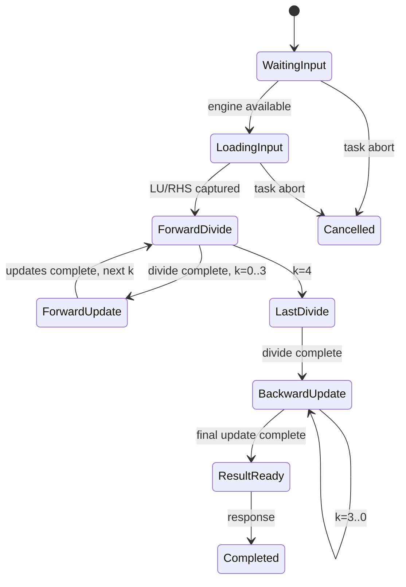
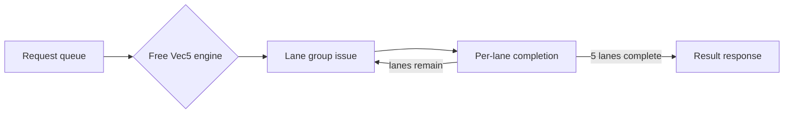

# CFD-DSA LU-SGS Step4 Event Controller 技术文档

> 文档版本：v0.4（2026-07-01 Step4-C Event-driven TRSV5 and Vector5 Resource Engines）
>
> 当前状态：`scons -Q build/ARM/gem5.opt -j2` 构建通过。Step4-A.1 与 Step4-B 旧路径保留；Stage C 已把 TRSV5 展开为 5 次 divide 与 20 次 multiply-subtract 事件，并把 Vector5 展开为可配置 1/2/5 lane 的 COPY/SUB/AXPY engine。1x1/1x2/1x3/1x17/1x64/1x512/1x50000 正确性、backpressure、trace、watchdog、completion validation 和旧路径回归通过。
>
> 边界：三个计算 engine 都是 controller 内的 gem5 event resource model。guest Path A standalone 仍走 O3 FU 路径；SPM 仍由 `SETranslatingPortProxy` 取得数值，没有真实 bank/port 竞争。多 context、tile/DMA、RTL、综合、STA 和 PPA 未完成。

## 1. 启用方式与兼容性

默认 ABI 不变：`cfd_lusgs_launch` 与 `cfd_lusgs_wait` 仍使用 Step3 指令编码。只有下列开关启用时才进入 Step4 event controller：

```text
--lusgs-step4-enable=1
GEM5_CFD_LUSGS_CONTROLLER_IMPL=event
```

Step4-B 不改变 Step4-A.1 默认行为，必须显式打开：

```text
--lusgs-step4-patha-real=1
GEM5_CFD_LUSGS_STEP4_PATHA_REAL=1
```

Step4-C 由独立 Stage C 开启，Stage C 自动启用 real Path A/TRSV5/Vector5：

```text
--lusgs-step4-stage=C
--lusgs-step4-trsv-real=1
--lusgs-step4-vec5-real=1
```

未启用 Step4 时继续走 `src/arch/arm/cfd_lusgs_controller.cc` 的 Step3 functional macro-controller。未启用 `--lusgs-step4-patha-real=1` 时，Step4 仍走 Step4-A.1 skeleton Path A helper。Path A、TRSV5、Path C、decode-exclusive 的既有编码和行为保持独立。

## 2. Step4-A.1 核心变化

本阶段把原 Step4-A skeleton 从“共享完成事件”推进为“每个资源请求一条可验证生命周期”：

| 机制 | 当前实现 |
| --- | --- |
| Task lifecycle | `Idle -> Queued -> Running -> CompletedNotReaped/ErrorNotReaped -> Idle` |
| Request identity | 每条请求带 `requestId/taskToken/taskGeneration/contextId/phase/resourceType/line/cell/tile` |
| Pending table | `unordered_map<requestId, PendingLusgsRequest>` 管理 live request |
| Completion validation | 校验 generation、token、context、requestId、resourceType、wait state |
| Descriptor snapshot | launch 只保存 descriptor 地址；descriptor read 完成后复制快照，后续只使用 snapshot |
| Wait/reap | wait 未完成返回 `Busy=1`；完成或错误后正确 token 才 reap 并清理任务 |
| Watchdog | 可选 no-progress 检测，错误码 `WatchdogTimeout=10` |

新增错误状态：

```text
WatchdogTimeout = 10
UnexpectedCompletion = 11
InternalStateError = 12
```

## 3. 状态机

Step4-A.1 和当前 Step4-B 仍限定 Stage A shape：`n_lines=1`、`contexts=1`、`tile_cells=1`。控制器按 cell 粒度拆分 forward/backward/Q-update：

```text
IDLE
COMMAND_QUEUED
READ_DESCRIPTOR_REQ / WAIT
VALIDATE_DESCRIPTOR
ALLOC_CONTEXT
FORWARD_INIT
FORWARD_LOAD_REQ / WAIT
FORWARD_PATHA_REQ / WAIT
FORWARD_VEC5_REQ / WAIT
FORWARD_TRSV_REQ / WAIT
FORWARD_DQSTAR_WRITE_REQ / WAIT
FORWARD_NEXT
BACKWARD_INIT
BACKWARD_LOAD_REQ / WAIT
BACKWARD_PATHA_REQ / WAIT
BACKWARD_VEC5_REQ / WAIT
BACKWARD_DQ_WRITE_REQ / WAIT
BACKWARD_NEXT
Q_UPDATE_REQ / WAIT
TASK_COMPLETE
TASK_ERROR
```

等待状态不再靠 scheduler tick 空转；资源完成 event 唤醒状态机。正常路径下 pending request allocate/free 必须配平，completion mismatch 计数保持 0。

## 4. Request/Response 语义

每次 `issueRequest()` 创建一条 `PendingLusgsRequest`，并调度独立 `EventFunctionWrapper` completion event。completion 到达时只标记请求完成并做校验；状态机在相应 wait state 中 `consumeRequest()` 后释放 entry。

Step4-A.1 默认资源仍是 skeleton 级 helper；Step4-B 只替换 LU-SGS 内部 Path A MVM：

| 资源 | 当前行为 | 后续阶段 |
| --- | --- | --- |
| Descriptor/SPM read/write | event 化 request/wait，数据仍由 `SETranslatingPortProxy` functional 读写 | Step4-D 建真实 multi-bank SPM |
| Path A, Step4-A.1 | event request 延迟后调用 `mvm5()` helper | 默认保留 |
| Path A, Step4-B | controller 内部展开 6 MatLd + 5 Dotp + 1 Pack + result-ready transfer | 后续可接全局 FU/SPM 仲裁 |
| TRSV5, Stage A/B | event request 延迟后调用 `cfdTrsv5Solve()` | 兼容路径保留 |
| TRSV5, Stage C | queue + load + 5 divide + 20 multiply-subtract + result response | 当前实现 |
| Vector5, Stage A/B | COPY/SUB/AXPY 固定 wrapper + helper | 兼容路径保留 |
| Vector5, Stage C | 独立 queue、1/2/5 lane、busy/retry/result response | 当前实现 |
| Tile/DMA | 固定 tileCells=1 | Step4-F 建 DMA、tile prefetch、双缓冲 |

## 5. Step4-B Path A Resource Graph

当 `env.pathaReal` 为真时，forward/backward 的 Path A MVM 不再在 wait 状态调用热路径 `mvm5()`。状态机改为创建一个 parent PathA request，并把它交给 controller 内部 Path A engine：

```text
parent PathA MVM
  -> alloc result slot
  -> 5 x matrix row MatLd + 1 x vector MatLd
  -> 5 x Dotp(row, vector)
  -> 1 x Pack(result[0:4])
  -> 1 x 40B result-ready transfer
  -> complete parent request
```

资源语义：

| 子资源 | 数量/MVM | 参数来源 | 当前行为 |
| --- | ---: | --- | --- |
| MatLd | 6 | `GEM5_CFD_LUSGS_PATHA_MATLD_LAT/COUNT`，默认跟随 `GEM5_CFD_LMAT_LAT` 与 `GEM5_CFD_READPORT_COUNT` | 读取 C/Bbar 行和 dqstar/dq 向量；记录 40B 读流量 |
| Dotp | 5 | `GEM5_CFD_PATHA_DOTP_LAT`、`GEM5_CFD_LUSGS_PATHA_DOTP_COUNT` | 等 matrix/vector ready 后按 Dotp count/lat issue，完成时计算 5 lane dot |
| Pack | 1 | `GEM5_CFD_LUSGS_PATHA_PACK_LAT/COUNT` | 等 5 个 Dotp 完成后打包到 result slot |
| result-ready | 1 | `GEM5_CFD_LUSGS_PATHA_RESULT_LAT` | 40B result 传给 LU-SGS tmp，释放 slot，完成 parent request |
| result slot | 1 live/MVM | `GEM5_CFD_PATHA_RESULT_BUFFER_DEPTH` | alloc/free 成对；记录 overwrite/early-consume 错误 |

Forward 使用 `C[cell] * dqstar[cell-1]`，Backward 使用 `Bbar[cell] * dq[cell+1]`。这些 vector 依赖仍由原 LU-SGS 状态机顺序保证；Step4-B 只是替换每个 MVM 的内部执行图，不改变数学结果、边界 cell 行为或 Step4-A.1 token/wait 生命周期。

## 6. 数据捕获与内存可见性

Step4-A.1 的 launch 不再立即读取 descriptor 内容，只记录 descriptor 地址和 token。`READ_DESCRIPTOR_WAIT` 消费 descriptor-read request 后复制 `CfdLusgsDescriptor` 到 `descriptorSnapshot`，随后 validation 和全部计算都基于该快照。测试 `--lusgs-step4-snapshot-test` 会在 launch 后修改原 descriptor，结果仍必须与 launch 时输入一致。

SE 模型仍是 functional memory access：

| 阶段 | 语义 |
| --- | --- |
| launch 前 | guest 已写完 descriptor 和输入数组 |
| descriptor read completion | controller 捕获 descriptor snapshot |
| wait Busy | 任务仍可能未完成，输出不可作为 final |
| wait Complete/Error | 正确 token reap 后任务资源释放 |

## 7. wait/poll 与 wrong-path guard

`cfd_lusgs_wait(token)` 现在是 poll/reap：

| 条件 | 返回 | 任务状态 |
| --- | --- | --- |
| token=0、无任务、token 不匹配 | `BadToken=7` | 不清理当前任务 |
| 任务未完成 | `Busy=1` | 不清理当前任务 |
| 任务完成且 token 匹配 | final status | reap token 并清理 |

Launch/wait 指令仍保持非投机提交语义。wrong-path 测试用不可执行分支确认 architectural wrong-path 不会产生有效 token；真实 squash accounting 仍依赖 gem5 的 non-speculative/serialize 提交边界。

## 8. 统计与 trace

`CfdLusgsControllerRecord` 与 `CfdLocalSpm` 增加 Step4-A.1 统计：

```text
lusgsEventDecodedLaunches / CommittedLaunches / SquashedLaunches
lusgsEventWaitInstructions / BusyPolls / SuccessfulWaits / ErrorWaits
lusgsEventTokensReaped / BadTokenWaits
lusgsEventPendingRequestAlloc / Free / FullStalls / MaxPendingRequests / CancelledRequests
lusgsEventStaleCompletions / UnexpectedCompletions / DuplicateCompletions
lusgsEventRequestIdMismatches / GenerationMismatches / WrongStateCompletions
lusgsEventLifecycleQueuedCycles / RunningCycles / CompletedNotReapedCycles / ErrorNotReapedCycles
lusgsEventVec5Copy/Sub/Axpy Requests / Accepted / Completed / Retries / WaitCycles
lusgsEventWatchdogTimeouts / NoProgressCycles / DoubleScheduleErrors
```

Step4-B 追加 Path A 子资源统计：

```text
lusgsEventPathaMvmRequests / Accepted / Retries / Completed / WaitCycles
lusgsEventPathaMatLdRequests / Accepted / Retries / Completed / BusyCycles / Bytes
lusgsEventPathaDotpRequests / Accepted / Retries / Completed / BusyCycles / PipelineOccupancy
lusgsEventPathaPackRequests / Accepted / Retries / Completed / BusyCycles
lusgsEventPathaSlotAlloc / Free / OverwriteErrors / EarlyConsumeErrors
lusgsEventPathaResultTransfers / ResultBytes
lusgsEventPathaLoadPhaseCycles / DotpPhaseCycles / PackPhaseCycles / ResultPhaseCycles
lusgsEventPathaAverageMvmLatency / MinMvmLatency / MaxMvmLatency
```

CSV trace 字段也扩展为包含 generation、request_type、lifecycle、pending count、descriptor snapshot、stale/cancelled、completion validation 和 last_progress_tick。

Step4-C 追加真实 stage 统计：

```text
lusgsEventTrsvQueueFullStalls / MaxQueueDepth
lusgsEventTrsvDivRequests / Completed / BusyCycles
lusgsEventTrsvFmaRequests / Completed / BusyCycles
lusgsEventTrsvForwardCycles / BackwardCycles / DependencyWaitCycles
lusgsEventTrsvForwardedResults / AverageLatency / MinLatency / MaxLatency
lusgsEventTrsvDividerUtilization / FmaUtilization
lusgsEventVec5QueueFullStalls / BusyCycles / MaxQueueDepth
lusgsEventVec5LaneOperations / AverageLatency / LaneUtilization
```

trace 新增 `operation/k/i/lane` 字段和 `trsv_*`、`vec5_*` 逐阶段事件。实测 CSV 为 36 列且无列数异常；FMA busy 尝试以 `accepted=0,retry=1` 与成功 issue 区分。

## 9. 验证记录

构建与语法：

```text
scons -Q build/ARM/gem5.opt -j1 --linker=gold --limit-ld-memory-usage PASS
file build/ARM/gem5.opt                                  ELF x86-64 executable
python3 -m py_compile projects/cfd_dsa/configs/run_cfd_dsa.py projects/cfd_dsa/configs/lusgs/run_cfd_lusgs_step4.py PASS
aarch64-linux-gnu-gcc -static -O2 -Wall -Wextra -march=armv8-a+sve projects/cfd_dsa/benchmarks/lusgs/test_cfd_lusgs_patha_step4.c -o build/cfd_dsa/aarch64/test_cfd_lusgs_patha_step4_arm -lm PASS
```

注：本机默认 bfd 链接器在 `gem5.opt` 链接阶段被系统杀掉；gold + memory limit 构建通过。

Step4-A.1 正常路径：

| case | result | mismatch | busy polls | expected PathA/TRSV5/Vec5Copy/Vec5Sub/Vec5Axpy |
| --- | --- | ---: | ---: | --- |
| 1x1 | `LUSGS_STEP4A_PASS` | 0 | 1 | 0 / 1 / 2 / 0 / 0 |
| 1x2 | `LUSGS_STEP4A_PASS` | 0 | pass | 2 / 2 / 2 / 2 / 0 |
| 1x3 | `LUSGS_STEP4A_PASS` | 0 | pass | 4 / 3 / 2 / 4 / 0 |
| 1x17 | `LUSGS_STEP4A_PASS` | 0 | pass | 32 / 17 / 2 / 32 / 0 |
| 1x64 | `LUSGS_STEP4A_PASS` | 0 | 1132 | 126 / 64 / 2 / 126 / 0 |

当前 1x64 关键 stats（`results/cfd_dsa/baselines/lusgs/step4a/1x64/stats.txt`）：

| stat | value |
| --- | ---: |
| `lusgsEventActualCycles` | 11440 |
| `lusgsEventEventsProcessed` | 1859 |
| `lusgsEventPendingRequestAlloc/Free` | 575 / 575 |
| `lusgsEventMaxPendingRequests` | 1 |
| `lusgsEventStaleCompletions/Unexpected/Duplicate` | 0 / 0 / 0 |
| `lusgsEventRequestIdMismatches/GenerationMismatches/WrongStateCompletions` | 0 / 0 / 0 |
| `lusgsEventVec5Copy/Sub/AxpyRequests` | 2 / 126 / 0 |
| `lusgsEventWatchdogTimeouts/DoubleScheduleErrors` | 0 / 0 |

Step4-B 正常路径：

| case | result | mismatch | expected MVM/MatLd/Dotp/Pack |
| --- | --- | ---: | --- |
| 1x1 | `LUSGS_STEP4B_PASS` | 0 | 0 / 0 / 0 / 0 |
| 1x2 | `LUSGS_STEP4B_PASS` | 0 | 2 / 12 / 10 / 2 |
| 1x3 | `LUSGS_STEP4B_PASS` | 0 | 4 / 24 / 20 / 4 |
| 1x17 | `LUSGS_STEP4B_PASS` | 0 | 32 / 192 / 160 / 32 |
| 1x64 | `LUSGS_STEP4B_PASS` | 0 | 126 / 756 / 630 / 126 |

Step4-B 1x64 关键 stats（`results/cfd_dsa/baselines/lusgs/step4b/1x64/stats.txt`）：

| stat | value |
| --- | ---: |
| `lusgsEventActualCycles` | 7594 |
| `lusgsEventPendingRequestAlloc/Free` | 511 / 511 |
| `lusgsEventPathaMvmRequests/Accepted/Completed` | 126 / 126 / 126 |
| `lusgsEventPathaMatLdRequests/Completed/Bytes` | 756 / 756 / 30240 |
| `lusgsEventPathaDotpRequests/Completed` | 630 / 630 |
| `lusgsEventPathaDotpRetries/BusyCycles/PipelineOccupancy` | 504 / 1260 / 4410 |
| `lusgsEventPathaPackRequests/Completed` | 126 / 126 |
| `lusgsEventPathaSlotAlloc/Free` | 126 / 126 |
| `lusgsEventPathaResultTransfers/ResultBytes` | 126 / 5040 |
| `lusgsEventPathaAverage/Min/MaxMvmLatency` | 14 / 14 / 14 |

默认隔离检查：不加 `--lusgs-step4-patha-real=1` 的 Step4-A.1 1x64 仍输出 `pathaReal=0`，Step4-B PathA 内部计数全部为 0。

Step4-B 参数敏感性（1x17，全部 `LUSGS_STEP4B_PASS`）：

| case | actual cycles | avg MVM latency | 关键变化 |
| --- | ---: | ---: | --- |
| default | 2001 | 14 | Dotp retries=128，Dotp busy=320 |
| `--patha-dotp-lat=5` | 1937 | 12 | Dotp pipeline occupancy 1120 -> 800 |
| `--patha-dotp-count=2` | 1937 | 12 | Dotp retries 128 -> 96，busy 320 -> 128 |
| `--patha-matld-count=1` | 2161 | 19 | MatLd busy 0 -> 480 |
| `--patha-pack-count=2` | 2001 | 14 | 当前单 MVM wait 调度下无 pack 竞争变化 |
| `--patha-result-buffer-depth=1` | 2001 | 14 | 当前单 parent MVM wait 调度下无 slot 竞争变化 |

错误与生命周期路径：

| case | result | 关键输出 |
| --- | --- | --- |
| bad-shape | PASS | status=3 |
| bad-stride | PASS | status=4 |
| bad-align | PASS | status=5 |
| bad-flags | PASS | status=6 |
| missing-q | PASS | status=2 |
| unsupported-stage | PASS | status=8 |
| spm-capacity | PASS | status=9 |
| bad-token | PASS | status=7，cleanupStatus=0 |
| busy launch | PASS | secondToken=0，cleanupStatus=0 |
| bad-shape-then-legal | PASS | first status=3，legalStatus=0 |
| watchdog | PASS | status=10，`lusgsEventWatchdogTimeouts=1` |
| descriptor snapshot | PASS | launch 后修改 descriptor 不影响结果 |
| lifecycle | PASS | bad token 不 reap，正确 token reap，第二次 launch 可完成 |
| wrong-path launch | PASS | architecturalToken=0，legal task 完成 |
| wrong-path wait | PASS | wrong-path wait 不 reap，正确 wait 完成 |
| overlap | PASS | independent work 与 controller execution 重叠，final mismatch=0 |

Step4-B 开启时重新验证：

| case | result | 关键输出 |
| --- | --- | --- |
| descriptor snapshot | `LUSGS_STEP4A_SNAPSHOT_PASS` | status=0，mismatch=0 |
| lifecycle | `LUSGS_STEP4A_LIFECYCLE_PASS` | badToken=7，correctStatus=0，secondStatus=0 |
| wrong-path launch | `LUSGS_STEP4A_WRONG_PATH_LAUNCH_PASS` | architecturalToken=0，legalStatus=0 |
| wrong-path wait | `LUSGS_STEP4A_WRONG_PATH_WAIT_PASS` | wrong-path wait 不 reap，correctStatus=0 |
| overlap | `LUSGS_STEP4A_OVERLAP_PASS` | status=0，mismatch=0，overlapCycles>0 |
| watchdog | `LUSGS_STEP4A_ERROR_PASS` | expectedStatus=10，status=10 |

注：这些测试二进制的输出标签仍沿用 `STEP4A_*`，但运行命令均带 `--lusgs-step4-patha-real=1`，覆盖的是 Step4-B 内部 Path A resource graph。

回归：

| 路径 | 命令摘要 | 结果 |
| --- | --- | --- |
| Step1 | `projects/cfd_dsa/configs/lusgs/run_cfd_lusgs_step1.py --lusgs-lines=1 --lusgs-cells=17` | `LUSGS_STEP1_PASS` |
| Step1 | `projects/cfd_dsa/configs/lusgs/run_cfd_lusgs_step1.py --lusgs-lines=8 --lusgs-cells=64` | `LUSGS_STEP1_PASS` |
| Step2 | `projects/cfd_dsa/configs/lusgs/run_cfd_lusgs_step2.py --lusgs-lines=1 --lusgs-cells=17` | `LUSGS_STEP2_PASS` |
| Step2 | `projects/cfd_dsa/configs/lusgs/run_cfd_lusgs_step2.py --lusgs-lines=8 --lusgs-cells=64` | `LUSGS_STEP2_PASS` |
| Step3 | `projects/cfd_dsa/configs/lusgs/run_cfd_lusgs_step3.py --lusgs-lines=1 --lusgs-cells=17` | `LUSGS_STEP3_PASS` |
| Step3 | `projects/cfd_dsa/configs/lusgs/run_cfd_lusgs_step3.py --lusgs-step3-stage=C --lusgs-lines=8 --lusgs-cells=64 --lusgs-contexts=8 --lusgs-tile-cells=1` | `LUSGS_STEP3_PASS` |
| Path A | `projects/cfd_dsa/configs/run_cfd_patha.py --bench-iters=64` | Overall PASS |
| TRSV5 | `projects/cfd_dsa/configs/run_cfd_trsv5.py --trsv5-solves=1/17/512` | `TRSV5_PASS` |
| Path C | `projects/cfd_dsa/configs/run_cfd_pathc.py --bench-iters=64` | Overall PASS |
| decode-exclusive | `build/cfd_dsa/aarch64/test_cfd_dsa_decode_exclusive_arm` | `DECODE_EXCLUSIVE_PASS` |

注：Step3 默认 wrapper 是 Stage A；`8x64` 默认 Stage A 会返回 `UnsupportedStage=8`，不是本次 Step4-B 引入的回归。Step3 8x64 的有效回归是 Stage C。

## 10. Step4-C 计算引擎

### 10.1 TRSV5 request queue 与状态机

`Trsv5EventRequest` 在进入 engine 时携带地址、header 和输入 buffer；LU/RHS 在 load completion 时通过 Proxy 捕获到 transaction，后续 stage 只读 transaction buffer。热路径不调用完整 `cfdTrsv5Solve()`：divide/FMA completion callback 才更新对应 `value[]`。



每事务严格执行 5 divide、10 forward multiply-subtract、10 backward multiply-subtract。同一 forward `k` 下不同 `i` 可占用多个 FMA，因为它们写不同元素并读取同一已完成的 `value[k]`；backward 同一 `k` 的更新写同一个 `value[k]`，因此保持 `i` 的严格串行顺序。资源忙时只在最早 ready tick 安排唤醒，不做逐周期轮询。

### 10.2 Vector5 queue 与 lane



Request accepted 时冻结 `input0/input1/scalar`。COPY、SUB、AXPY 分别在 lane completion callback 计算对应元素，不预先计算完整向量。`vec5-lanes=1/2/5` 决定每组元素数；`vec5-count`、initiation interval 和 queue depth 独立参数化。

### 10.3 Controller 接入

```text
Forward boundary: Vec5 COPY -> TRSV5 -> DQ_STAR write
Forward interior: Path A -> Vec5 SUB -> TRSV5 -> DQ_STAR write
Backward boundary: Vec5 COPY -> DQ write
Backward interior: Path A -> Vec5 SUB -> DQ write
Q update: Q read -> Vec5 AXPY -> Q write
```

parent request 仍进入 Step4-A.1 pending table；engine response 消费前继续校验 requestId、taskGeneration、token、context、resource、phase 和 wait state。watchdog/error 会取消 engine transaction、清空 queue，并允许错误 reap 后重新 launch。

### 10.4 架构参数

| Engine | 参数 |
| --- | --- |
| TRSV5 | `--trsv5-event-count`、`--trsv5-div-count`、`--trsv5-fma-count`、`--trsv5-div-lat`、`--trsv5-fma-lat`、`--trsv5-load-lat`、`--trsv5-result-lat`、`--trsv5-forwarding`、`--trsv5-queue-depth` |
| Vector5 | `--vec5-count`、`--vec5-lanes`、`--vec5-copy-lat`、`--vec5-sub-lat`、`--vec5-axpy-lat`、`--vec5-initiation-interval`、`--vec5-queue-depth` |

默认 TRSV transaction/divider/FMA 数均为 1，latency 为 load/div/FMA/result=`2/4/3/1`；Vector5 为 count=1、lanes=5、COPY/SUB/AXPY=`1/3/4`、II=1；两侧 queue depth=2。这些是架构探索参数，不是工艺库或 RTL 时序结论。

## 11. Step4-C 实测

### 11.1 正确性与理论计数

1x1、1x2、1x3、1x17、1x64、1x512 和 1x50000 均输出 `LUSGS_STEP4C_PASS`，与 reference/Step2 的 `max_abs_error=0`、`max_rel_error=0`、`mismatch_count=0`。1x64：TRSV=64、divide=320、FMA=1280（forward/backward 各 640），COPY=2、SUB=126、Vector lane op=640；Path A MVM/MatLd/Dotp/Pack=126/756/630/126。1x512 的 TRSV/divide/FMA 实测为 512/2560/10240。

1x50000 使用 `--dram-size=128MB` 容纳约 50MB 测试数组，默认仍为 16MB。实测 actual event cycles=6999974，TRSV/divide/FMA=`50000/250000/1000000`，Vector request/lane-op=`100000/500000`，pending alloc/free=`399999/399999`。benchmark 在 launch 前显式触碰 controller 输出页，避免 SE functional Proxy 无法替 CPU 触发惰性页 fault；该预处理位于 stats reset 之前，不计入 event timeline。

一般 $L$ line、每 line $N$ cell 的理论值为：

```text
TRSV5 = L*N
divide = 5*L*N
forward FMA = 10*L*N
backward FMA = 10*L*N
COPY = 2*L
SUB = 2*L*(N-1)
AXPY = L*N, only when Q update is enabled
```

因此 8x64 理论为 TRSV/divide/forward-FMA/backward-FMA=`512/2560/5120/5120`，COPY/SUB=`16/1008`，Q update 开启时 AXPY=512。Step4-C 当前仍限制单 line，8x64 仅作理论计数；8x64 functional Stage C 已由 Step3 回归覆盖。

### 11.2 1x64 timeline

| 指标 | Step4-A.1 | Step4-B | Step4-C |
| --- | ---: | ---: | ---: |
| actual event cycles | 11440 | 7594 | 8934 |
| event 数 | 1859 | 3369 | 5737 |
| pending alloc/free | 575/575 | 511/511 | 511/511 |

Step4-C 默认 TRSV 平均延迟为 83 cycles：load 2 + forward 50 + backward 30 + result 1。Vector5 平均延迟 2.96875 cycles；divider/FMA/Vector lane utilization 为 0.143273/0.429819/0.336842。Step4-C 比 Step4-B 周期高，是因为原 60-cycle coarse TRSV wrapper 被可解释的 83-cycle staged timeline 替代，并新增逐 lane/stage 事件；不能把三者差值全部解释为硬件加速比。

### 11.3 参数敏感性（1x17）

| 参数扫描 | cycles | TRSV avg | divider util | FMA util | Vec util |
| --- | --- | --- | --- | --- | --- |
| div latency 4 / 8 / 16 | 2354 / 2694 / 3374 | 83 / 103 / 143 | .144 / .252 / .403 | .433 / .379 / .302 | .347 / .347 / .347 |
| FMA latency 3 / 4 / 5 | 2354 / 2694 / 3034 | 83 / 103 / 123 | .144 / .126 / .112 | .433 / .505 / .560 | .347 / .347 / .347 |
| FMA count 1 / 2 / 4 | 2354 / 2150 / 2048 | 83 / 71 / 65 | .144 / .158 / .166 | .433 / .237 / .125 | .347 / .347 / .347 |
| Vec lanes 1 / 2 / 5 | 2490 / 2422 / 2354 | 83 / 83 / 83 | .137 / .140 / .144 | .410 / .421 / .433 | .726 / .512 / .347 |
| Vec SUB latency 1 / 3 / 5 | 2290 / 2354 / 2418 | 83 / 83 / 83 | .148 / .144 / .141 | .445 / .433 / .422 | 1.000 / .347 / .210 |
| TRSV queue depth 1 / 2 / 4 | 2354 / 2354 / 2354 | 83 / 83 / 83 | .144 / .144 / .144 | .433 / .433 / .433 | .347 / .347 / .347 |
| Vec count 1 / 2；queue 1 / 2 / 4 | 均 2354 | 均 83 | 均 .144 | 均 .433 | 均 .347 |

所有正常单 context 扫描的 queue-full 和 dependency wait 均为 0。关闭 forwarding 后 actual cycles 2354 -> 2558、TRSV avg 83 -> 95、dependency wait=204、forwarded results=0。专用 backpressure 测试在两侧 depth=1 时得到 TRSV/Vec5 retries=1/1、queue-full=1/1，最终 mismatch=0 且 pending=25/25。

### 11.4 Vector、trace 与异常注入

- AXPY `omega=1.0/0.5/-0.25` 搭配 lanes=`1/2/5`、queue depth=`1/2/4` 均 `LUSGS_STEP4C_PASS`，Q mismatch=0。
- trace 覆盖 `trsv_request/load/div/fma/stage/result` 和 `vec5_request/lane/result`；36 列 CSV 无坏行。
- 丢弃首个 TRSV divide completion：status=10，watchdog=1；reap 后合法任务 status=0。
- stale generation completion：generation mismatch=1、stale=1，任务正常完成。
- bad request-id 和重复 Vector5 completion：分别 requestId mismatch=1、duplicate=1，status=11；两者 reap 后合法任务 status=0。
- 上述运行 pending alloc/free 分别为 24/24、28/28、26/26、27/27，无 transaction 泄漏。

## 12. 未完成项

仍未实现：

```text
Step4-D: event-level multi-bank SPM port/bank/outstanding/backpressure
Step4-E: 多 context 真实交错与 context arbitration
Step4-F: tile DMA、prefetch、Ping/Pong double buffer、跨 tile 调度
Global arbitration: Step4-B controller Path A 子事件尚未与 guest Path A ISA 指令共用同一个 O3 FUPool 仲裁实例
RTL/synthesis/power: 尚无 RTL、综合、频率、面积、功耗、ECC/BIST、物理 SRAM 宏
```

Step4-C 的性能数字来自 controller 内部 event resource graph，可用于计算资源拆分和参数敏感性分析；仍不应解读为完整硬件系统性能结论。
