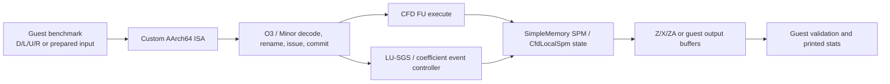
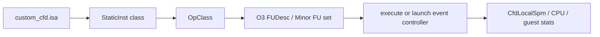
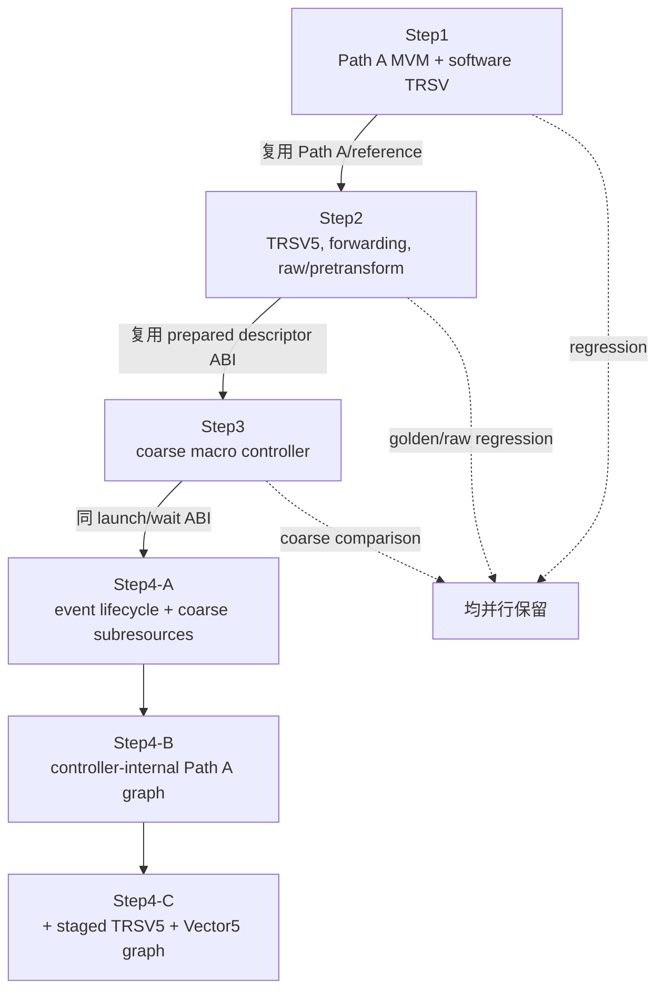
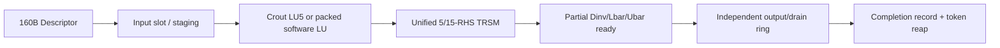

# CFD DSA / LU-SGS gem5 项目结构与实现路径说明

> 审查基线：2026-07-28 工作区；本文件描述的是当前工作树，不以提交时间判断 active。
> 状态词：**active** 当前推荐或默认实际使用；**legacy** 兼容/回归保留；
> **experimental** 可运行但不是 LU-SGS 主路径；**test-only** 仅测试；
> **generated** 构建或运行生成；**unknown/待确认** 代码证据不足。

## 1. 文档目的

本文件是 CFD DSA 与 LU-SGS 的项目地图，回答入口、数据语义、ISA/FU、控制器、
SPM、模式、统计和回归之间的对应关系。它不把旧性能数字当作当前默认实现，也不授权
删除 legacy 代码。完整逐文件清单见
`projects/cfd_dsa/docs/CFD_DSA_PROJECT_FILE_INDEX.md`；关键结论均保留在本文件。

最重要的结论如下：

- 工程级入口是 `projects/cfd_dsa/configs/run_cfd_dsa.py`，专用 wrapper 只追加默认值后
  `runpy` 到该入口（`projects/cfd_dsa/configs/lusgs/run_cfd_lusgs_step2.py:36-39,143-156`）。
- 推荐继续优化的 LU-SGS 功能路径是 **raw D/L/U/R + coefficient event controller +
  event LU（或显式 software-LU 对照）+ 统一 5/15-RHS TRSM + Path A hot loop**。
  这与 Step2 wrapper 的启动默认 `all + coarse + software` 不同；后者是兼容回归默认
  （`projects/cfd_dsa/configs/lusgs/run_cfd_lusgs_step2.py:89-112,143-149`）。
- `coeff3 coarse` 在一条指令的 `execute()` 中一次算完 15 RHS；`coeff event` 是独立
  descriptor/token 状态机。两者数学目标相同，执行模型不同
  （`src/arch/arm/insts/cfd_dsa.cc:1707-1780`；
  `src/arch/arm/cfd_coeff_preprocess_controller.cc:229-358,1902-1946`）。
- 在该主路径上新增显式 **Streaming Stage A+B1.5+B2.5+B3+B4+C1+C2/B5** mode：B3 生成 request-local
  base；B4 复用同一有界 ColumnFma5 消费 Lbar 与 controller-local 前一 cell dq_star，经
  ForwardCombine 发布 40 B dq_star。C1 用一个 parent token 自治展开整条 line；C2/B5
  逐列消费 Ubar 并在 controller 内反向转发 dq。direct 跳过 DInv/Lbar matrix drain 和全部
  guest forward/backward Path A。1×17/window8 的 C1/C2 分别为12602/9640 cycles；
  4-line frontier-aware B5 为29232 cycles，均 mismatch 0
  （`results/cfd_dsa/campaigns/stage2-line-autonomous-20260728/w8-r3/simout.txt`；
  `results/cfd_dsa/campaigns/stage4-ubar-direct-20260728/lines1-r2/simout.txt`；
  `results/cfd_dsa/campaigns/stage5-frontier-schedule-20260728/lines4/simout.txt`）。
- 另有一套 **Step4 LU-SGS event controller**。它把 sweep 内 Path A/TRSV5/Vector5
  调度移入控制器，但不是 coefficient event controller
  （`src/arch/arm/cfd_lusgs_event_controller.cc:40-176,2985-3048`）。
- 当前所谓 coeff `packet` 是 `CfdLocalSpm::issuePacket()` 的内部 event 仲裁 API，
  未接入 gem5 memory hierarchy 的 `RequestPort/sendTimingReq`
  （`src/arch/arm/cfd_local_spm.cc:2290-2390`）。

## 2. 仓库扫描范围与方法

在仓库根 `/home/zyy/gem5` 执行并核对了 `pwd`、`git rev-parse --show-toplevel`、
`git status --short`、`git ls-files` 与用户指定的 `find`。扫描规模为：git 跟踪文件
10,933 个，`projects/cfd_dsa` 59 个文件（其中 3 个为 `__pycache__`，非生成文件 56 个），
`src/arch/arm` 355 个文件，`src/cpu`
363 个文件。重点逐内容核对：

- `projects/cfd_dsa/{benchmarks,configs,docs,suites,tools}`；
- `src/arch/arm/{insts,isa}` 及六个 CFD 控制器/SPM/helper；
- `src/cpu/{op_class.hh,FuncUnit.py,o3,minor}`；
- `src/arch/arm/SConscript`、根级兼容 runner、results manifest/simout/stats；
- 通过 `rg` 交叉检查类、函数、mode、参数、环境变量、指令类和测试引用。

`build/`、`__pycache__/`、二进制、trace 与 stats 只做分类。results 规模：
`archive` 1201、`baselines` 10 个普通文件（另有 Step4-C 软链接）、`campaigns`
1340、`failed` 16、`runs` 637；旧顶层 `results/lusgs_raw` 98、
`results/lusgs_optprep` 115。正式结果生命周期由
`projects/cfd_dsa/docs/RESULT_MANAGEMENT.md:18-30` 定义。

工作树在审查开始时已有大量 modified/untracked CFD 文件；因此本文描述“当前工作树”，
不能据 git 历史判定 active。此次只新增两份 Markdown。

## 3. 项目总体架构



O3 的职责是让普通自定义指令经历真实 decode/rename/IQ/FU/commit 资源约束，并用
`OpClass/opLat/count` 暴露结果时延与结构冲突；它不自动把 coarse `execute()` 中的数学
拆成逐周期硬件。`OpDesc.opLat` 明确定义为“result available”的周期数
（`src/cpu/FuncUnit.py:152-162`）。event controller 则在一次 launch 之后自行调度子资源；
O3 只执行 launch/wait 指令及其序列化语义。

## 4. 顶层目录结构

```text
gem5/
├── src/
│   ├── arch/arm/
│   │   ├── insts/cfd_dsa.{cc,hh}
│   │   ├── isa/formats/custom_cfd.isa
│   │   ├── cfd_local_spm.{cc,hh}
│   │   ├── cfd_coeff_preprocess_controller.{cc,hh}
│   │   ├── cfd_lusgs_controller.{cc,hh}
│   │   ├── cfd_lusgs_event_controller.{cc,hh}
│   │   ├── cfd_lusgs_vec5.{cc,hh}
│   │   └── cfd_trsv5_math.hh
│   └── cpu/
│       ├── op_class.hh / FuncUnit.py
│       ├── o3/{FuncUnitConfig.py,FUPool.py,commit.cc}
│       └── minor/BaseMinorCPU.py
├── projects/cfd_dsa/
│   ├── benchmarks/{common,lusgs,patha,pathb,pathc,trsv5}
│   ├── configs/{lusgs,run_cfd_*.py}
│   ├── docs/
│   ├── suites/
│   └── tools/
├── build/cfd_dsa/aarch64/          # generated guest binaries
└── results/cfd_dsa/                # generated runs/campaigns/baselines
```

| 模块 | 侧/面 | 职责与调用者 | 状态 |
| --- | --- | --- | --- |
| `projects/cfd_dsa/benchmarks/` | guest / 数据面 | 生成数据、inline asm、reference、校验；由 config 作为 workload 启动 | active + legacy |
| `projects/cfd_dsa/configs/` | host / 控制面 | 解析 CLI、构造 CPU/FU/SPM、形成 guest argv | active |
| `src/arch/arm/insts/cfd_dsa.*` | simulator / 数据面 | StaticInst、execute、architectural X/Z/ZA 与 helper 调用 | active + legacy class |
| `src/arch/arm/isa/formats/custom_cfd.isa` | simulator / 控制面 | 唯一 CFD 自定义编码分派 | active |
| `src/arch/arm/cfd_local_spm.*` | simulator / 数据面/统计 | Path A/ZA 状态、linebuf、内部 request 仲裁、全局 CFD stats | active |
| coeff controller | simulator / 控制面 | raw 系数 LU/TRSM/drain event 图 | active |
| LU-SGS controllers | simulator / 控制面 | Step3 coarse 与 Step4 sweep event 图 | experimental/回归 |
| `projects/cfd_dsa/suites/`、`projects/cfd_dsa/tools/` | host / 控制面 | 构建、不可变 campaign、回归组合 | active |
| `projects/cfd_dsa/docs/` | 文档 | 分主题历史与专项说明 | active + historical |

编译入口在 `src/arch/arm/SConscript:91-96`；ISA include 在
`src/arch/arm/isa/formats/custom_cfd.isa:115-124`，
`src/arch/arm/isa/insts/cfd_dsa.isa:4-11` 仅为兼容说明 stub。

## 5. 模拟器侧与 Guest 侧边界

Guest 主 benchmark `test_cfd_lusgs_patha_step2.c` 同时承担：`Problem` 数据分配，
D/L/U/R 与 prepared 数据生成，软件 LU/TRSM/TRSV，raw/legacy mode dispatcher，
inline encoding，launch/wait、正确性比较和周期打印（结构体见该文件 `38-197,488-609`；
mode 解析见 `4498-4595`）。模拟器侧不生成问题数据；它读取 guest 地址或本地 SPM 状态。

Python 参数链完整路径为：

```text
CLI
  -> split wrapper 追加缺省值
  -> projects/cfd_dsa/configs/run_cfd_dsa.py 解析
  -> O3 FUDesc.count/opLat 或 os.environ[GEM5_CFD_*]
  -> StaticInst execute / C++ controller readEnv()
  -> guest argv（仅 benchmark 需要的语义参数）
```

证据：环境变量映射 `projects/cfd_dsa/configs/run_cfd_dsa.py:1381-1552`，O3 FU 覆盖
`3481-3566`，guest argv `3661-3803`，SPM SimObject 与地址映射
`3598,3633-3647,3810-3813`。

## 6. 核心数据语义

| 名称 | 数学/存储语义 | 生成位置 | 不可混用规则 |
| --- | --- | --- | --- |
| `D/L/U/R` | raw block diagonal/lower/upper/RHS | guest `Problem.d_mat/l_mat/u_mat/rhs` | raw `U` 不是 `Ubar` |
| `lu_a` | prepared `LU(D)` | legacy 数据生成 | 不是 raw `D` |
| `c_mat` | prepared lower `L` | legacy 数据生成 | 名称 C/L 混用仅是历史 ABI |
| `b_bar` | prepared `D^-1 U` | legacy 数据生成 | 绝不能作为 raw `U` |
| `lu_d` | raw D 的 packed LU | software/event LU | guest heap，必要时 controller request buffer |
| `u_bar` | `D^-1 U` | MRHS 或 coeff event | raw backward MVM 使用 |
| `d_inv` | `D^-1` | dual/coeff3/event | pretransform forward RHS |
| `l_bar` | `D^-1 L` | dual/coeff3/event | pretransform forward MVM |

raw reference 明确执行 `factor(D)`、`solve(LU,U)`，随后用 raw L forward、Ubar backward
（benchmark `2794-2843`）；prepared reference 直接从 `lu_a/c_mat/b_bar/rhs` 开始
（`2750-2791`）。raw 公共预处理的字节和周期统计见 `1328-1406`。

LU 当前有三类实现：guest software `cfd_lu5_factor`；coeff event 控制器内 Crout LU5；
Step3/Step4 descriptor 接受已经 prepared 的 `lu_a`，不额外做 LU。coarse coeff3 也接受
packed LU，并非第四种 LU 分解（`src/arch/arm/insts/cfd_dsa.cc:1731-1779`）。

## 7. 自定义 ISA 清单

所有 CFD 编码先由 `decodeCustomCFD()` 处理
（`src/arch/arm/isa/formats/custom_cfd.isa:123-320`）。

| 指令/族 | 输入 -> 输出 | OpClass / FU | 实现 | 路径/状态 |
| --- | --- | --- | --- | --- |
| `lmat5` cache legacy | X base -> Z row | MatLd / ReadPort | `DSALmatRow`；execute panic，走 memory path | Path A legacy |
| `lmat5_spm` | X base+row -> Z | MatLd / ReadPort | `DSALmatRowSPM` 或 Local | Path A active；decode `166-187` |
| `dotp_row` | 2 Z -> internal/X16..20 | Dotp / CFD Matrix | `DSADotpRow` | Path A active |
| `pack_acc` | internal/X window -> Z | Pack / PACK | `DSAPackAcc` | Path A active |
| `patha_pack_sub5` | memory RHS - internal -> Z | Pack / PACK | `DSAPackSubAcc` | Step2 forwarded active |
| stream load/dotp/store/drain | guest tile/internal slot -> memory | StreamLd/Dotp/Store5 | `DSAPathA*` | Path A experimental, decode `274-300` |
| `trsv5_lu_spm` | LU ptr + RHS ptr -> Z | Trsv5 / TRSV5 | `DSATrsv5LuSPM` | standalone/Step2 coarse active |
| `trsv5_lu_spm_zrhs` | LU ptr + Z RHS -> Z | Trsv5 / TRSV5 | `DSATrsv5LuZRHS` | forwarded raw active |
| `trsm5_mrhs_spm` | LU + 5 RHS -> output | Mrhs / MRHS | `DSATrsm5MrhsSPM` | Ubar/common coarse |
| `trsm5_inv_lbar_spm` | LU+L -> Dinv+Lbar | InvLbar / dual FU | `DSATrsm5InvLbarSPM` | compatibility comparison |
| `trsm5_coeff3_spm` | LU+L+U -> Dinv+Lbar+Ubar | Coeff3 / coarse FU | `DSATrsm5Coeff3SPM` | coarse regression |
| `vec5_sub_z` | Z-Z -> Z | Vec5 / VEC5 | `DSAVec5SubZ` | raw forward/backward |
| linebuf read/write | line/cell + Z/memory -> Z/state | LineBuf | `DSALineBuf*` | Step2 linebuf regression |
| `cfd_lusgs_launch/wait` | descriptor/token -> token/status | LusgsCtrl | `DSALusgs*` -> Step3/4 controller | experimental/regression |
| coeff launch/wait/cancel | descriptor/token -> token/status | LusgsCtrl | `DSACoeffPreprocess*` | coeff event active |
| `cfdsme_mvm5_pipe_step` | Zcol,Zvec,k -> ZA col | SMEPipe | Path B execute | standalone experimental |
| `cfdsme_za_outer5_step` | selected outer column -> ZA col | SMEZaOuter | Path C execute | standalone experimental |
| old `cfdsme_fmopa5_step` | fixed ZA[:,0] | SMEFmopa | C++ class remains | decoder guard 101 返回 Unknown；legacy candidate |

dual/coeff3 exact fixed-register guards先于 generic TRSV/MRHS 解码，coeff cancel 也仍可 decode
（`src/arch/arm/isa/formats/custom_cfd.isa:196-272`）。OpClass 枚举的完整 CFD 集合在
`src/cpu/op_class.hh:151-165` 与 `src/cpu/FuncUnit.py:133-147`。

## 8. OpClass 与 FU 映射



O3 默认 FU：Dotp 7×1、Pack 1×1、TRSV5 60×1、MRHS 100×1、dual 200×1、
coeff3 300×1、Vec5 4×1、LusgsCtrl 1×1 non-pipelined，MatLd 在 ReadPort
（`src/cpu/o3/FuncUnitConfig.py:147-255,268-283`）。runner 会按 CLI 覆盖
（`projects/cfd_dsa/configs/run_cfd_dsa.py:3481-3566`）。MRHS/dual/coeff3 和 lusgs launch/wait 是
non-speculative；前三者还 serialize before/after
（`src/arch/arm/insts/cfd_dsa.cc:1550-1712,1951-2015`）。coeff launch/wait/cancel 是
non-speculative，但不设置同样的双向 serialize（`2039-2137`）。

Minor 只把 Dotp、MRHS、dual、coeff3、Vec5、LineBuf 放进 SIMD FU，把 MatLd 放进
memory FU；缺 Pack/StreamLd/Store5/TRSV5/LusgsCtrl/PathB/PathC
（`src/cpu/minor/BaseMinorCPU.py:220-283`）。因此 **当前完整 CFD 路径推荐 O3；Minor
支持不完整，属于配置风险，待补 decode/run 回归**。

## 9. SPM 与存储层

当前并存三种访问层：

1. `system.spm = SimpleMemory`，地址窗口 `0x70000000` 由 SE `process.map` 设为
   uncacheable；generic `lmat5_spm` 可发 timing memory read
   （`projects/cfd_dsa/configs/run_cfd_dsa.py:3633-3647,3810-3813`）。
2. `CfdLocalSpm` 的 functional/local-event 模型，保存 Path A internal result/token、
   ZA rename/pending、line buffer，并按 read port/bank/outstanding/Z writeback 统计。
3. coefficient event 的 `internal` 仲裁或名为 `packet` 的共享 `issuePacket()` API。
   `issuePacket()` 选择 port/bank、限制 outstanding、创建 local completion event
   （`src/arch/arm/cfd_local_spm.cc:2290-2346`），不是 gem5 Packet/RequestPort。

coeff event input slots、request-local `D/L/U/LU/Dinv/Lbar/Ubar`、pending op、15 个
`RhsState`、output/drain ring 在 controller 内；最终值仍用 proxy 写回 descriptor 指向的
guest heap（`src/arch/arm/cfd_coeff_preprocess_controller.cc:274-358,1607-1623,1781-1805`）。
partial-ready 分别为 Dinv/Lbar/Ubar 排队 drain，独立 drain 可与 compute overlap
（`1540-1603`）。layout 可选 `legacy/matrix-separated/row-striped`
（`57-80`）。

Step4 controller 仍在完成模拟等待后通过 `SETranslatingPortProxy` 读写数值，例如 descriptor
读在 `src/arch/arm/cfd_lusgs_event_controller.cc:3007-3023`；其 `spmReadLatency` 统计不是上述 coeff
packet 的真实共享 memory request。

## 10. Path A / Path B / Path C

| 路径 | 数据流 | 当前状态 | LU-SGS 关系 |
| --- | --- | --- | --- |
| A | 5 行 lmat -> 5 dotp -> internal ping/pong result/token -> pack/pack-sub/store | active | Step1/2 hot MVM；Step4-B/C 有 controller 内独立资源图 |
| B | 5 次 selected partial-sum pipe step，ZA 列间转发，MOVA final | experimental | standalone suite 覆盖，未进入 LU-SGS mode dispatcher |
| C | 5 次 selected-column outer product，ZA column-ready，MOVA final | experimental | standalone SME/ZA 探索，未进入 LU-SGS 主路径 |

Path A 新 benchmark 是 `test_cfd_patha_extreme_perf.c`；
`test_cfd_extreme_perf.c` 明确作为 `patha-legacy` 构建
（`projects/cfd_dsa/tools/build_benchmarks.py:20-23`）。Path B/C 均在 core regression
（`projects/cfd_dsa/suites/core-regression.json:4-18`），但没有被 Step2 benchmark 调用。
Path C compatibility source只 include 新 outer benchmark；旧 fixed-ZA source仍能编译，
其编码在 decoder 中不可达，故是“待审查 legacy/test-only”，不能删除。

## 11. LU-SGS Step1 / Step2 / Step3 / Step4

Step2 当前已经演化为包含 prepared/raw、TRSV/pretransform、dual/coeff3、coarse/event
和 context/linebuf 的模式族；具体逐 cell 调用、模式布尔开关、事件状态机及统计口径以
`projects/cfd_dsa/docs/CFD_DSA_LUSGS_STEP2.md` 为准。



- Step1：完整 guest sweep，MVM 用 Path A，TRSV 为 software；是最小融合基线。
- Step2：增加 hardware TRSV5、Z-RHS forwarding、line-context/linebuf、raw common
  preprocess、dual/coeff3/event pretransform；当前功能主路径在此 benchmark。
- Step3：`CfdLusgsController::runTask()` 立即 functional 读/算/写，再给 analytic schedule；
  Stage A/B/C 表示 coarse 模型扩展，不是 coeff event
  （`src/arch/arm/cfd_lusgs_controller.cc:168-267,269-423`）。
- Step4-A：descriptor/token 生命周期和 completion event；A 默认仍可用 coarse helper。
- Step4-B：把 Path A MVM 展开成 controller 内 slot/load/dotp/pack graph。
- Step4-C：再把 TRSV5 和 Vector5 展成 queue/lane/div/FMA event graph；Stage B/C 会强制
  `pathaReal`，Stage C 还强制 `trsvReal/vec5Real`
  （`src/arch/arm/cfd_lusgs_event_controller.cc:413-519`）。

Step4 当前只支持 `n_lines=1, contexts=1, tile_cells=1`，否则 UnsupportedStage
（`src/arch/arm/cfd_lusgs_event_controller.cc:689-728`）。后一步没有替代前一步；四个 benchmark 和
suite case 都保留为 golden/regression。

## 12. Legacy prepared-input 路径

输入已是 `lu_a=LU(D), c_mat=L, b_bar=D^-1U, rhs=R`，因此不包含 raw coefficient
生成成本。模式差异：

| 模式 | 变化 | 状态 |
| --- | --- | --- |
| `reference` | software MVM + software TRSV | golden |
| `step1` | Path A MVM + software TRSV | legacy regression |
| `step2` | Path A + memory-RHS hardware TRSV | legacy regression |
| `step2-core`/`fused` | pack-sub fused，仍有 RHS stage | legacy regression |
| `step2-core-forwarded`/`forwarded` | pack-sub Z 直接喂 Z-RHS TRSV | legacy regression |
| `...-context`/`context` | 每 line 保存 prev/next vector，减少 heap source | legacy regression |
| `...-linebuf`/`linebuf` | CfdLocalSpm hardware line buffer | legacy experimental regression |
| `step2-pretransform[-context]` | 对 prepared LU/L 生成 Dinv/Lbar；Ubar沿用 b_bar | compatibility |
| `step2-pretransform-optprep[-context]` | dual INV/LBAR 对照 | compatibility |

不要用这些模式与 raw event 的“总成本”直接比较。

## 13. Raw TRSV5 路径

```mermaid
flowchart LR
    R[D / L / U / R] --> P[LU(D) + Ubar=solve(LU,U)]
    P --> F[MVM L,prev]
    F --> S[Vector/pack subtract]
    S --> T[TRSV5 Z-RHS]
    T --> B[MVM Ubar,next + subtract]
```

`step2-trsv5-raw[-context]` 先走 `prepare_raw_common()` 或 coeff-event 5-RHS request，
再把 `lu_a/c_mat/b_bar` 临时 alias 为 `lu_d/l_mat/u_bar`，复用 Path A/TRSV hot loop
（benchmark `4134-4175`）。coarse 预处理为 guest software LU + MRHS FU；event 模式由
`--coeff-preprocess-model=event` 选择，`--lu5-model=event|software` 决定 LU 在 controller
还是 guest 先完成（`3917-4026`）。

## 14. Raw pretransform dual 路径

`step2-pretransform-raw[-context]` 在公共 LU/Ubar 之外，用 dual INV/LBAR 生成 Dinv/Lbar；
hot loop 使用 `Lbar` 做 forward MVM，`Dinv*R` 替代逐 cell TRSV，backward 使用 Ubar。
它保留用于兼容、与 coeff3 比较和系数生成方案对照，不是推荐的 event 硬件模型。
dual execute 一次读 LU/L 并写 Dinv/Lbar（`src/arch/arm/insts/cfd_dsa.cc:1621-1696`）。

## 15. Coarse coeff3 路径

`step2-pretransform-raw-optprep[-context]` 且 coeff model 非 event 时使用
`trsm5_coeff3_spm`：一条 non-speculative、serialized 指令，在 `execute()` 内一次读取
LU/L/U，调用同一 TRSV 数值序列求 15 RHS，写 Dinv/Lbar/Ubar；O3 只看默认 300-cycle
FU latency（`src/arch/arm/insts/cfd_dsa.cc:1707-1780`；
`src/cpu/o3/FuncUnitConfig.py:202-206`）。

这是功能回归与 coarse 上界/对照，**不代表逐周期 LU、divider、mul/sub、drain 或
backpressure 硬件**。

## 16. Event coeff3 路径



request 状态由 `RequestStage`、`LuPhase`、15 个 `RhsState`、`PendingOp`、资源池和
`DrainTask` 组成（`src/arch/arm/cfd_coeff_preprocess_controller.cc:229-358`）。launch snapshot
descriptor，generation/token 绑定 request；wait/reap 和 cancel 处理完成、错误、旧 token
（controller `609-840`）。每 tick 的顺序是 complete ops、分配 input、LU、solve、drain、
finish（`1902-1929`）。

输入 staging、Crout LU step-ready、统一 5-RHS Ubar 或 15-RHS Dinv/Lbar/Ubar、partial
ready、独立 drain、output depth、pending depth、port/bank/outstanding 均有 stall/overlap
统计。当前推荐面积/性能平衡点为 RHS15/div1/mul1；div2/mul1 是高性能探索点。正式
`coeff-event-packet-formal-s16` 两个 case manifest 均 passed，simout 的 raw TRSV、raw
PRE、raw coeff3 mismatch 均为 0
（`results/cfd_dsa/campaigns/coeff-event-packet-formal-s16/*/manifest.json:1-40`；
相应 `results/cfd_dsa/campaigns/coeff-event-packet-formal-s16/*/simout.txt:893-1247`）。
这是一条结果证据，不等于 wrapper 默认值。

### 16.1 Streaming Stage A+B1.5+B2.5+B3+B4+C1+C2/B5

`step2-pretransform-raw-optprep-stream` 复用同一 event controller，但 descriptor 增加
`CFD_COEFF_PRE_STREAMING_PROGRESS` 与 NEED_DINV/LBAR/UBAR mask。mask 全零保持旧 15 RHS；
显式 mask 查固定 `RhsMaskPlans[8]` 并生成 15-bit work mask，未请求 batch 不进入
input/solve/drain（controller `:342-370,644-720,1257-1696`）。默认 auto 路径的 launch slot 与
stable per-cell record 分离；真实 drain 发布 progress record，完整 terminal record 发布后由
controller 自动 erase request/token（controller `:1720-1784,1923-1973`；benchmark
`:4747-5027`）。显式 `queue` 模式仍保留 bounded round-robin reaper 回归。

Stage A 冻结基线为 17300 cycles；B1+B2 queue 历史点为 23228 cycles。B1.5+B2.5 默认 auto
1×17 为 15648 cycles、245 RHS、skip 10、17/17 auto-retire、0 WAIT/queue scan、mismatch 0
（`results/cfd_dsa/campaigns/stageb15-final-smoke/auto-1x17-w4-final/simout.txt:784-1032`）。旧 queue 的慢 drain
压力路径继续用于验证 terminal 前复用。
B3 使用 descriptor bit10/11 和 reserved R/base 地址，在现有 input timing 中加入40 B R，
`requestedBatchMask` 与 `matrixDrainMask` 分离。DInv 列进入 request-local storage；scheduler 跨
request round-robin、同 request 固定 k=0..4；第五列后通过 BaseVector output drain 发布40 B。
direct 1×17 的 Path A MVM 49→32、DInv drain/reload 各避免3400 B、event output
13200→10480 B；shadow 位级 mismatch=0。证据 `results/cfd_dsa/campaigns/stageb3-final3/`。
B4 用 bit12/13 和 reserved correction/dq_star 地址；相邻 dq_star handoff 独立于 request
auto-retire，cell i>0 严格 k=0..4 累加 Lbar correction，默认 1/1/1/2 的 ForwardCombine 计算
base-correction。direct 跳过 Lbar drain/reload 各3200 B，Path A 49→16，只发布 680 B dq_star；
同构建 off/direct18158/16754，证据 `results/cfd_dsa/campaigns/stageb4-final-perf4/`。
C1 的 bit17 line descriptor 由 controller 按 window 展开普通 B4 子请求，guest 每 line
只提交/回收一个 parent token；2/4/8 line 折算每 line 为11202/10698.5/10449.25 cycles。
C2/B5 的 bit18 保留各 cell Ubar/dq_star，用共享 ColumnFma5 反向消费五列并转发 dq，
使 forward/backward Path A 均为0；1-line/4-line 为9640/29890 cycles。frontier-aware
DInv→Lbar→Ubar+aging 调度进一步把4-line降到29232 cycles。技术细节与口径见
`projects/cfd_dsa/docs/CFD_DSA_LUSGS_STEP2_STREAMING.md`。

4-line B5 的 `packet + row-striped + inputSlots=4 + outstanding=8` 回归发出/完成1776个
内部 SPM packet，观测 read/write/bank/outstanding stall=17/1257/2/194，total=30106，
mismatch 0（`results/cfd_dsa/campaigns/stage6-packet-double-buffer-20260728/lines4/simout.txt`）。
这验证了控制器内部 bank/port/outstanding backpressure 和 input-slot 双缓冲，不代表
DDR→DMA→SPM。Stage 6b 现已另增 `--coeff-spm-model=dma`，由
`CfdLocalSpm.dma_port` 发出真实 timing ReadReq/WriteReq；`packet` 历史结果的口径不变。
这里没有新增独立 DMA SimObject：选择扩展既有 memory-side `CfdLocalSpm`，而不是让匿名
coefficient controller 直接持有端口。最终 1×17 回归观测 604 个 packet 发出且 604 个
response 完成，10480 B read、7280 B write、374 次 RequestPort retry、0 translation
failure（`results/cfd_dsa/campaigns/coeff-streaming-boundaries-final4-20260728/stage6b-requestport-dma/`）。
集中回归入口为
`projects/cfd_dsa/suites/coeff-streaming-line-autonomous.json`；2026-07-28 的6个 case
manifest 全部 passed，证据
`results/cfd_dsa/campaigns/coeff-streaming-line-autonomous-final-20260728/`。

## 17. Context 与非 Context

注意区分本节guest前后向context和控制器LU/TRSM活动request额度。
后者的1/2/4固定资源消融及新发射/在途统计见
`projects/cfd_dsa/docs/CFD_DSA_CONTEXT_ABLATION.md`；参数为`lu5-count/coeff3-count`，
不是`lu5-div-count/coeff3-div-count`等算术FU数量。

新增可选 `--coeff-line-mvm-model=split` 实验入口：line级乘积预计算、顺序累加和
有界乘积缓冲，具体资源成本与覆盖范围见 `CFD_DSA_LUSGS_STEP2_STREAMING.md` 第17节。
默认仍为serial；新增LineProduct/LineAccumulate只是控制器内部事件类型，不是新ISA或OpClass。

当前 autonomous line 又增加了缓存命中 base 前瞻和本地数值 ready 驱动后向，
各自有 `--coeff-line-base-ahead` / `--coeff-line-early-backward` 开关（默认1）。
实现、生命周期边界和消融入口见 `projects/cfd_dsa/docs/CFD_DSA_LUSGS_STEP2_STREAMING.md`
第16节及 `projects/cfd_dsa/suites/coeff-line-dependency.json`。上述2026-07-28周期为
历史实现数据，不能视为本次优化后的测量；本次也没有将 parent 结果 proxy 写回改为DMA。

`ForwardLineContext` 保存每 line 的 `prev_dqstar[5] + valid/line/cell`；
`BackwardLineContext` 保存 `next_dq[5] + tags`
（benchmark `571-583`）。non-context 从 guest `dq_star[cell-1]` 或 `dq[cell+1]` 读取并
stage；context 在 line 遍历时从该软件 context 直接取相邻 vector并更新
（`2867-2885,2889-3095`）。

两者数学方程相同，benchmark 对 context/non-context 作 mismatch 比较
（`7263-7277,7347-7363`）。性能差异来自 heap load/store、stage、forwarding 与
interleave，不来自系数语义。目前值得保留为回归/数据移动研究；它是 **guest software
context**，不要与 Step4 controller context table 混称。

## 18. 运行模式矩阵

`--lusgs-mode` 的实际集合来自 benchmark `4498-4595`：

| 模式 | 原始输入 | 预处理/LU | 求解/Forward/Backward | Context | 推荐用途 |
| --- | --- | --- | --- | --- | --- |
| `all` | prepared + raw | coarse/software 默认，跑全部 | 所有分支 | 两者 | 大回归；非性能单点 |
| `raw-compare` | raw | coarse 或 event；software/event LU | TRSV raw + PRE dual + PRE coeff3 | 否 | raw 正确性/公平比较 |
| `raw-compare-context` | raw | 同上 | 同上 | 是 | context 对照 |
| `reference` | prepared | 无 | 全软件 | 否 | golden |
| `step1` | prepared | 无 | Path A + SW TRSV | 否 | 回归 |
| `step2` | prepared | 无 | Path A + TRSV | 否 | 回归 |
| `step2-core`,`fused` | prepared | 无 | fused sub + TRSV | 否 | 回归 |
| `step2-core-forwarded`,`forwarded` | prepared | 无 | Z-RHS forwarding | 否 | 回归 |
| `step2-core-forwarded-context`,`context` | prepared | 无 | forwarded | 是 | 回归 |
| `step2-core-forwarded-linebuf`,`linebuf` | prepared | 无 | hardware linebuf | linebuf | 压力/回归 |
| `step2-pretransform` | prepared | MRHS Dinv/Lbar | pretransform hot loop | 否 | compatibility |
| `step2-pretransform-context` | prepared | 同上 | 同上 | 是 | compatibility |
| `step2-pretransform-optprep` | prepared | dual | pretransform | 否 | 方案比较 |
| `step2-pretransform-optprep-context` | prepared | dual | pretransform | 是 | 方案比较 |
| `step2-trsv5-raw` | raw | LU+Ubar coarse/event | L + TRSV / Ubar | 否 | 功能基线 |
| `step2-trsv5-raw-context` | raw | 同上 | 同上 | 是 | context 基线 |
| `step2-pretransform-raw` | raw | common + dual | Lbar/Dinv / Ubar | 否 | compatibility |
| `step2-pretransform-raw-context` | raw | 同上 | 同上 | 是 | compatibility |
| `step2-pretransform-raw-optprep` | raw | coeff3 coarse/event | Lbar/Dinv / Ubar | 否 | **event 主路径 mode** |
| `step2-pretransform-raw-optprep-context` | raw | 同上 | 同上 | 是 | context 对照 |
| `step2-pretransform-raw-optprep-stream` | raw | coeff3 event + event LU + fixed 5/10/15 RHS | B3/B4 direct；可选 C1 line autonomy、C2/B5 Ubar direct | controller line context；旧路径 guest context | 当前性能路径支持1/2/4/8 line、仅1 sweep；off/queue/sync 保留回归 |

`--trsv5-mode` 虽由 Python 接受字符串，benchmark 当前只接受 `zreg-coarse`
（benchmark `4926-4929`）；`--ubar-inplace=1` 明确保留但拒绝
（`4962-4965`）。

## 19. 配置参数矩阵

下表默认值来自 Step2 wrapper；C++ fallback 同时列出时以 wrapper 为实际启动值。

| 参数 | 默认 | 作用/可选值 | 路径/有效性 |
| --- | ---: | --- | --- |
| `coeff-preprocess-model` | `coarse` | `coarse,event` | 有效；决定 coarse 指令还是 coeff controller |
| `lu5-model` | `software` | `software,event` | event preprocess 内有效 |
| `coeff3-rhs-lanes` | 15 | 1..15 | event TRSM 并行 RHS |
| `coeff3-div-count/lat/ii` | 1/12/4 | 正整数 | event solve divider |
| `coeff3-div-mode` | `divide` | divide/reciprocal | divide 保留逐 RHS 除法；reciprocal 仅容差等价实验 |
| `coeff-mulsub-count` | 1 | 正整数 | event solve mul/sub lanes |
| `coeff3-partial-output` | 1 | 0/1 | Dinv/Lbar/Ubar 分批 drain |
| `coeff-input-slots` | 2 | >=1 | input request slots |
| `coeff-output-buffer-depth` | 4 | >=1 | output/drain backpressure |
| `coeff-validation` | `full` | full/performance 等 | guest validation；不得计入硬件吞吐 |
| `coeff-streaming-enable` | mode决定；通常0 | 0/1 | 必须与显式 stream mode 一致；旧 mode 不变 |
| `coeff-stream-window` | 8 | 1/2/4/8 | streaming per-cell/line-child lookahead；Python/guest 双重校验 |
| `coeff-stream-retire-mode` | `auto` | sync/queue/auto | auto 为性能路径；queue 为 B1 压力回归；非法值双端拒绝 |
| `coeff-stream-boundary-mask` | 1 | 0/1 | 1 为 B2.5 5/10/15 RHS；0 保留 full15 隔离性能对照 |
| `coeff-stream-dinv-consumer` | off | off/shadow/direct | B3；仅 streaming+auto 有效；direct 跳过 DInv matrix drain |
| `coeff-stream-lbar-consumer` | off | off/shadow/direct | B4；要求 DInv direct；direct 跳过 Lbar drain 与 guest forward Path A |
| `coeff-stream-line-autonomous` | 0 | 0/1 | C1；每 line 一个 parent token，要求 B3/B4 direct |
| `coeff-stream-ubar-consumer` | off | off/direct | C2/B5；要求 line autonomous；direct 跳过 guest backward Path A |
| `coeff3-schedule` | line 模式 `frontier-aware`，其他 `round-robin-ready` | column/step/round-robin/ready/frontier | frontier-aware 为 DInv/Lbar 优先并带64-cycle aging |
| `coeff-column-fma-latency/ii/count/queue-depth` | 4/1/1/5 | lat 1..1024、II 1..64、count 1..4、queue 1..64 | controller 内部 ColumnFma5；不是 OpClass/FU |
| `forward-combine-latency/ii/count/queue-depth` | 1/1/1/2 | lat/II 1..64、count 1..4、queue 1..64 | controller 内部 base-correction；不是 OpClass/FU |
| `coefficient-update-interval` | 0 | >=0 | 0 不授权复用；K>0 是 guest 发布的连续 K sweep D/L/U 稳定承诺 |
| `lusgs-preprocess-auto` / legacy alias `lusgs-pretransform-auto` | 0 | 0/1 | guest 在 TRSV/PRE 间按模型选择；wrapper alias处理 `projects/cfd_dsa/configs/lusgs/run_cfd_lusgs_step2.py:136-141` |
| coeff SPM read/write ports | 1/1 | >=1 | event drain/input 仲裁 |
| coeff SPM input-write/drain-read width | 40B/40B | >=8B | event staging/drain；runner `projects/cfd_dsa/configs/lusgs/run_cfd_lusgs_step2.py:115-129` |
| coeff SPM banks/outstanding | 4/4 | >=1 | internal/packet 仲裁 |
| generic local SPM read width | 64B | >=1 | Path B/C/local-event；base runner `projects/cfd_dsa/configs/run_cfd_dsa.py:126-140` |
| `coeff-spm-model/layout` | internal/legacy | internal/packet/dma；3 layouts | packet 是 local event API；只有 dma 走 timing RequestPort |
| Path A dotp lat/count | 7/1 | cycles/engines | O3 FU 与 Step4 graph均有映射风险 |
| TRSV5 lat/count | 60/1 | coarse O3 FU | standalone/Step2；event TRSV另有参数 |
| MRHS lat/count | 100/1 | coarse FU | common Ubar |
| dual lat/count | 200/1 | coarse FU | compatibility |
| coeff3 coarse lat/count | 300/1 | coarse FU | 非 event |

event C++ 读取链见 `src/arch/arm/cfd_coeff_preprocess_controller.cc:142-260`；Python 环境映射见
`projects/cfd_dsa/configs/run_cfd_dsa.py:1590-1615`。已识别的配置风险：

- 默认值分散在 base runner、Step wrappers、C++ `EventEnv`；例如 C++ 声明初值
  `rhsLanes=5, coeffMulSubCount=5`，但 `readEnv()` fallback 和 wrapper 均为 15/1
  （controller `96-126,142-203`）。实际值正确，声明初值易误读。
- generic local SPM 参数与 coeff SPM 参数是两组；不能用 `--local-spm-*` 推断 coeff
  event 的端口/银行。
- Step4 的 `trsv5-*`/`vec5-*` event 参数与 Step2 coarse FU 同名近似但进入不同 C++。
- `GEM5_CFD_ZA_STATE_MODE` 在 runner 连续赋值两次（`1405-1406`），功能无变化但应清理。
- Minor 未消费全部 OpClass；选择 `--cpu=minor` 不能视为完整支持。
- C++ 支持四种 RHS scheduler 和三种 layout，Python有暴露；`ColumnMajor` 枚举存在，
  未在 parser 中作为显式字符串分支，非匹配值回落 round-robin-ready
  （controller `57-94`），应在后续统一校验。

## 20. 核心数据结构

| 结构 | 位置/生命周期 | 生产者 -> 消费者 | 内容/路径 |
| --- | --- | --- | --- |
| `Problem` | guest heap；一次进程 | generator -> all solvers | raw/prepared 系数、全部结果；benchmark `67-120` |
| forward/back contexts | guest heap；每 sweep reset | sweep -> next cell | prev dqstar / next dq；`571-583,2867-2885` |
| `CfdLusgsDescriptor` | guest heap snapshot | Step3/4 benchmark -> controllers | prepared bases/shape/flags；`src/arch/arm/cfd_lusgs_controller.hh:21-38` |
| `CfdLusgsControllerRecord` | guest record | controllers -> benchmark/report | coarse/event timing和流量；header `57-291` |
| coeff descriptor | guest heap snapshot | Step2 -> coeff controller | D/L/U/output/record/generation；benchmark `488-505` |
| coeff completion record | guest heap | controller -> wait/validation | ready/drain/stall/overlap、B3/B4 column/handoff/combine/publish；controller header `64-316` |
| `StreamingCellState` | guest window slot；一次 stream sweep | launch/poll -> forward/reaper | line/cell/generation/token、阶段 ready、consumer/drain/reap；benchmark `626-645` |
| `Request` | controller pending table | launch -> auto-retire/wait | request-local matrices、RHS[15]、DInv/Lbar列、base/correction/dqstar、stage/token；controller `330-466` |
| `ColumnFmaTask` | bounded controller queue/active op | DInv/Lbar column ready -> accumulator | kind/token/generation/cell/column snapshot；controller `469-482` |
| `ForwardDqHandoff` | per-line controller table；可跨 request terminal | producer dqstar -> adjacent consumer | cell/generation/vector/ready cycle；controller `493-500,1967-2068` |
| `ForwardCombineTask` | bounded controller queue/active op | base+correction -> dqstar | token/generation snapshot；controller `487-492,2072-2152` |
| `RhsState` | Request 内 | scheduler -> TRSM ops | 15 RHS 的 phase/row/依赖；`274-285` |
| input slot | controller arrays | assign -> input done | slot ownership/backpressure；`287-334,770-840` |
| output/drain entry | drain queue/active ring | partial ready -> proxy write | LU/Dinv/Lbar/Ubar/Base/Correction/DqStar；controller `299,659-688,2508-2654` |
| SPM request | `CfdLocalSpm` queue | issuePacket -> completion event | id/address/port/bank/times/callback；`src/arch/arm/cfd_local_spm.hh:190-214` |
| ZA pending/physical state | CfdLocalSpm | PathB/C execute/commit/squash | speculative ZA updates；`src/arch/arm/cfd_local_spm.hh:157-188` |
| Path A internal result | CfdLocalSpm slot/token | dotp -> pack/sub/store | ping/pong results and deps；`src/arch/arm/insts/cfd_dsa.cc:759-817,861-1015` |
| Step4 pending/context | controller heap/table | issue event -> consume/free | token/generation/request/state；`src/arch/arm/cfd_lusgs_event_controller.cc:108-176` |

architectural X/Z/ZA 只承载普通指令显式输入输出；event request-local matrix 不在架构寄存器。

## 21. 主要调用图

```text
run_cfd_lusgs_step2.py
  -> run_cfd_dsa.py -> O3/FU/SPM + workload argv
  -> test_cfd_lusgs_patha_step2_arm::main
  -> parse mode -> selected solver(s)

TRSV raw
  -> prepare_raw_common / prepare_raw_event
  -> LU factor -> MRHS/event 5-RHS Ubar
  -> Path A MVM -> pack/VectorSub -> TRSV5 Z-RHS
  -> Path A Ubar MVM -> subtract

PRE coeff3 coarse
  -> stage addresses -> trsm5_coeff3_spm
  -> DSATrsm5Coeff3SPM::execute -> cfdTrsv5Solve x 15
  -> guest output buffers

PRE event
  -> CoeffPreprocessDescriptor -> cfd_coeff_pre_launch
  -> CfdCoeffPreprocessController request/input/LU/TRSM/drain
  -> completion record -> cfd_coeff_pre_wait/reap

PRE streaming Stage A+B3+B4
  -> fill per-cell request window
  -> DInv column ready -> in-order ColumnFma5 -> base accumulator
  -> B4 off: 40 B BaseVector -> guest Lbar Path A/fused subtract
  -> B4 direct: previous dq_star handoff + in-order Lbar ColumnFma5
  -> ForwardCombine -> 40 B DqStarVector drain
  -> terminal record/auto-retire/generation check -> slot reuse
  -> backward sweep after forward frontier completes

Path A
  -> inline lmat5_spm x5 -> dotp_row x5
  -> CfdLocalSpm internal result/token -> pack_acc/pack_sub
  -> Z register -> predicated store or TRSV RHS
```

普通 ISA 到 FU 的证据链为 `src/arch/arm/isa/formats/custom_cfd.isa:166-319` ->
`src/arch/arm/insts/cfd_dsa.cc:467-2396` -> `src/cpu/op_class.hh:151-165` ->
`src/cpu/o3/FuncUnitConfig.py:147-255` -> `src/cpu/o3/FUPool.py` 默认 pool。控制器
launch/wait 在 `src/arch/arm/insts/cfd_dsa.cc:1951-2151` 分派到 coarse/event 实现。

## 22. 统计与周期口径

| 类别 | 定义/增加位置 | 单位与适用范围 | 风险 |
| --- | --- | --- | --- |
| Path A/SPM/ZA/B/C | `src/arch/arm/cfd_local_spm.cc:51-238` 及 execute record | Count/Byte/Cycle；普通指令 | local-event 与 SimpleMemory stats不是同一层 |
| TRSV/MRHS/dual/coeff3 coarse | `src/arch/arm/cfd_local_spm.cc` 中对应组；execute调用 record | 指令数、bytes、coarse latency | opLat 不是内部逐级周期 |
| coeff event/packet | coeff record + `src/arch/arm/cfd_local_spm.cc:238-604` | request/stall/overlap/drain | packet名不等于 memory Packet |
| Step3 controller | `src/arch/arm/cfd_local_spm.cc:605-735` | analytic schedule/traffic | functional math已立即完成 |
| Step4 event | `src/arch/arm/cfd_local_spm.cc:737-1115+` | actual event、lifecycle、PathA/TRSV/Vec | 与 coeff event同对象前缀近似但不同控制器 |
| benchmark | Step2 `Stats` 和 printf | guest cycle counter、mismatch | full validation/初始化会污染端到端 total |

统一报告口径应固定为：

```text
initialization
  + common preprocess (LU + Ubar)
  + extra preprocess (Dinv + Lbar, if PRE)
  + forward hot loop
  + backward hot loop
  = runtime/sweep scope
validation（单列，不并入硬件吞吐）
total（明确是否含 initialization/validation）
```

coarse 和 event 统计不互斥：`all/raw-compare` 会连续跑多路径，必须按路径标签读取；
`system.cpu.numCycles` 是整个进程，不是单一 accelerator runtime。event overlap 只有 controller
active 区间和资源状态同时满足时才是实际 event overlap；coarse 的估算 overlap 不可并列比较。

## 23. 测试与回归矩阵

| 测试/证据 | 覆盖 | 规模/预期 | 用途 |
| --- | --- | --- | --- |
| decode-exclusive | custom decode 排他、TRSV/MRHS/dual/coeff3/ctrl | 1；PASS | 每次 ISA 修改必跑 |
| standalone TRSV5 | TRSV math/FU/Z output | suite 512 solves；PASS | 核心回归 |
| standalone Path A | lmat/dotp/pack/SPM | suite 64 | 核心回归/性能 |
| Path B/C | ZA pipe/outer | suite 各64 | 实验核心回归 |
| ZA squash | speculative ZA commit/squash | 小压力 | ISA/O3 改动时 |
| Step1/2/3 | 演进基线 | core 1x17 | 核心回归 |
| Step4-C | controller event graph | core 1x64；另 1x50000 baseline | 核心/压力 |
| raw-compare[-context] | raw TRSV/dual/coeff3 | mismatch=0 | coeff 改动必跑 |
| coeff event correctness | LU/TRSM/partial output | RHS15 formal s16 | 主路径正确性 |
| streaming auto-retire | stable record/auto token retirement/fixed mask | 1x1/1x2/1x17/1x64；window 1/2/4/8；压力；mismatch=0 | 受限性能路径核心回归 |
| B3 DInv consumer | off/shadow/direct、in-order列、R/base timing、cancel/generation、资源压力 | 23 cases；shadow bitwise=0；direct mismatch=0 | B3 必跑回归 |
| B4 Lbar consumer | off/shadow/direct、handoff、共享ColumnFma、combine、dq publication、四阶段cancel/乱序/packet及wrong-cell/generation注入 | 33 cases；shadow correction/dq bitwise=0；direct mismatch=0 | B4 必跑回归 |
| partial output/backpressure | drain/ring | `results/cfd_dsa/campaigns/coeff-event-final-pressure/single-everything-1x17` | 压力 |
| single output entry | depth/outstanding/bank均为1 | `results/cfd_dsa/campaigns/coeff-event-packet-pressure/out1-bank1-output1-1x17` | 极限压力 |
| generation/cancel | token lifecycle | `results/cfd_dsa/campaigns/coeff-event-cancel-correctness-v3/active-and-generation-1x17` | 压力/负面测试 |
| SPM bank conflict | packet内部仲裁 | `results/cfd_dsa/campaigns/coeff-event-packet-pressure/bank-conflict-1x17` | 压力 |
| SPM layout | legacy/matrix-separated/row-striped | `results/cfd_dsa/campaigns/coeff-event-layout-correctness/*-1x17` | 正确性/性能 |
| Step4 stale generation | completion identity | `results/cfd_dsa/campaigns/2026-07-01-step4c/faults/stale-generation` | 负面测试 |
| sensitivity | RHS/div/mul/pending/drain/input | 8x256 | 性能 campaign，非每次必跑 |

`projects/cfd_dsa/suites/core-regression.json:3-48` 是最小跨 Path/Step suite；
`projects/cfd_dsa/suites/coeff-event-sensitivity.json:3-45` 是性能 campaign。最新已检查的
`core-regression-coeff-final` 九个 manifest 均为 passed
（各 case `manifest.json` 的 `status` 字段）。Step4-C baseline 是指向
`campaigns/2026-07-01-step4c/correctness/{1x64,1x50000}` 的软链接；A/B 为旧物理 baseline。

推荐修改后的核心顺序：decode-exclusive、TRSV5、Step2 raw-compare、core suite；只有
controller/SPM 资源变更才追加 packet/backpressure/generation 和 sensitivity。

Streaming 专项 suite 为 `coeff-streaming-auto-retire.json`、`coeff-streaming-correctness.json`、
`coeff-streaming-boundary-mask.json`、`coeff-streaming-reaper.json`、
`coeff-streaming-dinv-consumer.json`、`coeff-streaming-lbar-consumer.json`。它们分别覆盖窗口/规模、
边界动态 RHS 和 detached/out-of-order/backpressure。修改 progress ABI、wait/reap、record
layout、mask/worklist 或 window 生命周期时必须运行四者；reaper suite 显式固定 `queue`。

## 24. 当前推荐主路径

**功能/继续优化主路径**：

```text
raw D/L/U/R
  + --lusgs-mode=step2-pretransform-raw-optprep（或 raw-compare 做成对校验）
  + --coeff-preprocess-model=event
  + --lu5-model=event
  + unified RHS15 TRSM, partial output
  + Path A MVM hot loop
```

当前 single-sweep 性能实验推荐：
`step2-pretransform-raw-optprep-stream + window=8 + auto + DInv/Lbar/Ubar direct +
line-autonomous + frontier-aware`。1/2/4/8 line 均有 full-validation 证据；通用功能主路径和
raw/context 回归仍保留非 streaming mode。跨 sweep cache 已通过 parent descriptor
bit19/20 的 version/dirty 契约实现；真实 timing DMA 已由 `CfdLocalSpm.dma_port` 实现。
两者仍是显式可选路径，默认分别为“不复用”和 `coeff-spm-model=internal`。
version/dirty 的发布者明确是 guest 算法层：当前 benchmark 的 `init_problem()` 后 D/L/U
不再改变，因此 `--coefficient-update-interval=K` 才构成连续 K sweep 的稳定性承诺；真实
CFD 必须由 Jacobian/系数装配者在写完后递增 version 并置 dirty，controller 不自行推断。
1×17 的 3-sweep/K=2 回归得到 rebuild/reuse=2/1 且 mismatch=0，证据
`results/cfd_dsa/campaigns/coeff-streaming-boundaries-final4-20260728/stage7-versioned-reuse-dirty-3s/`。

面积/性能平衡探索点：RHS15/div1/mul1；高性能探索：RHS15/div2/mul1。功能回归基线：
software raw reference、TRSV5 raw、coarse coeff3。兼容回归：prepared Step2 全家族。
Stage 8 的 reciprocal 只作为显式实验参数 `--coeff3-div-mode=reciprocal`；默认
`divide` 保留逐 RHS division。项目接受 reciprocal 的容差等价测试，不接受 FP64 位级等价
声明；full-validation 证据在同一 final4 campaign 的 `stage8-reciprocal-fp64/`。
Step4-C 是“将整个 sweep 调度移入 event controller”的并行研究线，尚受单 line/context/tile
和 proxy SPM 边界限制，不能替代上述 raw coefficient 主路径。

不要混用：prepared `b_bar` 与 raw `U`；coarse opLat 与 event actual cycles；full validation
与硬件吞吐；coeff internal packet 与真实 memory packet；guest line context 与 Step4 context。

## 25. Legacy 与实验路径

- 明确 legacy：root `run_cfd_*.py` compatibility shims（
  `projects/cfd_dsa/docs/RESULT_MANAGEMENT.md:15-16`）；Path A
  `projects/cfd_dsa/benchmarks/patha/test_cfd_extreme_perf.c`；prepared Step1/2
  mode；旧 fixed-ZA C++ class/benchmark source。
- compatibility/回归：dual INV/LBAR、MRHS coarse、coeff3 coarse、linebuf、context variants。
- experimental：Path B、Path C、Path A streaming、Step2 coefficient Streaming Stage A+B1.5+B2.5+B3+B4、
  Step3 coarse macro、Step4 A/B/C。
- generated：`build/cfd_dsa/aarch64`、`results/`、`__pycache__`。
- 待确认死代码：`DSAGetAcc`/`DSAVsetZero` 类、old FMOPA class、decoder 中 PathB 分支后的
  unreachable `return Unknown64`、仅旧文档/compile target 引用的 old SME source。仅标记，
  未删除；删除前必须按 Stage4 条件审查。

## 26. 已知混杂和技术债务

### 命名与路径混杂

- L/C/lower、U/B/b_bar/u_bar、D/lu_a/lu_d、pretransform/optprep/coeff3 指向不同
  阶段的同类数学对象；`Problem` 同时保存全部版本（benchmark `67-120`）。
- legacy 与 raw 共用一个约 7,000 行 Step2 benchmark 和同一 mode dispatcher；功能强，
  但入口难读。
- coarse coeff3 和 event coeff3 共享“coeff3”名称，却分别是 StaticInst execute 与 request
  controller；统计前缀也容易混读。
- Step4 event 与 coefficient event 是两套 event 模型；参数 `trsv5/vec5` 近似重名。

### 文件职责过重与重复实现

- `test_cfd_lusgs_patha_step2.c` 同时含 ABI、ISA encoder、数学 helper、所有模式、校验、
  stats/report，是首要模块化候选。
- `projects/cfd_dsa/configs/run_cfd_dsa.py` 同时解析所有 Path/Step、配置 CPU/memory/FU、生成 argv、打印报告；
  wrapper/base/C++ 三处默认值有漂移风险。
- TRSV5 数值 helper存在 guest software、`src/arch/arm/cfd_trsv5_math.hh`、coarse MRHS/coeff3与 event
  micro-op 多份：golden/硬件双实现是必要的，但应共享测试向量和命名。
- LU factor 有 guest software 与 event Crout 两份，这是模型对照所需；不得机械合并数值时序。
- SPM staging/drain、stats printing、context/non-context sweep有明显重复，可在保持 ABI 后抽取。

### 文档与结果风险

- `projects/cfd_dsa/docs/CFD_DSA_IMPLEMENTATION.md` 是 Path A 历史累积文档，性能章节包含多轮旧配置；只把
  其接口结论当当前事实，性能数字必须跟随各自结果路径。
- `projects/cfd_dsa/docs/performance_analysis.md`、`projects/cfd_dsa/docs/test_report.md`
  是历史 comparison artifact，不是当前默认。
- `projects/cfd_dsa/docs/CFD_DSA_LUSGS_FULL_TECHNICAL_REPORT.md` 与 STEP/PRETRANSFORM
  文档会重复描述边界；其审计日期为 2026-07-01，覆盖 Step4-C，但未包含 2026-07-14
  `projects/cfd_dsa/docs/CFD_DSA_LUSGS_PRETRANSFORM.md:1-8` 所记录的最终 coeff-event
  路径。以后应以本项目地图做导航，以专项文档保留细节。
- `projects/cfd_dsa/docs/test_report.md:1-13` 仍使用绝对路径链接并只汇总六组早期 Path A
  参数；内容可作历史证据，链接与“当前”措辞已过时。
- `projects/cfd_dsa/docs/RESULT_MANAGEMENT.md:23-24` 提到
  `results/cfd_dsa/baseline-index.json`，当前扫描未发现该文件；
  Step4-C baseline 软链接实际存在。**baseline index 文件是否遗漏：待确认。**
- `__pycache__` 出现在项目树中是 generated，不应进入源码索引或评审 diff。

## 27. 安全清理建议

### Stage 0：仅补标签

给 source/doc mode 加 `active/legacy/experimental/test-only` 注释；统一 D/L/U/R、LU(D)、
Ubar、Dinv、Lbar 术语；给历史性能表加 campaign/规模/模式标签。

### Stage 1：统一入口

集中 mode 列表、参数 schema 和默认值；wrapper 只选 profile；启动时打印最终 profile、
coarse/event controller、SPM model 和 guest mode。

### Stage 2：抽取公共代码

抽取 LU helper 接口、TRSM 测试 kernel、SPM staging/drain、result validation、stats printing；
保留 software 与 event implementation 作为不同 backend。

### Stage 3：模块化拆分

将 Step2 benchmark 拆为数据生成、reference、TRSV raw、PRE raw、event launch、validation、
report；将 runner 的 Path/Step 参数组拆为 profile 模块。

### Stage 4：废弃候选审查

只有同时满足“无 mode 引用、无测试引用、无文档依赖、有替代实现、核心回归通过”才能
删除。本任务未执行任何 Stage4 删除。

## 28. 后续开发入口

常改文件：Step2 benchmark（数学/模式）、Step2 wrapper/base runner（参数）、
`src/arch/arm/isa/formats/custom_cfd.isa` 与 `src/arch/arm/insts/cfd_dsa.*`（普通指令）、
coeff controller（主预处理调度）、`src/arch/arm/cfd_local_spm.*`（仲裁/统计）、
suite JSON（回归）。

不应轻易修改：编码 guard 与 operand ABI、`src/arch/arm/cfd_trsv5_math.hh` 数值顺序、descriptor/record
布局与 static assert、OpClass 枚举顺序、O3 commit 的 ZA squash/commit 处理、results
immutable campaign。相关修改必须带 decode-exclusive、旧 mode、generation/token 和数值回归。

新成员阅读顺序：

1. 本文件；
2. `projects/cfd_dsa/docs/CFD_DSA_LUSGS_STEP2.md` 与
   `projects/cfd_dsa/docs/CFD_DSA_LUSGS_STEP2_STREAMING.md`；
3. `projects/cfd_dsa/benchmarks/lusgs/test_cfd_lusgs_patha_step2.c` 的 `Problem`、mode、raw/stream 函数；
4. `projects/cfd_dsa/configs/lusgs/run_cfd_lusgs_step2.py`；
5. `projects/cfd_dsa/configs/run_cfd_dsa.py` 的 env/FU/argv 段；
6. `src/arch/arm/isa/formats/custom_cfd.isa`；
7. `src/arch/arm/insts/cfd_dsa.{hh,cc}`；
8. `src/arch/arm/cfd_coeff_preprocess_controller.{hh,cc}`；
9. `src/arch/arm/cfd_local_spm.{hh,cc}`；
10. `src/cpu/{op_class.hh,FuncUnit.py,o3/FuncUnitConfig.py,o3/FUPool.py}`；
11. `projects/cfd_dsa/suites/{core-regression,coeff-event-sensitivity,coeff-streaming-correctness}.json` 与专项文档。

## 29. 构建与运行命令

```bash
scons build/ARM/gem5.opt -j2

python3 projects/cfd_dsa/tools/build_benchmarks.py --opt=-O2 \
  lusgs-step2 trsv5 decode-exclusive

python3 -m py_compile \
  projects/cfd_dsa/configs/run_cfd_dsa.py \
  projects/cfd_dsa/configs/lusgs/run_cfd_lusgs_step2.py \
  projects/cfd_dsa/tools/run_suite.py

python3 -m json.tool \
  projects/cfd_dsa/suites/coeff-event-sensitivity.json >/dev/null

python3 projects/cfd_dsa/tools/run_suite.py \
  projects/cfd_dsa/suites/core-regression.json \
  --campaign <new-immutable-campaign-name>
```

本轮 Stage 6b/7/8 修改了 C++、Python/SimObject 和 guest benchmark，因此已重建
`build/ARM/gem5.opt` 与 `lusgs-step2` guest，并执行三项集中 full-validation；命令与证据见
`projects/cfd_dsa/docs/CFD_DSA_LUSGS_STEP2_STREAMING.md`。

## 30. 待确认问题

1. `projects/cfd_dsa/docs/RESULT_MANAGEMENT.md` 所述
   `results/cfd_dsa/baseline-index.json` 当前不存在，是迁移遗漏
   还是已由软链接取代？
2. Minor 缺少多项 CFD OpClass，是有意只支持子集还是尚未同步？
3. old `DSAGetAcc/DSAVsetZero` 与 fixed-ZA FMOPA C++ 类是否仍有外部/未入库测试依赖？
4. `sme-step` build target 编译旧不可 decode 编码，是专门的 negative/decode 测试还是历史残留？
5. Step4 多 context/tile 参数虽然 Python 暴露，但 controller 明确拒绝非 1；是否应在 CLI
   提前报错而非运行期 UnsupportedStage？
6. `ColumnMajor` scheduler 是否需要成为显式受支持 CLI 值，还是应删除仅枚举残留？
7. Stage 6b 已覆盖 coefficient request 的 timing RequestPort，但尚无 tile descriptor、
   DMA burst 合并和 load/compute/store 三缓冲；这些是否作为下一阶段统一实现？
8. 真实 CFD Jacobian/系数装配代码尚未接入本仓库的 version/dirty publisher ABI；需要由算法
   团队指定装配完成点和 lineId 命名域，不能把 benchmark 的 K 值直接当成生产算法结论。

以上待确认项均未通过猜测填补，也未触发代码修改。
