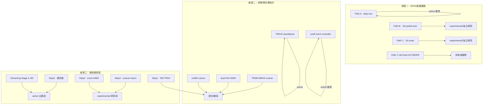

# CFD-DSA 方案 / 版本清单与保留策略建议

> 审查基线：2026-09-09 工作树。本文件是**决策性汇总**，回答三个问题：
> ① 每个阶段有哪些方案；② 每个方案有哪些版本/模式；③ 哪些建议保留、哪些建议删除。
> 逐文件的状态判定与代码/结果证据见
> `projects/cfd_dsa/docs/CFD_DSA_PROJECT_STRUCTURE.md` 与
> `projects/cfd_dsa/docs/CFD_DSA_PROJECT_FILE_INDEX.md`；本文件不重复逐行证据，
> 只给结论与理由。
>
> 重要：现有文档（`CFD_DSA_PROJECT_STRUCTURE.md` §25）明确"不授权删除 legacy 代码"。
> 因此本文件的"删除建议"分两档：**可直接删除**（generated / 纯残留 / 无任何引用）
> 与**待 Stage4 审查后删除**（需同时满足：无 mode 引用、无测试引用、无文档依赖、
> 有替代实现、核心回归通过，见 `CFD_DSA_PROJECT_STRUCTURE.md` §27 Stage 4）。

---

## 0. 一句话结论

这个项目不是"一个方案一路迭代"，而是**三条正交维度叠加**出来的方案树：

| 维度 | 可选方案 | 当前推荐 |
| --- | --- | --- |
| MVM 数据通路 | Path A（dotp-row）/ Path B（ZA partial-sum）/ Path C（ZA outer） | **Path A** |
| 求解/预处理指令 | TRSV5 / TRSM-MRHS / dual INV-LBAR / coeff3 | **TRSV5 + coeff3** |
| 端到端调度 | Step1 → Step2 → Step3 → Step4 + coeff-event + streaming | **Step2 coeff-event + streaming** |

**推荐主路径（继续优化的唯一对象）**：

```text
raw D/L/U/R 输入
  + --lusgs-mode=step2-pretransform-raw-optprep[-stream]
  + --coeff-preprocess-model=event   # 不用 coarse 指令
  + --lu5-model=event                # 不用 guest software LU
  + 统一 RHS15 TRSM + partial output
  + Path A MVM hot loop
  + （性能实验）stream + window8 + auto + DInv/Lbar/Ubar direct
    + line-autonomous + frontier-aware
```

其余全部是：**回归/golden 对照、兼容对照、独立研究线、或历史残留**。

---

## 1. 三个维度的方案树总览



---

## 2. 各阶段方案与版本明细

### 2.1 维度一：MVM 数据通路

| 方案 | 版本/变体 | 状态 | 建议 |
| --- | --- | --- | --- |
| Path A | 当前 direct/streaming MVM（`test_cfd_patha_extreme_perf.c`，`lmat5_spm + dotp_row + pack_acc + pack_sub5`） | **active** | 必留，主路径 MVM |
| Path A | 旧 benchmark（`test_cfd_extreme_perf.c` → `patha-legacy` target） | legacy | 保留作回归 |
| Path A | streaming load/dotp/store/drain（`DSAPathA*`） | experimental | 保留，独立研究 |
| Path B | ZA 空间 partial-sum pipeline（`pathb`） | experimental | 保留，独立研究 |
| Path C | ZA outer-product pipeline（`pathc`，`cfdsme_za_outer5_step`） | experimental | 保留，独立研究 |
| Path C | 旧 fixed-ZA FMOPA（`cfdsme_fmopa5_step` + `test_cfd_sme_step_perf.c` → `sme-step`） | legacy/dead | **待审查删除**（decoder 已拒绝其 guard，见下文 §4.3） |

### 2.2 维度二：求解/预处理指令

| 指令/族 | 版本 | 状态 | 建议 |
| --- | --- | --- | --- |
| `trsv5_lu_spm` | standalone / Step2 coarse | **active** | 必留 |
| `trsv5_lu_spm_zrhs` | forwarded Z-RHS（raw 主路径用） | **active** | 必留 |
| `trsm5_mrhs_spm` | common Ubar 5-RHS coarse | compatibility | 保留回归 |
| `trsm5_inv_lbar_spm` | dual INV/LBAR | compatibility | 保留回归 |
| `trsm5_coeff3_spm` | coeff3 coarse（单指令 15-RHS） | compatibility/coarse 上界对照 | 保留回归 |
| coeff event controller | 逐周期 request/LU/TRSM/drain 状态机 | **active（推荐）** | 必留 |
| `cfd_trsv5_math.hh` | TRSV 数值顺序（FP64，禁 FMA 收缩） | **active, 敏感** | 必留，禁止改数值顺序 |

> coarse（单指令 `execute()` 内算完）与 event（逐周期状态机）数学目标相同、执行模型不同；
> coarse 是**功能回归与上界对照**，不代表逐周期硬件。二者都要留。

### 2.3 维度三：LU-SGS 端到端（Step1 → Step4）

| 阶段 | 本质 | 状态 | 建议 |
| --- | --- | --- | --- |
| **Step1** | Path A MVM + software TRSV（最小融合基线） | legacy regression | 保留回归 |
| **Step2** | 功能主路径，已演化为模式族（见 §2.4） | **active + legacy + experimental** | 主路径必留，legacy 模式保留回归 |
| **Step3** | coarse functional macro controller（`CfdLusgsController`） | experimental regression | 保留，独立研究线 |
| **Step4** | event controller A/B/C（`CfdLusgsEventController`） | experimental regression | 保留，独立研究线（受单 line/context/tile 限制，不能替代 Step2 主路径） |

> Step1→2→3→4 是**递进扩展，不是替代**；后一步没有删除前一步，四个 benchmark 都保留为 golden/regression。

### 2.4 Step2 模式族（重点，本项目的版本密集区）

Step2 单个 benchmark（`test_cfd_lusgs_patha_step2.c`，约 7000 行）内含全部以下模式。
按"输入形式 × 预处理模型 × 求解路径 × context × streaming"正交组合：

| 模式 | 输入 | 预处理 | 建议 |
| --- | --- | --- | --- |
| `reference` | prepared | 全软件 | 保留（golden） |
| `step1` / `step2` | prepared | 无 / TRSV | 保留回归 |
| `step2-core` / `-forwarded` / `-context` / `-linebuf` | prepared | fused/forwarded/linebuf | 保留回归 |
| `step2-pretransform[-context]` | prepared | MRHS Dinv/Lbar | 保留兼容 |
| `step2-pretransform-optprep[-context]` | prepared | dual | 保留兼容（方案比较） |
| `step2-trsv5-raw[-context]` | raw | LU+Ubar | 保留（raw 功能基线） |
| `step2-pretransform-raw[-context]` | raw | common + dual | 保留兼容 |
| `step2-pretransform-raw-optprep[-context]` | raw | coeff3 coarse/event | **主路径（event 模式）** |
| `step2-pretransform-raw-optprep-stream` | raw | coeff3 event + event LU + 5/10/15-RHS | **性能路径（B3/B4/C1/C2-B5 direct）** |

**raw vs prepared**：prepared 输入不含 raw 系数生成成本，不能与 raw event 的"总成本"直接比较。这是两组基线，都要留。

### 2.5 Streaming 流水线（Stage A → B5，当前性能前沿）

| Stage | 内容 | 状态 | 建议 |
| --- | --- | --- | --- |
| A | per-cell window + auto-retire 冻结基线 | active | 必留 |
| B1/B2 | queue reaper 兼容路径 | compatibility | 保留回归 |
| B1.5 | controller auto-retire | active | 必留 |
| B2.5 | 固定 bitmask/worklist，边界 5/10/15-RHS | active | 必留 |
| B3 | DInv column consumer（off/shadow/direct） | active | 必留（direct 为性能路径） |
| B4 | Lbar column consumer + dq_star handoff + ForwardCombine（off/shadow/direct） | active | 必留 |
| C1 | line-level autonomous（每 line 一个 parent token） | active | 必留 |
| C2/B5 | Ubar backward direct consumer（off/direct） | active | 必留 |
| Stage 6b/7/8 | dma SPM model / version-dirty reuse / reciprocal | active/experimental | 保留（显式可选路径） |

---

## 3. 保留/删除分级汇总表

| 分级 | 包含内容 | 动作 |
| --- | --- | --- |
| **A · 必留（主路径核心）** | Path A 当前、TRSV5（含 zrhs）、coeff event controller、Step2 主 benchmark 的 raw-optprep[-stream] 模式、Streaming Stage A/B1.5/B2.5/B3/B4/C1/C2-B5、`cfd_trsv5_math.hh`、`custom_cfd.isa`、`cfd_dsa.{cc,hh}`、`cfd_local_spm.{cc,hh}`、base runner + step2 wrapper、core-regression + streaming suites、decode-exclusive | 维护 + 继续优化 |
| **B · 保留作回归/golden** | prepared Step1/2/2-core/forwarded/context/linebuf 全家族、dual/MRHS/coeff3 coarse、TRSV5 standalone、raw TRSV5 / raw pretransform dual、context/non-context 对照、B1/B2 queue 路径 | 保留，跑回归，不主动优化 |
| **C · 保留作独立研究线** | Path B、Path C（新 outer）、Path A streaming、Step3 coarse、Step4 A/B/C | 保留，独立 benchmark/suite |
| **D · 可直接删除（generated/残留）** | `__pycache__/`、根目录 `三对角矩阵求解.c`（见 §4.1）、`results/lusgs_raw/` 与 `results/lusgs_optprep/`（已迁移，见 §4.2）、`results/cfd_dsa/{runs,failed,archive}/`（disposable/non-evidence） | 删除或归档 |
| **E · 待 Stage4 审查后删除** | 根级 `run_cfd_*.py` shims、旧 fixed-ZA FMOPA class + `sme-step` 源、`DSAGetAcc`/`DSAVsetZero`、decoder 不可达分支、`isa/insts/cfd_dsa.isa` stub | 满足 5 条件后删除（见 §4.3） |

---

## 4. 删除建议详单

### 4.1 可直接删除（无引用，纯残留）

| 对象 | 理由 |
| --- | --- |
| 根目录 `三对角矩阵求解.c` | 一个 `template` 三对角块求解的**软件参考实现**（forward/backward substitution），是被加速算法的数学参考，不是项目代码；放仓库根、无任何 build/mode/测试引用。建议：**移入 `docs/` 或 `benchmarks/common/` 作 reference，或直接删除**（数学已在 `cfd_trsv5_math.hh` 与 benchmark reference 中固化）。 |
| `projects/cfd_dsa/**/__pycache__/` | Python bytecode，generated；`.gitignore` 已不追踪源码场景。直接删。 |
| `results/lusgs_raw/`、`results/lusgs_optprep/` | 重组前的旧结果树，已迁移到 `results/cfd_dsa/`，迁移关系见 `results/cfd_dsa/migration-inventory.json`。确认迁移完整后归档/删除。 |
| `results/cfd_dsa/runs/`、`failed/` | disposable development runs 与空 stats 失败运行；按 `RESULT_MANAGEMENT.md` 政策可随时清。 |
| `results/cfd_dsa/archive/` | superseded 的旧 campaign，按政策保留为历史；若确定不再引用可归档压缩。 |

### 4.2 建议删除但需先确认（配置/兼容层）

| 对象 | 理由 | 前置条件 |
| --- | --- | --- |
| 根级 9 个 `run_cfd_*.py` | 只是转发 canonical configs 的 compatibility shim，文档明确"不要加逻辑"。 | 确认无外部脚本/README 仍以根路径调用；删除后 README 指向 `projects/cfd_dsa/configs/` 即可。 |
| `src/arch/arm/isa/insts/cfd_dsa.isa` | 兼容说明 stub（`4-11` 行），实现已全部转 C++。 | 确认 ISA 生成器不依赖其占位。 |

### 4.3 待 Stage4 审查后删除（死代码候选，须同时满足 5 条件）

这些是 `CFD_DSA_PROJECT_STRUCTURE.md` §25/§30 已标记的"待确认死代码"，**本文件不授权立即删除**：

| 对象 | 现状 | 删除前必须确认 |
| --- | --- | --- |
| 旧 fixed-ZA FMOPA C++ class（`cfdsme_fmopa5_step`） | decoder guard（`custom_cfd.isa:138-146`）已拒绝其编码，返回 Unknown | 无 mode/测试/文档引用；`sme-step` target 是否仅为 negative decode 测试 |
| `test_cfd_sme_step_perf.c`（`sme-step` target） | 编译旧不可解码编码 | 同上，确认是否为历史残留 |
| `DSAGetAcc` / `DSAVsetZero` 类 | `cfd_dsa.hh/cc` 中疑似无调用 | `rg` 确认零引用 |
| decoder 中 PathB 分支后的 unreachable `return Unknown64` | 死分支 | 确认不可达后清理 |

**删除纪律**：任何 E 级删除都必须跑 `decode-exclusive`、旧 mode 回归、generation/token 回归、core suite 全绿后再提交，且不要与功能改动混在同一个 commit。

---

## 5. 清理顺序建议（对应 STRUCTURE 文档 §27）

| 阶段 | 动作 | 风险 |
| --- | --- | --- |
| Stage 0 | 给 source/doc mode 补 `active/legacy/experimental/test-only` 注释；统一 D/L/U/R、LU(D)、Ubar、Dinv、Lbar 术语 | 无 |
| Stage 1 | 统一 mode 列表 / 参数 schema / 默认值；wrapper 只选 profile；启动打印最终 profile | 低 |
| Stage 2 | 抽取 LU helper、TRSM 测试 kernel、SPM staging/drain、validation、stats 公共代码 | 中 |
| Stage 3 | 拆分 7000 行 Step2 benchmark；runner 参数组拆 profile 模块 | 中 |
| Stage 4 | 按 §4.3 五条件删除死代码 | 需全回归 |

---

## 6. 一句话备忘（防混用）

- prepared `b_bar` ≠ raw `U`；`lu_a` ≠ raw `D`。
- coarse `opLat`（FU 延迟）≠ event actual cycles。
- full validation ≠ 硬件吞吐。
- coeff internal `packet` ≠ 真实 memory Packet（只有 `coeff-spm-model=dma` 走 timing RequestPort）。
- guest line context ≠ Step4 controller context。

---

## 7. 关联文档

- 项目总地图：`projects/cfd_dsa/docs/CFD_DSA_PROJECT_STRUCTURE.md`
- 逐文件分类：`projects/cfd_dsa/docs/CFD_DSA_PROJECT_FILE_INDEX.md`
- Step2 当前执行路径：`projects/cfd_dsa/docs/CFD_DSA_LUSGS_STEP2.md`
- Streaming 细节：`projects/cfd_dsa/docs/CFD_DSA_LUSGS_STEP2_STREAMING.md`
- 结果生命周期：`projects/cfd_dsa/docs/RESULT_MANAGEMENT.md`
